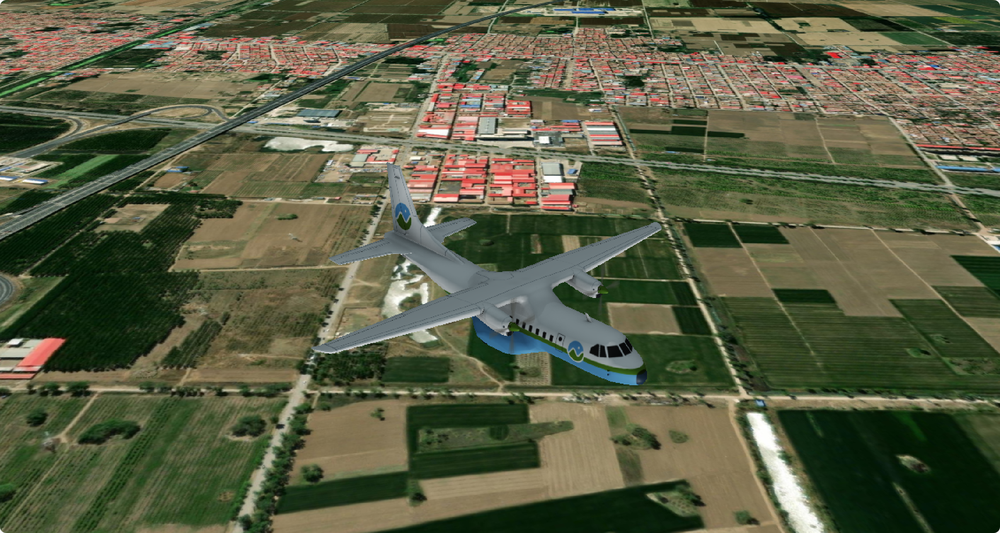

# 地图图层

Cesium 支持大量的数据格式，主要分为一下几类：

- 影像地图：Bing、天地图、ArcGIS、OSM、WMTS、WMS
- 地形数据：ArcGIS、谷歌、STK
- 矢量数据：KML、KMZ、GeoJSON、TopoJSON、CZML
- 三维模型：GLTF、GLB（二进制GLTF文件）
- 三维瓦片：3D Tiles（倾斜摄影、人工模型、三维建筑物、CAD、BIM、点云数据等）


## ImageryLayer 类

在 Cesium 中，使用 [`ImageryLayer`](https://cesium.com/learn/cesiumjs/ref-doc/ImageryLayer.html?classFilter=ImageryLayer) 对象来表示一个影像图层。`ImageryLayer` 是包含一个或多个瓦片的图层，它可以用来控制地图图层的显示、叠加和透明度等属性。

并且可以通过将其添加到 [`ImageryLayerCollection`](https://cesium.com/learn/cesiumjs/ref-doc/ImageryLayerCollection.html?classFilter=ImageryLayerCollection) 中来实现在场景中切换图层的效果。

使用方式：

```js
const imagerLayer = new Cesium.ImageryLayer(imageryProvider, options);
```

参数：

| 参数                | 描述                                                         |
| ------------------- | ------------------------------------------------------------ |
| imageryProvider     | 一个 ImageryProvider 对象，用于提供地图影像数据              |
| alpha               | 影像图层的透明度（0~1），默认值为1                           |
| brightness          | 影像图层的亮度调整值（-1~1），默认值为0                      |
| contrast            | 影像图层的对比度调整值（-1~1），默认值为0                    |
| hue                 | 影像图层的色调调整值（-1~1），默认值为0                      |
| saturation          | 影像图层的饱和度调整值（-1~1），默认值为0                    |
| gamma               | 影像图层的伽马调整值（>=1），默认值为1                       |
| show                | 布尔类型，表示该图层是否可见，默认值为true                   |
| maximumTerrainLevel | 数字类型，表示在地形高程数据缺失时，该图层的最大可见级别，默认值为Infinity |
| rectangle           | 一个 Rectangle 对象，表示该图层的可视范围                    |
| zIndex              | 数字类型，表示该图层在图层堆叠顺序中的位置，数值越大表示越靠前 |

方法：

| 方法                        | 描述                                                   |
| --------------------------- | ------------------------------------------------------ |
| `imagerLayer.destroy()`     | 当不再需要该图层时，销毁该图层，释放资源，避免内存泄漏 |
| `imagerLayer.isDestroyed()` | 返回布尔值，表示该图层是否已销毁                       |

```js
const imagerLayer = new Cesium.ImageryLayer(imageryProvider, options);

// 销毁图层
imagerLayer.destroy();

// 检查图层是否销毁
const isDestroy = imagerLayer.isDestroyed();
```


## ImageryProvider 类

在 Cesium 中，[ImageryProvider](https://cesium.com/learn/cesiumjs/ref-doc/ImageryProvider.html?classFilter=ImageryProvider) 是提供影像数据的**抽象类**，定义了一些基本方法和属性，用于获取、处理和显示影像数据。

在实际应用中，通常需要根据不同的影像数据源**选择不同的 ImageryProvider 子类**，如 ArcGisMapServerImageryProvider、BingMapsImageryProvider等。

使用方式：

```js
// 例如使用 ArcGisMapServerImageryProvider 子类
async function addImageryLayer() {
  const esri = await Cesium.ArcGisMapServerImageryProvider.fromUrl(
    "https://map.geoq.cn/ArcGIS/rest/services/ChinaOnlineStreetPurplishBlue/MapServer"
  );
  viewer.scene.imageryLayers.addImageryProvider(esri);
}
```


## ImageryLayerCollection 类

在 Cesium 中，[ImageryLayerCollection](https://cesium.com/learn/cesiumjs/ref-doc/ImageryLayerCollection.html?classFilter=ImageryLayerCollection) 类可以用于存储和管理多个 ImageryLayer 对象。每个 ImageryLayer 对象表示一个图像图层，可以包含单张图片或图像切片集合。

参数：

| 参数         | 描述                                 |
| ------------ | ------------------------------------ |
| length       | 返回集合中 ImageryLayer 对象的数量   |
| layerAdded   | 当图像图层添加到该集合时发生的事件   |
| layerMoved   | 当图像图层在该集合内移动时发生的事件 |
| layerRemoved | 当图像图层从该集合中删除时发生的事件 |

方法：

| 方法                                         | 描述                                                         |
| -------------------------------------------- | ------------------------------------------------------------ |
| `add(layer, index)`                          | 将给定的 ImageryLayer 对象添加到集合中的指定位置。如果省略索引，则将该图像图层添加到末尾 |
| `remove(layer)`                              | 从集合中删除给定的 ImageryLayer 对象                         |
| `removeAll()`                                | 从集合中删除所有 ImageryLayer 对象                           |
| `raiseToTop(layer)`                          | 将给定的 ImageryLayer 对象移动到集合的顶部                   |
| `lowerToBottom(layer)`                       | 将给定的 ImageryLayer 对象移动到集合的底部                   |
| `addImageryProvider(imageryProvider, index)` | 用于将给定的 ImageryProvider 对象创建的图像图层添加到集合中的指定位置。如果省略索引，则将该图像图层添加到末尾 |


## 影像地图

### [ArcGIS](https://cesium.com/learn/cesiumjs/ref-doc/ArcGisMapServerImageryProvider.html) 地图

方式一：

```js
const esri = Cesium.ImageryLayer.fromProviderAsync(
  Cesium.ArcGisMapServerImageryProvider.fromUrl(
    "https://services.arcgisonline.com/ArcGIS/rest/services/World_Imagery/MapServer"
  ),
  {
    show: true
  }
);

// 1、在初始化时添加图层
const viewer = new Cesium.Viewer("cesiumContainer", {
  baseLayer: esri,
  infoBox: false
});

// 2、在运行时添加图层
viewer.imageryLayers.add(esri);
```

方式二：

```js
async function addImageryLayer() {
  const esri = await Cesium.ArcGisMapServerImageryProvider.fromUrl(
    "https://map.geoq.cn/ArcGIS/rest/services/ChinaOnlineStreetPurplishBlue/MapServer"
  );
  viewer.scene.imageryLayers.addImageryProvider(esri);
}
```


### 栅格网格

栅格网格类似于经纬度，将地球表面划分为无数个小格子，使用 [GridImageryProvider](https://cesium.com/learn/cesiumjs/ref-doc/GridImageryProvider.html#.ConstructorOptions) 添加到地图：

```js
async function addImageryLayer() {
  var gridImagery = new Cesium.GridImageryProvider({
    color: Cesium.Color.fromCssColorString("#ff00ff"),
    cells: 16, 						//网格单元格数
    glowColor: Cesium.Color.WHITE, 	// 网格线光晕颜色
    glowWidth: 6 					// 网格线线宽
  });
    
  viewer.scene.imageryLayers.addImageryProvider(gridImagery);
}
```


## 地形数据


## 矢量数据

### [kml / kmz](https://cesium.com/learn/cesiumjs/ref-doc/KmlDataSource.html?classFilter=KmlDataSource)

::: tip kmz 和 kml 的区别是什么？

1. `KML`是解压缩文件的文件扩展名，而`KMZ`是`KML`文件的压缩版本；

2. `KML`通常用于保存和存储地图位置，而`KMZ`则以相同的容量用于更具体的位置，例如地标；
3. 与`KMZ`相比，`KML`具有更大的文件空间和更长的数据传输。KMZ作为压缩或压缩文件具有较小的文件空间和大小；
4. `KML`可以被许多运行地图和图像(例如Google Earth和Google Maps)的地理浏览器或程序读取和识别，`KMZ`并不总是这样；

:::

Cesium 官方提供的了 kmz 数据，下载地址：[kmz 数据](https://github.com/CesiumGS/cesium/blob/main/Apps/SampleData/kml/gdpPerCapita2008.kmz)

```js
// 加载 kml 只需要换地址即可
const promise = Cesium.KmlDataSource.load("/kmz/gdpPerCapita2008.kmz", {
    camera: viewer.scene.camera,
    canvas: viewer.scene.canvas
});
viewer.dataSources.add(promise);
viewer.zoomTo(promise);
```


### [geojson](https://cesium.com/learn/cesiumjs/ref-doc/GeoJsonDataSource.html?classFilter=GeoJsonDataSource)

::: tip 提示

1.  `Cesium.GeoJsonDataSource.load(linestring)` 的返回值是一个 `Promise` 对象，所以可以使用 `.then` 方法。
2.  `viewer.dataSources.add()`可以接收一个 `Promise` 作为参数使用，因此可以将 `load` 方法的返回值作为参数。

:::

**加载 geojson**

1. 加载 turf 生成的线要素：

   ```js
   // 使用 turf 生成一条线
   const lineString = turf.lineString([
       [102.73176821728828, 38.02964680894118],
       [102.73330135753423, 38.02546206796032],
       [102.7356545495424, 38.02598166289124],
       [102.7360289209974, 38.02475990679443]
   ]);
   
   // 方式一
   const promise = Cesium.GeoJsonDataSource.load(lineString, {
       stroke: Cesium.Color.HOTPINK,
       strokeWidth: 5
   });
   promise.then(res => {
       const entity = viewer.entities.add(res.entities.values[0]);
       viewer.zoomTo(entity);
   });
   
   // 方式二(推荐)
   const promise = Cesium.GeoJsonDataSource.load(lineString, {
       stroke: Cesium.Color.HOTPINK,
       strokeWidth: 5
   });
   viewer.dataSources.add(promise);
   viewer.zoomTo(promise);
   ```

   

2. 加载本地 geojson 文件：

   ```js
   import geojson from "../data/geojson.json";
   
   const promise = Cesium.GeoJsonDataSource.load(geojson, {
       markerSize: 40, 							// 点图标大小(像素)
       markerSymbol: "?", 							// 点图标内部的默认符号
       markerColor: Cesium.Color.SKYBLUE, 			// 点图标颜色
       stroke: Cesium.Color.HOTPINK, 				// 线颜色
       strokeWidth: 5, 							// 线宽
       fill: Cesium.Color.SKYBLUE.withAlpha(0.5), 	// 填充颜色
       clampToGround: false 						// 是否贴地(当true时，多边形的外边线将会失效)
   });
   viewer.dataSources.add(promise);
   viewer.zoomTo(promise);
   ```

   

**删除 geojson**

```js {6}
import geojson from "../data/geojson.json";

onMounted(async () => {
  const dataSource = await Cesium.GeoJsonDataSource.load(geojson, {
    clampToGround: true,
    fill: Cesium.Color.AZURE.withAlpha(0.5)
  });
  viewer.dataSources.add(dataSource);
  viewer.zoomTo(dataSource);
    
  setTimeout(() => {
    viewer.dataSources.remove(dataSource);
  }, 3000);
});
```


### topojson

topojson 数据的加载方式和 geojson 的加载方式一样，都是使用 `Cesium.GeoJsonDataSource.load()` 方法。

在 Ceisum 官网[下载源代码](https://cesium.com/downloads/)，其中 Cesium-1.99\Apps\SampleData\ne_10m_us_states.topojson ，就是一个 topojson 数据。

```js
const promise = Cesium.GeoJsonDataSource.load(
  "/topojson/ne_10m_us_states.topojson",
  {
      markerSize: 40, 							// 点图标大小(像素)
      markerSymbol: "?", 							// 点图标内部的默认符号
      markerColor: Cesium.Color.SKYBLUE, 			// 点图标颜色
      stroke: Cesium.Color.HOTPINK, 				// 线颜色
      strokeWidth: 5, 							// 线宽
      fill: Cesium.Color.SKYBLUE.withAlpha(0.5), 	// 填充颜色
      clampToGround: false 						// 是否贴地(当true时，多边形的外边线将会失效)
  }
);
viewer.dataSources.add(promise);
viewer.zoomTo(promise);
```


## 三维模型

### 加载 glb 模型

Cesium 官方提供了 glb 模型，下载地址：[glb 模型](https://github.com/CesiumGS/cesium/tree/main/Apps/SampleData/models/CesiumAir)

```js
const viewer = new Cesium.Viewer("cesiumContainer", {
    baseLayer: esri,
    infoBox: false,
    shouldAnimate: true, // 开启飞机动画
    shadows: true 		 // 开启飞机阴影
});

const position = Cesium.Cartesian3.fromDegrees(116.39, 38.9, 400.0);
// 设置飞机的俯仰角
const orientation = Cesium.Transforms.headingPitchRollQuaternion(
    position,
    new Cesium.HeadingPitchRoll(-90, 0, 0)
);

const entity = viewer.entities.add({
   position: position,
   orientation: orientation,
   model: {
      uri: "/glb/Cesium_Air.glb",
      minimumPixelSize: 200,
      maximumScale: 5000,
      show: true
   }
});

// 固定视角到飞机
viewer.camera.lookAt(
  position,
  new Cesium.HeadingPitchRange(Cesium.Math.toRadians(0), Cesium.Math.toRadians(-90), 500)
);
```



## 三维瓦片

### [3D Tiles](https://cesium.com/learn/cesiumjs/ref-doc/Cesium3DTileset.html?classFilter=Cesium3DTileset)

在加载 3D Tiles 数据之前，可以先到 Cesium [官网](https://ion.cesium.com/assets/69380?page=1&sortBy=DATE_ADDED&sortOrder=DESC)添加 墨尔本和纽约 的在线数据。

1. 加载在线数据：

   ```js
   const tileset = viewer.scene.primitives.add(
       // 加载墨尔本建筑物3D Tiles
       await Cesium.Cesium3DTileset.fromIonAssetId(69380),
       // 加载纽约建筑物3D Tiles
       await Cesium.Cesium3DTileset.fromIonAssetId(75343),
       // 加载Google地球3D Tiles
       await Cesium.Cesium3DTileset.fromIonAssetId(2275207)
   );
   viewer.flyTo(tileset);
   ```

2. 加载离线数据，[详见参数配置](https://cesium.com/learn/cesiumjs/ref-doc/Cesium3DTileset.html#.ConstructorOptions)：

   ```js
   const tileset = await Cesium.Cesium3DTileset.fromUrl(
       "/3DTiles/b3dm/tileset.json",
       {
           enableCollision: true,
           skipLevelOfDetail: true,
           baseScreenSpaceError: 1024,
           skipScreenSpaceErrorFactor: 16,
           skipLevels: 1,
           immediatelyLoadDesiredLevelOfDetail: false,
           loadSiblings: false,
           cullWithChildrenBounds: true
       }
   );
   
   viewer.scene.primitives.add(tileset);
   viewer.flyTo(tileset);
   ```

   ::: tip 提示

   添加完模型后如果漂浮在空中，可以使用下面的代码调整模型贴地：
   
   ```js
   // 调整模型的高度偏移
   const heightOffset = -70;
   const boundingSphere = tileset.boundingSphere;
   const cartographic = Cesium.Cartographic.fromCartesian(boundingSphere.center);
   const surface = Cesium.Cartesian3.fromRadians(
       cartographic.longitude,
       cartographic.latitude,
       0.0
   );
   const offset = Cesium.Cartesian3.fromRadians(
       cartographic.longitude,
       cartographic.latitude,
       heightOffset
   );
   const translation = Cesium.Cartesian3.subtract(
       offset,
       surface,
       new Cesium.Cartesian3()
   );
   tileset.modelMatrix = Cesium.Matrix4.fromTranslation(translation);
   ```
   
   :::


