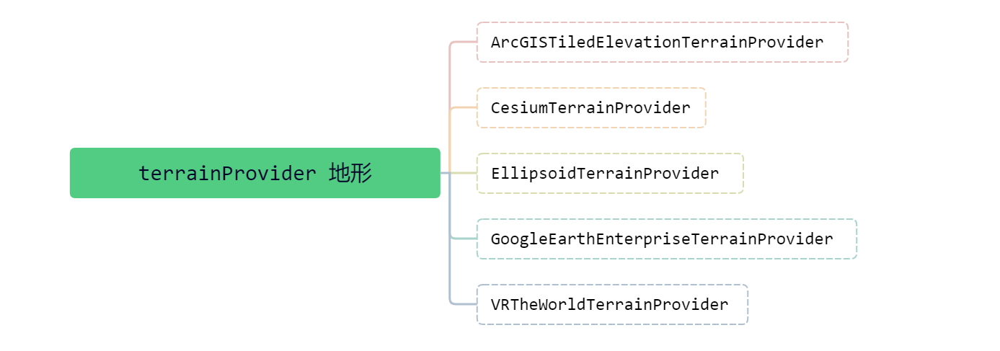

# 地形数据

Cesium 提供了 [TerrainProvider](https://cesium.com/learn/cesiumjs/ref-doc/TerrainProvider.html?classFilter=TerrainProvider) 基类，该 Provider 负责每一个 Tile 对应的地形数据的构建，定义了一套地形 Provider 需要实现的接口和规范，但它本身并不会参与其中的操作。

基于此类，Cesium 为我们封装了 5 个现成的继承类操作地形数据：



Cesium 支持渐进式的加载和渲染全球高精度地形，并且包含海、湖、河等睡眠效果。相对于 2D 地图，山峰、山谷等其他地形特征更适合在 3D 地球中显示。

Cesium 支持两种类型的地形，STK World Terrain 和 Small Terrain（两种地形有什么区别，查看[文章](https://my.oschina.net/u/1585572/blog/290481)）。


## ArcGIS 地形

[ArcGISTiledElevationTerrainProvider](https://cesium.com/learn/cesiumjs/ref-doc/ArcGISTiledElevationTerrainProvider.html?classFilter=TerrainProvider) 用来加载 ArcGIS 提供的真实的、带高程的地形地图，它的每一个切片会根据 ArcGIS 规范来请求图片，图片中的像素对应的值就是该像素对应的高度。

```js {3}
async function addImageryLayer() {
  const terrainProvider =
    await Cesium.ArcGISTiledElevationTerrainProvider.fromUrl(
      "https://elevation3d.arcgis.com/arcgis/rest/services/WorldElevation3D/Terrain3D/ImageServer",
      {
        token:
          "KED1aF_I4UzXOHy3BnhwyBHU4l5oY6rO6walkmHoYqGp4XyIWUd5YZUC1ZrLAzvV40pR6gBXQayh0eFA8m6vPg.."
      }
    );
  viewer.terrainProvider = terrainProvider;
}
```


## Cesium 地形

[CesiumTerrainProvider](https://cesium.com/learn/cesiumjs/ref-doc/CesiumTerrainProvider.html?classFilter=CesiumTerrainProvider) 用来加载 Cesium 官方提供的标准地形地图，该 Provider 支持两种地形格式，分别为 高度图（已废弃）和 **带有TIN网格的STK地形**。

Cesium 提供的 STK 地形服务，最大的优点就是使用 QuantizedMeshTerrainData 封装了 STK 地形数据格式，支持水面和法线，同时数据量小。

```js {5-7,15-17,23}
// 方式一
onMounted(() => {
  const viewer = new Cesium.Viewer("cesiumContainer", {
    infoBox: false,
    terrain: new Cesium.Terrain(
      Cesium.CesiumTerrainProvider.fromIonAssetId(3956, {
          requestVertexNormals: true, 	// 请求地形照明数据
      	  requestWaterMask: true 		// 请求水体效果所需要的海岸线数据
      })
    )
  });
});

// 方式二
onMounted(async () => {
  const viewer = new Cesium.Viewer("cesiumContainer", {
    infoBox: false,
    terrainProvider: await Cesium.CesiumTerrainProvider.fromIonAssetId(3956, {
      requestVertexNormals: true,
      requestWaterMask: true
    })
  });
});

// 方式三
async function addTerrainServer() {
  var terrainProvider = await Cesium.CesiumTerrainProvider.fromIonAssetId(3956, {
      requestVertexNormals: true,
      requestWaterMask: true
  });
  viewer.terrainProvider = terrainProvider;
}
```


## Ellipsoid 地形

[EllipsoidTerrainProvider](https://cesium.com/learn/cesiumjs/ref-doc/EllipsoidTerrainProvider.html?classFilter=EllipsoidTerrainProvider) 提供了全球范围内高度为0的地形，不需要额外的地形文件，加载地图的负担更小（感觉就是平面的地形图，不带有高程数据）。

```js
const viewer = new Cesium.Viewer("cesiumContainer", {
  infoBox: false,
  baseLayerPicker: false,
  terrainProvider: new Cesium.EllipsoidTerrainProvider()
});
```
