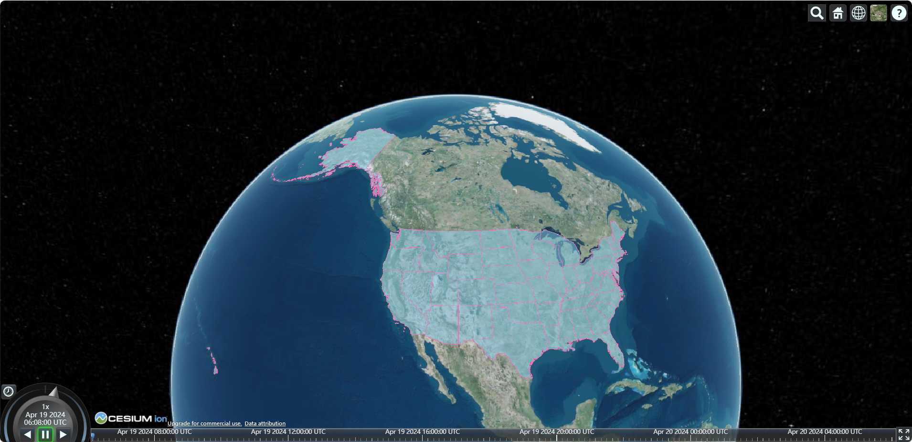
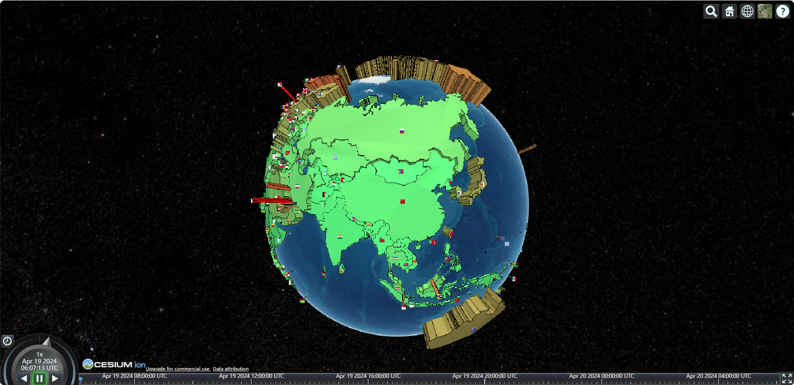

# 矢量数据

矢量数据 是用 X、Y、Z 坐标表示地图图形或地理实体位置的数据，常见的矢量数据有：点、线、面等格式。

矢量数据优点：数据结构紧凑、冗余度低、有利于网络和检索分析、图形显示质量好、精度高、不会失真等。

## geojson

Cesium 中使用 [`Cesium.GeoJsonDataSource.load()`](https://cesium.com/learn/cesiumjs/ref-doc/GeoJsonDataSource.html?classFilter=GeoJsonDataSource) 方法加载 geojson 数据，该方法的返回值是一个 Promise 对象，所以可以调用 .then 方法。

同时，`viewer.dataSources.add()` 方法可以接收一个 `Promise` 作为参数使用，因此可以将 `Cesium.GeoJsonDataSource.load()` 方法的返回值作为参数传递。

### 加载 geojson

加载 turf 生成的线要素（本质也是 geojson）：

```js
nst lineString = turf.lineString([
  [102.73176821728828, 38.02964680894118],
  [102.73330135753423, 38.02546206796032],
  [102.7356545495424, 38.02598166289124],
  [102.7360289209974, 38.02475990679443]
]);

// 方式一
const promise = Cesium.GeoJsonDataSource.load(lineString, {
  stroke: Cesium.Color.HOTPINK,
  strokeWidth: 5
});
promise.then(res => {
  const entity = viewer.entities.add(res.entities.values[0]);
  viewer.zoomTo(entity);
});

// 方式二(推荐)
const promise = Cesium.GeoJsonDataSource.load(lineString, {
  stroke: Cesium.Color.HOTPINK,
  strokeWidth: 5
});
viewer.dataSources.add(promise);
viewer.zoomTo(promise);
```

加载本地 geojson 数据：

```js
on from "../data/geojson.json";

const promise = Cesium.GeoJsonDataSource.load(geojson, {
  markerSize: 40, 								// 点图标大小(像素)
  markerSymbol: "?", 							// 点图标内部的默认符号
  markerColor: Cesium.Color.SKYBLUE,	 		// 点图标颜色
  stroke: Cesium.Color.HOTPINK, 				// 线颜色
  strokeWidth: 5, 								// 线宽
  fill: Cesium.Color.SKYBLUE.withAlpha(0.5), 	// 填充颜色
  clampToGround: false 							// 是否贴地(当true时，多边形的外边线将会失效)
});
viewer.dataSources.add(promise);
viewer.zoomTo(promise);
```

### 删除 geojson

```js
import geojson from "../data/geojson.json";

onMounted(async () => {
  const dataSource = await Cesium.GeoJsonDataSource.load(geojson, {
    clampToGround: true,
    fill: Cesium.Color.AZURE.withAlpha(0.5)
  });
  viewer.dataSources.add(dataSource);
  viewer.zoomTo(dataSource);

  setTimeout(() => {
    viewer.dataSources.remove(dataSource);
  }, 3000);
});
```

## topojson

topojson 是 geojson 按拓扑学编码后的扩展形式，相比于 geojson 直接使用 Polygon、Point 等几何体来表示图形的方法，topojson 中每个几何体都是通过 **共享边** 后整合组成的，因此 topojson 降低了冗余，缩小了近 80%的文件大小。

topojson 使用坐标、弧的方式表示地理图形，它由 transform（变换参数）、objects（地理实体的属性信息）、arcs（有向弧的空间关系） 三部分组成。

Cesium 中使用 [`Cesium.GeoJsonDataSource.load()`](https://cesium.com/learn/cesiumjs/ref-doc/GeoJsonDataSource.html?classFilter=GeoJsonDataSource) 方法加载 topojson 数据，官方提供的 topojson 数据可[查看此处](https://github.com/CesiumGS/cesium/tree/main/Apps/SampleData)，也可以通过 [转换工具](https://jeffpaine.github.io/geojson-topojson/) 将 geojson 转换为 topojson 再进行加载。

```js
const topojson = Cesium.GeoJsonDataSource.load(
  "/topojson/ne_10m_us_states.topojson",
  {
    markerSize: 40, // 点图标大小(像素)
    markerSymbol: "?", // 点图标内部的默认符号
    markerColor: Cesium.Color.SKYBLUE, // 点图标颜色
    stroke: Cesium.Color.HOTPINK, // 线颜色
    strokeWidth: 5, // 线宽
    fill: Cesium.Color.SKYBLUE.withAlpha(0.5), // 填充颜色
    clampToGround: false // 是否贴地(当true时，多边形的外边线将会失效)
  }
);
viewer.dataSources.add(topojson);
viewer.zoomTo(topojson);
```



## kml / kmz

kml 是一种基于 xml 语法格式的文件，用来描述和存储地理信息数据（如点、线、面、多边形、多边体等），早已被 OGC 采用，成为 OGC 规范之一。

kml 文件有两个文件扩展名 `.kml` 和 `.kmz`，二者区别如下：

- kml 是解压缩文件，而 kmz 是 kml 文件的压缩版本；
- kml 有更大的文件空间和更长的数据传输，而 kmz 作为压缩文件具有较小的文件空间和大小；

Cesium 中使用 [`Cesium.KmlDataSource.load()`](https://cesium.com/learn/cesiumjs/ref-doc/KmlDataSource.html?classFilter=KmlDataSource) 加载 kml / kmz 数据，官方提供的 kml / kmz 数据可[查看此处](https://github.com/CesiumGS/cesium/tree/main/Apps/SampleData/kml)。

```js
const kmz = Cesium.KmlDataSource.load("/kmz/gdpPerCapita2008.kmz", {
  camera: viewer.scene.camera,
  canvas: viewer.scene.canvas
});
viewer.dataSources.add(kmz);
viewer.zoomTo(kmz);
```



## czml

czml 数据可以在 Cesium 中很酷炫的展示动态数据，本质上它就是一个 json 个数的字符串，用来描述与时间有关的动画场景，czml 包含点、线、地标、模型等图形元素，并指明了这些元素如何随着时间而变化。

在 Cesium 中使用 [`Cesium.CzmlDataSource.load()`](https://cesium.com/learn/cesiumjs/ref-doc/CzmlDataSource.html?classFilter=CzmlDataSource) 加载 czml 数据，官方提供的 czml 数据可[查看此处](https://github.com/CesiumGS/cesium/tree/main/Apps/SampleData)。

```js
// 加载数据之后，可以通过 animation 动画控件，播放动画效果
const czml = Cesium.CzmlDataSource.load("/czml/MultipartVehicle_part1.czml");
viewer.dataSources.add(czml);
viewer.zoomTo(czml);
```
