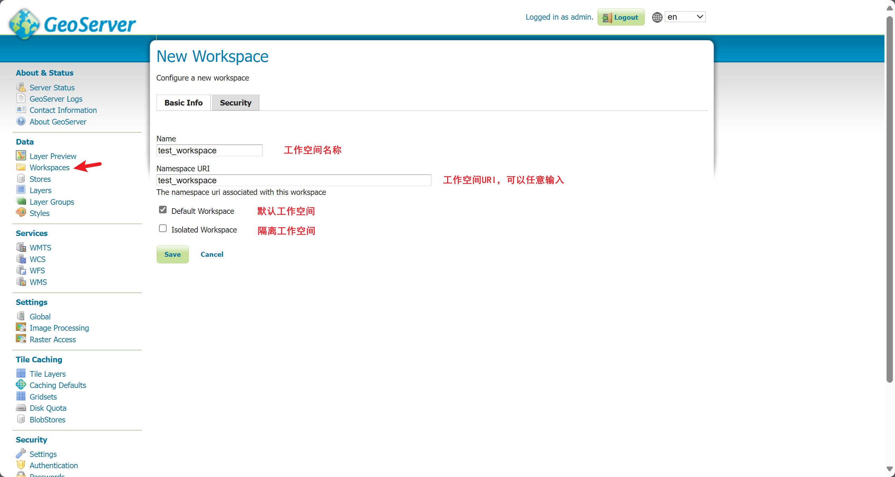
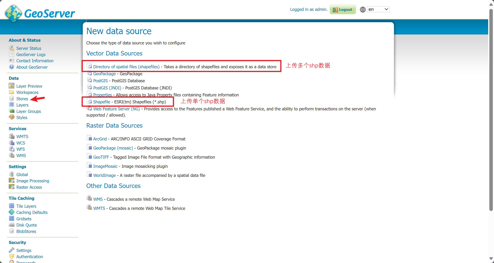
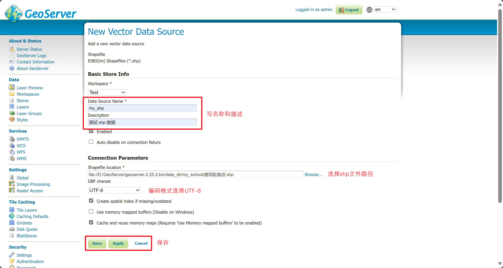
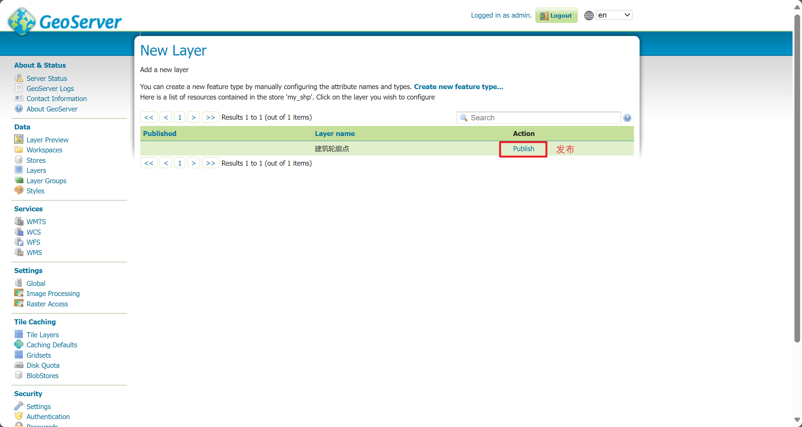
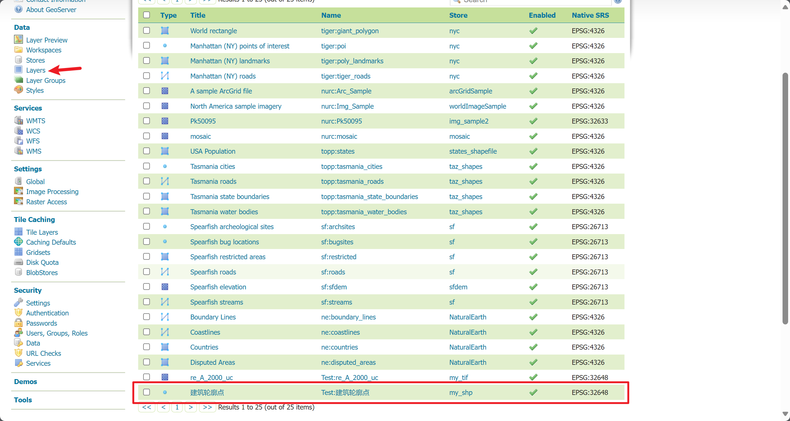
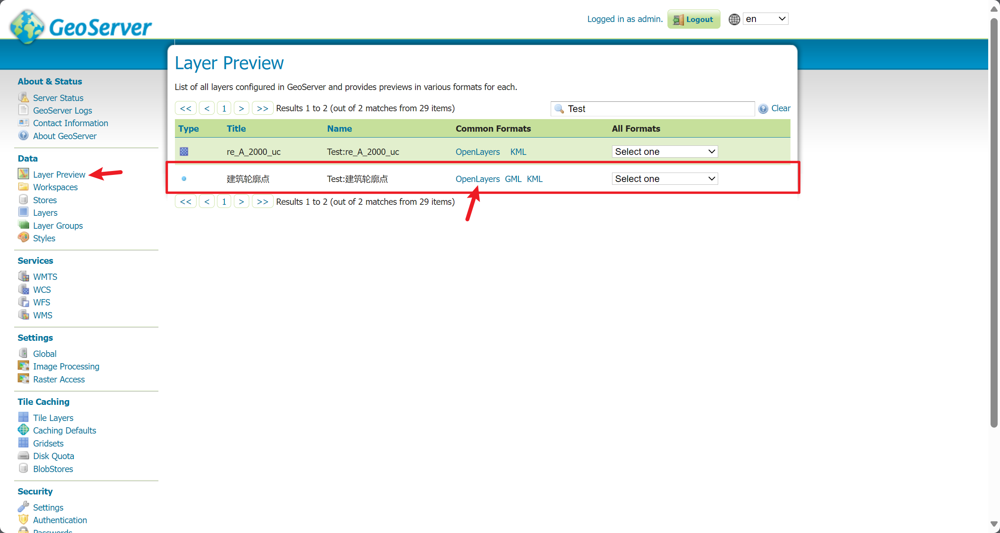
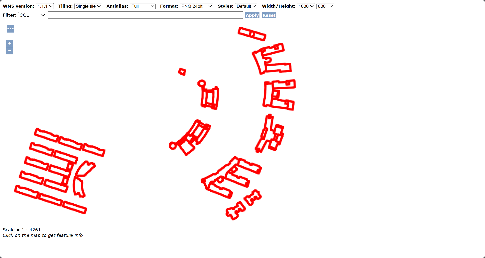

# 发布 shp 数据

## 单个 shp 数据

发布地图服务需要经历 3 个流程：**Workspaces（工作空间） --> Store（存储） --> Layer（图层）**。

步骤：

1. 新增 Workspaces 工作空间：

2. 新增 Store 存储空间，点击顶部 Add new Store 按钮，之后选择上传**单个/多个 shp 数据**：

3. 在 Layer 图层中查看图层是否发布成功：

4. 在 Layers Preview 中查看发布的 shp 数据：

## 多个 shp 数据

多个 shp 数据的发布和单个发布的步骤几乎相同，查看发布单个 shp 数据中的 第 2 步，点击顶部的 `Directory of spatial files (shapefiles)` 即可按文件夹发布所有的 shp 数据。
