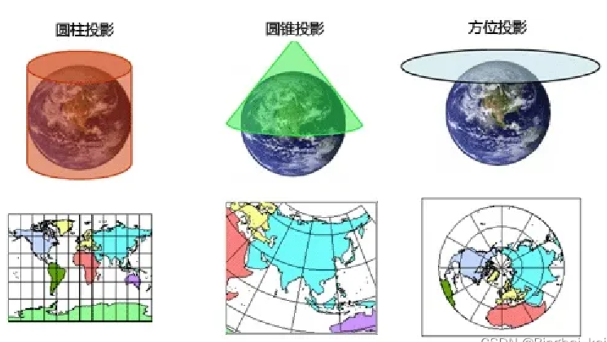

# 坐标系

>参考文章：
>
>https://blog.csdn.net/log2003/article/details/117355294
>
>https://blog.csdn.net/Bingbai_keji/article/details/135273272

地理坐标系：球面坐标，参考平面是椭球面，坐标单位为 经纬度。
投影坐标系：平面坐标，参考平面是水平面，坐标单位为 米/千米。

地理坐标系转换到投影坐标系的过程就叫 投影，即将不规则的地球曲面转换为平面。

## 地理坐标系

地理坐标，就是用 经线、纬线（经度、纬度）表示地面点位的球面坐标。

地理坐标一般可分为 3 种：天文经纬度、大地经纬度、地心经纬度。通常地图上使用的经纬度都是 大地经纬度。

大地经度：参考椭球面上某点的大地子午面与本初子午线的两面角，东正西负。

大地纬度：参考椭球体上某点的法线与赤道平面的夹角，北正南负。

大地高：指某点沿法线方向到参考椭球面的距离。

常见的地理坐标系：

- **WGS 84 世界大地坐标系**，它是为全球 GPS 定位系统使用而建立的坐标系；
- CGCS 2000 坐标系，我国最新使用的国家大地坐标系，原点为地球质心；
- 北京 54 坐标系，1954年定义的坐标系，大地原点在前苏联普尔科沃；
- 西安 80 坐标系，1980年定义的坐标系，大地原点在陕西省西安市；

## 投影坐标系

在地球椭球面和平面之间建立点与点之间函数关系的数学方法，称为地图投影。

地球椭球面表面并不是光滑的，而是存在高低起伏的，所以当把它展示到一个平面上的时候，就会出现 “拉伸” 或 “压缩”，这就是地图投影的变形。

地图投影按照不同的需要，可分为以下几种组合：

- 按变形性质分类
  - 等角投影：角度变形为 0，但面积变化很大（墨卡托投影）
  - 等积投影：面积变形为 0，但角度变化很大（兰伯特投影）
  - 任意投影：长度、面积、角度都存在变形

- 按投影面类型分类：
  - 圆柱投影：投影面为横圆柱，切点处无变形，离切点越远变形越大
  - 圆锥投影：投影面为圆锥，适用于中纬度地带沿纬线方向伸展地区的地图，我国多使用该投影
  - 方位投影：投影面为平面，适用于编制赤道附近地区的地图和世界地图

我国基本比例尺地图，1:100万、1:50万、1:25万、1:10万、1:5万、1:2.5万、1:1万、1:5000，除了 1:100 万之外其余均采用 **高斯-克吕格投影**。
