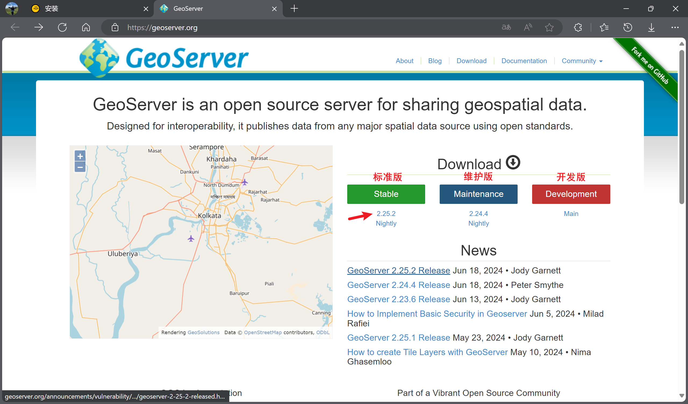
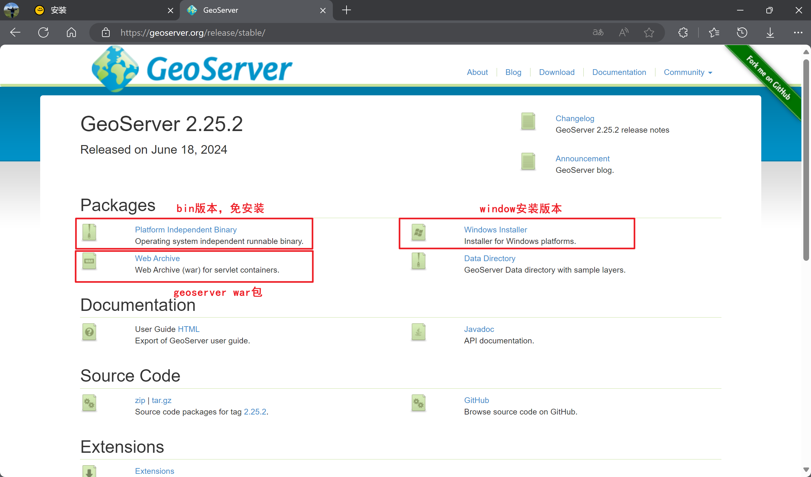

# 环境安装

由于 GeoServer 底层是 Java 写的，所以在安装 GeoServer 之前，需要先安装 Java JDK。


## Java 安装

Java JDK8 安装教程：[https://blog.csdn.net/JunLeon/article/details/122623465](https://blog.csdn.net/JunLeon/article/details/122623465)

Java JDK22 安装教程：[https://blog.csdn.net/dashengzhu/article/details/139137128](https://blog.csdn.net/dashengzhu/article/details/139137128) ✅


## GeoServer 安装

GeoServer 下载地址：[https://geoserver.org/](https://geoserver.org/)



1. 下载 免安装版本 和 geoserver war 包：



1. 打开 免安装版本，找到 `start.ini` 程序，修改 geoserver 端口（默认为 8080）：

```Shell
# 旧
# jetty.http.port=8080

# 新
jetty.http.port=10086
```

1. 打开 `bin\startup.bat` 程序，即可启动 geoserver，浏览器 web 页面 [`localhost:10086/geoserver/web`](http://localhost:10086/geoserver/web/) （用户名：admin，密码：geoserver ）


## TomCat 安装

Tomcat 主要用来托管和运行 Java web 应用程序。它是一个轻量级的应用服务器，适合处理 HTTP 请求和响应。

而 GeoServer 本身就是一个 java 程序，它需要一个 Servlet 容器来运行，TomCat 则正好提供了这一环境。


下载地址：[https://tomcat.apache.org/](https://tomcat.apache.org/) （这里使用 TomCat 9.x 版本 + Java JDK 22）

TomCat 和 Java JDK版本 需要一一对应（[查看版本对应](https://tomcat.apache.org/whichversion.html)），版本不对应 TomCat 窗口可能会一闪而过！


1. 下载完成后，打开 `conf\tomcat_users.xml` 文件，配置用户信息：

```XML
  <role rolename="manager-gui"/>
  <user username="admin" password="admin" roles="manager-gui"/>
```

1. 之后打开 `conf\logging.properties` 文件，修改编码格式为 GBK，否则启动的黑窗口字符会乱码：

```Shell
# 旧
# java.util.logging.ConsoleHandler.encoding = UTF-8

# 新
java.util.logging.ConsoleHandler.encoding = GBK
```

1. 将 geoserver war 包粘贴到 `webapps` 文件夹下，这样启动程序之后，TomCat 可以自动部署 war 包。

2. 启动 `bin\startup.bat` 程序，然年打开浏览器管理页面 [`localhost:8080`](http://localhost:8080/) （用户名：admin，密码：admin），点击页面中 Manager App 按钮，实现用户登录：


1. 登录成功后，再次点击 Manager App 按钮，看到 `/geoserver` 一行的 运行 是 true，表示部署成功：


