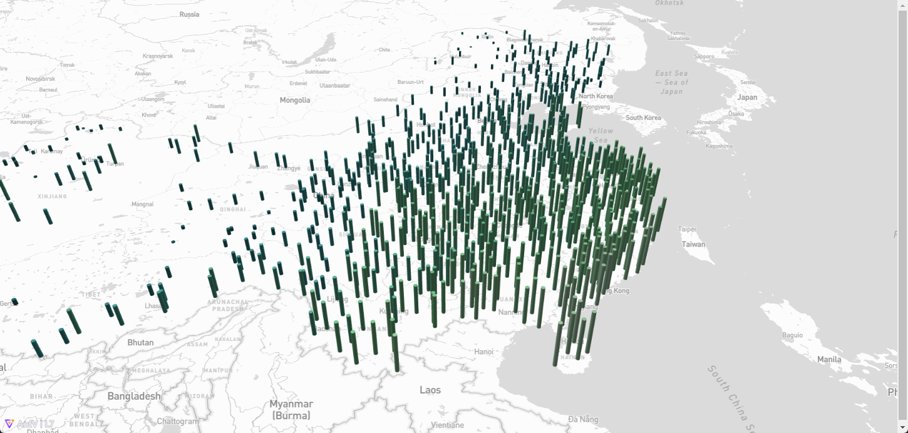

# Antv L7

> L7 官网：https://l7.antv.antgroup.com/tutorial/l7

L7 是由蚂蚁集团 AntV 数据可视化团队推出的基于 WebGL 的开源大规模地理空间数据可视分析引擎。

## 安装

安装 L7 和 L7-maps 依赖：

```shell
# 安装L7 依赖
pnpm install --save @antv/l7

# 安装第三方底图依赖
pnpm install --save @antv/l7-maps
```

vue 文件中导入：

```js
import { Scene } from "@antv/l7";
import { Mapbox } from "@antv/l7-maps";
```

## 柱状图

初始化 L7 Sence：

```js
onMounted(() => {
  const scene = new Scene({
    id: "map",
    map: new Mapbox({
      style: "mapbox://styles/mapbox/light-v11", // 样式 url，可以使用 mapbox 的样式
      center: [118.78355380411114, 37.50484242549551],
      pitch: 0,
      zoom: 12,
      token:
        "pk.eyJ1IjoiNzc5MjIiLCJhIjoiY2x1NGFtd2lqMDEwNTJrbnZ2dmhyY2l6MCJ9.ocEZHZuz7WwQWKTvGpQZqA"
    })
  });

  initMap(scene);
});
```

添加可视化图层：

```js
function initMap(scene: any) {
  fetch("https://gw.alipayobjects.com/os/rmsportal/oVTMqfzuuRFKiDwhPSFL.json")
    .then(res => res.json())
    .then(data => {
      const pointLayer = new PointLayer({})
        .source(data.list, {
          parser: {
            type: "json",
            x: "j",
            y: "w"
          }
        })
        .shape("cylinder")
        .size("t", function (level) {
          return [3, 3, level * 2 + 30];
        })
        .color("t", [
          "#094D4A",
          "#146968",
          "#1D7F7E",
          "#289899",
          "#34B6B7",
          "#4AC5AF",
          "#5FD3A6",
          "#7BE39E",
          "#A1EDB8",
          "#CEF8D6"
        ])
        .style({
          opacity: 1.0
        });
      scene.addLayer(pointLayer);
    });
}
```



## 雷达图

```js
function initMap(scene: any) {
  const layer = new PointLayer()
    .source([{ lng: 118.78355380411114, lat: 37.50484242549551 }], {
      parser: {
        type: "json",
        x: "lng",
        y: "lat"
      }
    })
    .shape("radar")
    .size(50) // 半径
    .color("#d00")
    .style({
      speed: 5 // 速度
    })
    .animate(true);

  scene.addLayer(layer);
}
```

## 水波图

```js
function initMap(scene: any) {
  fetch(
    "https://gw.alipayobjects.com/os/basement_prod/9078fd36-ce8d-4ee2-91bc-605db8315fdf.csv"
  )
    .then(res => res.text())
    .then(data => {
      const pointLayer = new PointLayer({})
        .source(data, {
          parser: {
            type: "csv",
            x: "Longitude",
            y: "Latitude"
          }
        })
        .shape("circle")
        .animate(true)
        .size(100)
        .color("#d00");

      scene.addLayer(pointLayer);
    });
}
```

## 添加 TMS 栅格瓦片

```js
function initMap(scene: any) {
  const layer = new RasterLayer().source(
    "http://webst0{1-4}.is.autonavi.com/appmaptile?style=6&x={x}&y={y}&z={z}",
    {
      parser: {
        type: "rasterTile",
        updateStrategy: "overlap"
      }
    }
  );

  scene.addLayer(layer);
}
```

## 添加 WMTS 栅格瓦片

```js
function initMap(scene: any) {
  const url =
    "https://t0.tianditu.gov.cn/img_w/wmts?tk=b72aa81ac2b3cae941d1eb213499e15e&";
  const layer = new RasterLayer().source(url, {
    parser: {
      type: "rasterTile",
      tileSize: 256,
      wmtsOptions: {
        layer: "img",
        tileMatrixset: "w",
        format: "tiles"
      }
    }
  });
  scene.addLayer(layer);
}
```
