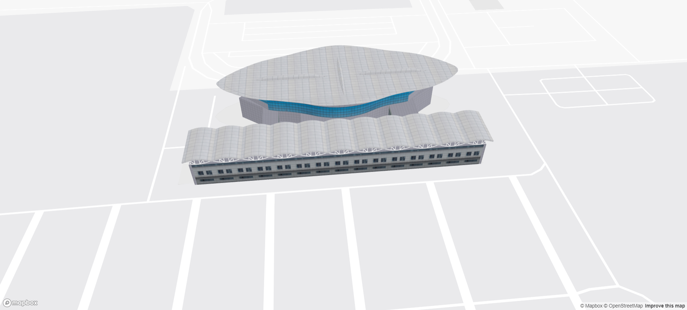

# Threebox

> NPM 包：https://www.npmjs.com/package/@enfexia/threebox-plugin
>
> Github 文档：https://github.com/jscastro76/threebox/blob/master/docs/Threebox.md
>
> Mapbox 官网示例：https://docs.mapbox.com/mapbox-gl-js/example/add-3d-model-threebox/

Threebox 可以用来在 Mapbox 中添加 Three.js 的三维场景，可以创建一个实现了 CustomLayerInterface 的 Mapbox 自定义图层。

## 安装

安装 @enfexia/threebox-plugin 插件：

```shell
pnpm i @enfexia/threebox-plugin
```

在项目中导入 Threebox 对象：

```js
import { Threebox } from "@enfexia/threebox-plugin";
```

## 基本使用

```ts
// @ts-nocheck
import { Threebox } from "@enfexia/threebox-plugin";

export class useMap3dModelRender {
  private activeMap: any;

  constructor(map: any) {
    this.activeMap = map;

    this.init3dModel();
  }

  /**
   * @description 初始化 3d 模型
   */
  init3dModel() {
    this.activeMap.on("style.load", () => {
      this.activeMap.addLayer({
        id: "custom-threebox-model",
        type: "custom",
        renderingMode: "3d",
        onAdd: (map, gl) => {
          // tb 属性必须挂载到 window 上，因为 Threebox 内部会从 window 中获取它
          window.tb = new Threebox(map, gl, {
            defaultLights: true
          });

          const options = {
            obj: "/model/terminal.glb",
            type: "gltf",
            scale: { x: 1.6, y: 2, z: 1.6 },
            units: "meters",
            rotation: { x: 90, y: -90, z: 0 },
            adjustment: { x: 0.3, y: 0.5, z: 0 }
          };

          tb.loadObj(options, model => {
            model.setCoords([118.78355380411114, 37.50484242549551]);
            model.setRotation({ x: 0, y: 0, z: 183 });
            tb.add(model);
          });
        },
        render: (gl, matrix) => {
          tb.update();
        }
      });
    });
  }
}
```



## tb 参数

|          参数          |  类型   |                         描述                          |
| :--------------------: | :-----: | :---------------------------------------------------: |
|     defaultLights      | boolean |        默认的灯光，为 false 的话，模型会为黑色        |
| enableSelectingObjects | boolean | 模型是否可被选中，当使用下方的三个属性时，必须为 true |
| enableDraggingObjects  | boolean |     模型是否可被拖动，按住 shift + 鼠标左键 拖动      |
| enableRotatingObjects  | boolean | 模型是否可被拉升 z 轴高度，按住 ctrl + 鼠标左键 拉升  |
|     enableTooltips     | boolean |                是否添加模型的提示标签                 |

## options 参数

| 参数       | 类型                              | 描述                                     |
| ---------- | --------------------------------- | ---------------------------------------- |
| obj        | string                            | obj、glb、gltf、fbx、dae 文件的 url 路径 |
| type       | string，可选：mtl、gltf、fbx、dae | 加载模型的类型                           |
| scale      | number 或 {x, y, z}               | 模型在三个轴上的缩放比例                 |
| units      | string，可选：scene、meters       | 推荐使用 meters，更精确                  |
| rotation   | number 或 {x, y, z}               | 模型在三个轴上的旋转角度                 |
| adjustment | {x, y, z}                         | 模型在三个轴上的位置信息                 |
| feature    | geojson 数据                      | 存放模型相关的 properties 属性           |
