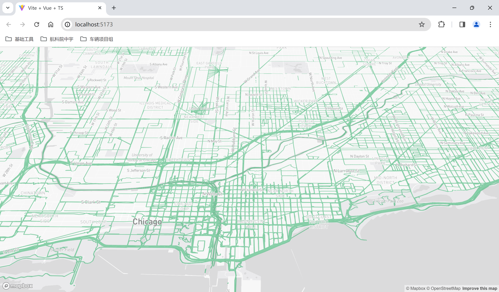

# 练习案例

## 添加 raster 数据

```vue
<template>
	<div id="map"></div>

	<div class="button-container">
    <button
      v-for="rasterLayer in BasicRasterLayerOption"
      @click="toggleMapStyle(rasterLayer.Name)"
    >
      {{ rasterLayer.Title }}
    </button>
  </div>
</template>

<script setup lang="ts">
  import mapboxgl from "mapbox-gl";
  import { onMounted } from "vue";

  mapboxgl.accessToken =
    "pk.eyJ1IjoiNzc5MjIiLCJhIjoiY2x1NGFtd2lqMDEwNTJrbnZ2dmhyY2l6MCJ9.ocEZHZuz7WwQWKTvGpQZqA";

  const BasicRasterLayerOption = [
    {
      Name: "none",
      Title: "默认地图",
      LayerUrl: []
    },
    {
      Name: "image",
      Title: "影像地图",
      LayerUrl: [
        "https://gac-geo.googlecnapps.cn/maps/vt?lyrs=s&x={x}&y={y}&z={z}"
      ]
    },
    {
      Name: "dark",
      Title: "暗色地图",
      LayerUrl: [
        "https://tiles.stadiamaps.com/tiles/alidade_smooth_dark/{z}/{x}/{y}.png?api_key=7e4327f7-a8df-4b7f-a8bb-31a50030718c"
      ]
    },
    {
      Name: "terrain",
      Title: "地形地图",
      LayerUrl: [
        "https://tiles.stadiamaps.com/tiles/stamen_terrain/{z}/{x}/{y}.png?api_key=7e4327f7-a8df-4b7f-a8bb-31a50030718c"
      ]
    }
  ];

  let map: any;
  onMounted(() => {
    map = new mapboxgl.Map({
      container: "map",
      style: "mapbox://styles/mapbox/light-v11",
      center: [114, 30],
      zoom: 2,
      attributionControl: false
    });

    map.on("load", () => {
      map.setFog({
        color: "rgb(186, 210, 235)",
        "high-color": "#fff",
        "horizon-blend": 0.02,
        "space-color": "rgb(11, 11, 25)",
        "star-intensity": 0.6
      });
    });
  });

  /**
 * @description 切换地图样式
 * @param {string} basicRasterLayerName 地图样式名称
 */
  function toggleMapStyle(basicRasterLayerName: string) {
    if (basicRasterLayerName === "") return;
    if (map.getLayer("BaseMapRasterLayer")) map.removeLayer("BaseMapRasterLayer");
    if (map.getSource("BaseMapRasterSource")) map.removeSource("BaseMapRasterSource");

    const BaseMapRasterSource = {
      type: "raster",
      tiles: BasicRasterLayerOption.find(o => o.Name === basicRasterLayerName)?.LayerUrl,
      tileSize: 256
    };

    if (BaseMapRasterSource.tiles?.length === 0) return;
    map.addSource("BaseMapRasterSource", BaseMapRasterSource);
    map.addLayer({
      id: "BaseMapRasterLayer",
      type: "raster",
      source: "BaseMapRasterSource",
      layout: {
        visibility: "visible"
      }
    });
  }
</script>

<style scoped>
  .button-container {
    position: absolute;
    top: 20px;
    left: 50px;
  }
  .button-container button {
    width: 100px;
    height: 40px;
    border-radius: 5px;
    border: none;
    margin-right: 10px;
    cursor: pointer;
  }
</style>
```


## 添加 vector 数据

```vue
<template>
	<div id="map"></div>
</template>

<script setup lang="ts">
  import mapboxgl from "mapbox-gl";
  import { onMounted } from "vue";

  mapboxgl.accessToken =
    "pk.eyJ1IjoiNzc5MjIiLCJhIjoiY2x1NGFtd2lqMDEwNTJrbnZ2dmhyY2l6MCJ9.ocEZHZuz7WwQWKTvGpQZqA";

  onMounted(() => {
    const map = new mapboxgl.Map({
      container: "map",
      style: "mapbox://styles/mapbox/light-v11",
      zoom: 10,
      center: [-87.622088, 41.878781]
    });

    map.on("load", () => {
      map.addSource("mapillary", {
        type: "vector",
        tiles: [
          "https://tiles.mapillary.com/maps/vtp/mly1_public/2/{z}/{x}/{y}?access_token=MLY|4142433049200173|72206abe5035850d6743b23a49c41333"
        ],
        minzoom: 6,
        maxzoom: 14
      });

      map.addLayer(
        {
          id: "mapillary",
          type: "line",
          source: "mapillary",
          "source-layer": "sequence",
          layout: {
            "line-cap": "round",
            "line-join": "round"
          },
          paint: {
            "line-opacity": 0.6,
            "line-color": "rgb(53, 175, 109)",
            "line-width": 2
          }
        },
        "road-label-simple"
      );
    });
  });
</script>
```

