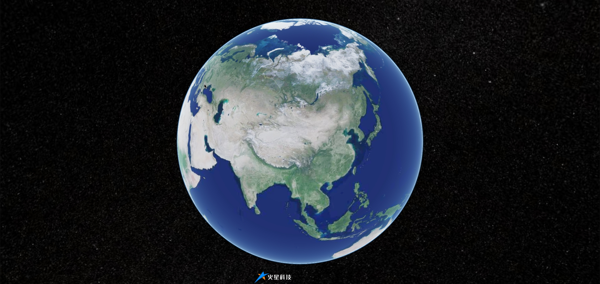

# 基础入门

Mars3D 是火星科技研发的一款网页端二三维 GIS 可视化地图平台。支持三维场景可视化、数据标绘与管理、场景与数据特效、场景工具、空间分析能力等功能。

::: navCard 3
```yaml
- name: 功能示例
  desc: Mars3D官方 vue 版本的功能示例
  link: https://mars3d.cn/example.html
  img: http://mars3d.cn/docs/img/logo.png
  badge: Mars3D
  badgeType: tip
  
- name: API文档
  desc: Mars3D官方API文档，融合了Cesium API文档
  link: https://mars3d.cn/api/Map.html
  img: http://mars3d.cn/docs/img/logo.png
  badge: Mars3D
  badgeType: tip
  
- name: 三维地理信息系统
  desc: Mars3D通用三维地理信息系统
  link: http://mars3d.cn/project/es5/index.html
  img: http://mars3d.cn/docs/img/logo.png
  badge: Mars3D
  badgeType: tip
```
:::


## NPM 安装

在 Node 环境下使用 npm 或 pnpm 等方式来安装 mars3d 包：

```shell [pnpm]
# 安装 mars3d 主库，其中 mars3d-cesium @turf/turf 为依赖库
pnpm add mars3d mars3d-cesium @turf/turf

# 安装 mars3d 插件，处理静态文件拷贝处理
pnpm add vite-plugin-mars3d --save-dev

# 安装 mars3d 拓展插件（按需安装）
pnpm add mars3d-space --save
```

在 `main.ts` 中引入 mars3d 样式文件，并在 `vite.config.ts`  修改项目配置：

::: code-group

```typescript [main.ts]
// 引入入 mars3d 样式文件
import "mars3d/mars3d.css";
import "mars3d-cesium/Build/Cesium/Widgets/widgets.css";
```

:::

::: code-group

```typescript [vite.config.ts]
import { mars3dPlugin } from "vite-plugin-mars3d";

export default defineConfig({
  plugins: [
    mars3dPlugin(),
  ],
});
```

:::


## 静态安装

下载 3 个 SDK 静态资源包，其中 mars3d-cesium 和 turf 库是依赖库。

::: navCard 3

```yaml
- name: mars3d主库
  desc: 下载Mars3D 3.10.11版本的静态文件包
  link: https://registry.npmjs.org/mars3d/-/mars3d-3.10.11.tgz
  img: http://mars3d.cn/docs/img/logo.png
  badge: 3.10.11
  badgeType: tip
  
- name: mars3d-cesium库
  desc: 下载Mars3D Cesium 1.136版本的静态文件包
  link: https://registry.npmjs.org/mars3d-cesium/-/mars3d-cesium-1.136.0.tgz
  img: https://cesium.com/logo-kit/cesium/Cesium_logo_only.svg
  badge: 1.136
  badgeType: tip

- name: turf库
  desc: 下载Turf 7.3.1版本的静态文件包
  link: https://registry.npmjs.org/@turf/turf/-/turf-7.3.1.tgz
  img: https://turfjs.org/img/logo.svg
  badge: 7.3.1
  badgeType: tip
```

:::

下载完成后，将其拷贝至项目 `public/lib` 目录下，并在 `index.html` 中引入依赖：

```html
<head>
  <meta charset="UTF-8">
  <meta name="viewport" content="width=device-width, initial-scale=1.0">
  <title>Mars3d案例</title>

  <!-- 引入 cesium 包 -->
  <link href="/lib/cesium/Widgets/widgets.css" rel="stylesheet" type="text/css"/>
  <script src="/lib/cesium/Cesium.js" type="application/javascript"></script>
  <!-- 引入 turf 包 -->
  <script src="/lib/turf/turf.min.js"></script>
  <!-- 引入 mars3d 包 -->
  <link href="/lib/mars3d/mars3d.css" rel="stylesheet" type="text/css"/>
  <script src="/lib/mars3d/mars3d.js" type="application/javascript"></script>
</head>
```


## 入门示例

> [!TIP] 提示
>
> 在要呈现 Mars3D 地图的组件中，定义 div 地图容器，并通过 CSS 设置容器的宽高（也可以使用 Mars3D 内置的样式 `mars3d-container`）。

```vue {2}
<template>
	<div id="mars3dContainer" class="mars3d-container"></div>
</template>

<script setup lang="ts">
  import { onMounted } from "vue";
  import * as mars3d from "mars3d";

  onMounted(() => {
    // 关闭控制台调试模式
    mars3d.Log.hasInfo(false);

    const map = new mars3d.Map("mars3dContainer", {
      basemaps: [
        {
          show: true,
          type: "tdt",
          name: "天地图",
          layer: "img_d",
        },
      ],
    });
  });
</script>
```


