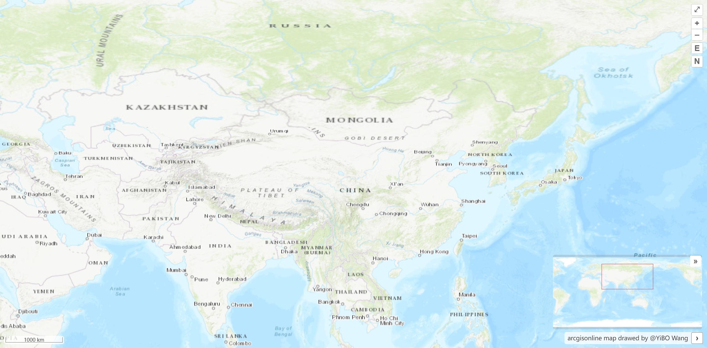

# 地图控件

## 导航控件

```js {19-26}
import { onMounted, ref } from "vue";
import "ol/ol.css";
import { Map, View } from "ol";
import TileLayer from "ol/layer/Tile";
import XYZ from "ol/source/XYZ";
import { defaults, ZoomToExtent } from "ol/control";

const raster = new TileLayer({
  source: new XYZ({
    url: "http://server.arcgisonline.com/ArcGIS/rest/services/World_Topo_Map/MapServer/tile/{z}/{y}/{x}"
  })
});

const controls = defaults({
  attributionOptions: {
    collapsible: false
  }
});
controls.extend([
  new ZoomToExtent({
    extent: [
      100.3730783763458, 37.26983042156971, 104.34617688289927,
      38.60850487099091
    ]
  })
]);

onMounted(() => {
  new Map({
    target: "map",
    layers: [raster],
    view: new View({
      projection: "EPSG:4326",
      center: [102.7362, 38.0249],
      zoom: 5
    }),
    controls: controls
  });
});
```

调整控件样式，使其位于右上角：

```css
/* 导航控件 */
:deep(.ol-zoom) {
  top: 35px;
  right: 8px;
  bottom: auto;
  left: auto;
}
/* E 控件 */
:deep(.ol-zoom-extent) {
  top: 85px;
  left: auto;
  right: 8px;
  bottom: auto;
}
```


## 比例尺控件

```js
import { ScaleLine } from "ol/control";

controls.extend([new ScaleLine()]);
```


## 全屏控件

```js
import { FullScreen } from "ol/control";

controls.extend([new FullScreen()]);
```


## 鹰眼控件

```js
import { OverviewMap } from "ol/control";

controls.extend([
  new OverviewMap({
    className: "ol-overviewmap ol-custom-overviewmap",
    layers: [
      new TileLayer({
        source: new XYZ({
          url: "http://server.arcgisonline.com/ArcGIS/rest/services/World_Topo_Map/MapServer/tile/{z}/{y}/{x}"
        })
      })
    ],
    collapseLabel: "\u00BB",
    label: "\u00AB",
    collapsed: false
  })
]);
```

调整控件样式，使其位于右下角：

```css
<style scoped>
:deep(.ol-custom-overviewmap),
:deep(.ol-custom-overviewmap.ol-uncollapsible) {
  bottom: auto;
  left: auto;
  right: 10px;
  top: 10px;
}

:deep(.ol-custom-overviewmap:not(.ol-collapsed)) {
  border: 1px solid #fff;
}

:deep(.ol-custom-overviewmap .ol-overviewmap-map) {
  border: none;
  width: 300px;
}

:deep(.ol-custom-overviewmap .ol-overviewmap-box) {
  border: 1px solid rgb(255, 28, 28);
}

:deep(.ol-custom-overviewmap:not(.ol-collapsed) button) {
  bottom: auto;
  left: auto;
  right: 1px;
  top: 1px;
}

:deep(.ol-rotate) {
  top: 170px;
  right: 0;
}
</style>
```


## 自定义控件

自定义控件需要继承 `Controls` 类：

::: code-group

```ts [useRotateNorthControl.ts]
import { Control } from "ol/control";

export class RotateNorthControl extends Control {
  constructor(map: any, options: Options) {
    const div = document.createElement("div");
    div.className = "rotate-north ol-unselectable ol-control";
    div.style.top = "112px";
    div.style.right = "8px";
    div.title = "Rotate to North";
    const button = document.createElement("button");
    button.innerHTML = "N";
    div.appendChild(button);

    super({
      element: div,
      target: options.target
    });

    button.addEventListener("click", this.handleRotateNorth.bind(this));
  }

  handleRotateNorth() {
    const map = this.getMap();
    if (map) {
      map.getView().setRotation(0);
    }
  }
}

interface Options {
  target: string | HTMLElement;
  [propName: string]: any;
}
```

```js [Map.vue]
import { RotateNorthControl } from "../utils/useControls";

onMounted(() => {
  const map = new Map({
    target: "map",
    layers: [raster],
    view: new View({
      projection: "EPSG:4326",
      center: [102.7362, 38.0249],
      zoom: 5,
      rotation: (Math.PI / 180) * 90
    }),
    controls: controls
  });

  controls.extend([new RotateNorthControl(map, { target: "map" })]);
});
```

:::



