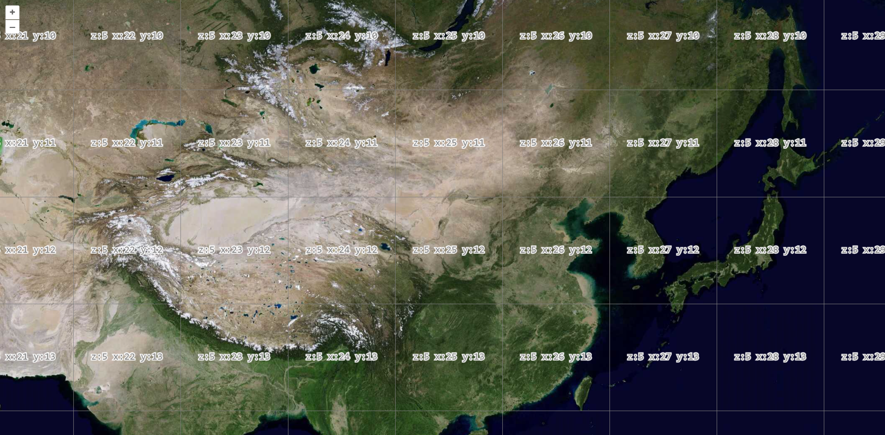

# 影像地图

## OSM

OSM 地图指的是 OpenStreenMap ，它是 openlayers 默认的底图。

```js
import { onMounted } from "vue";
import "ol/ol.css";
import { Map, View } from "ol";
import TileLayer from "ol/layer/Tile";
import { OSM } from "ol/source";

const osm = new TileLayer({
  source: new OSM({
    maxZoom: 18,
    attributions: "OSM attributions"
  })
});

onMounted(() => {
  new Map({
    target: "map",
    layers: [osm],
    view: new View({
      projection: "EPSG:4326",
      center: [102.7362, 38.0249],
      zoom: 5
    })
  });
});
```


## ArcGIS

```js {17,26}
import { onMounted } from "vue";
import "ol/ol.css";
import { Map, View } from "ol";
import TileLayer from "ol/layer/Tile";
import { XYZ } from "ol/source";

const raster = new TileLayer({
  source: new XYZ({
    url: "http://server.arcgisonline.com/ArcGIS/rest/services/World_Topo_Map/MapServer/tile/{z}/{y}/{x}",
    attributions: "ArcGISLayers attributions"
  })
});

onMounted(() => {
  const map = new Map({
    target: "map",
    layers: [raster], // 初始化时添加图层
    view: new View({
      projection: "EPSG:4326",
      center: [102.7362, 38.0249],
      zoom: 5
    })
  });

  // 运行时添加图层
  // map.addLayer(raster);
});
```


## BingMap

使用 [BingMaps](https://www.bingmapsportal.com/Application#) 之前需要去官网申请 key，注意申请类型为 Website 的 key，否则地图不显示。

```js
import { onMounted } from "vue";
import "ol/ol.css";
import { Map, View } from "ol";
import TileLayer from "ol/layer/Tile";
import { BingMaps } from "ol/source";

// BingMaps 提供的地图
var styles = ["Road", "RoadOnDemand", "Aerial", "AerialWithLabels", "collinsBart", "ordnanceSurvey"];

const raster = new TileLayer({
  source: new BingMaps({
    key: "AuTngMwN4lNgKFXy91uWt7eZjolIRsky9u2E3E9z6W7ru6b-zVvKtwz0n9ZSaD7i",
    imagerySet: "Road"
  })
});

onMounted(() => {
  new Map({
    target: "map",
    layers: [raster],
    view: new View({
      projection: "EPSG:4326",
      center: [102.7362, 38.0249],
      zoom: 5
    })
  });
});
```


## 谷歌地图

```js
import { onMounted } from "vue";
import "ol/ol.css";
import { Map, View } from "ol";
import TileLayer from "ol/layer/Tile";
import { XYZ } from "ol/source";

const raster = new TileLayer({
  source: new XYZ({
    url: "http://www.google.cn/maps/vt?lyrs=m@189&gl=cn&x={x}&y={y}&z={z}",
    maxZoom: 18,
    minZoom: 5,
    attributions: "google map attributions"
  })
});

onMounted(() => {
  new Map({
    target: "map",
    layers: [raster],
    view: new View({
      projection: "EPSG:4326",
      center: [102.7362, 38.0249],
      zoom: 5
    })
  });
});
```


## 天地图

加载天地图的方式和 [加载谷歌地图](#谷歌地图) 的方式一样，但使用 [天地图](https://console.tianditu.gov.cn/api/key) 之前需要去官网申请 key，注意申请类型为 浏览器端 的 key，否则地图不显示。

```js
const raster = new TileLayer({
  className: "tdtWebMapTile",
  source: new XYZ({
    url: "http://t0.tianditu.com/DataServer?T=img_w&x={x}&y={y}&l={z}&tk=da7665c4b8e7593a2cb6bd910400a71f",
    maxZoom: 18,
    minZoom: 8
  })
});
```


## 高德地图

加载高德地图的方式和 [加载谷歌地图](#谷歌地图) 的方式一样，只需要改变更改 url 地址为高德地图即可。

```js
const raster = new TileLayer({
  source: new XYZ({
    url: "http://wprd0{1-4}.is.autonavi.com/appmaptile?lang=zh_cn&size=1&style=7&x={x}&y={y}&z={z}",
    maxZoom: 18,
    minZoom: 5,
    attributions: "gaode map attributions"
  })
});
```


## 百度地图

使用 [百度地图开放平台](https://lbsyun.baidu.com/apiconsole/key#/home) 之前也需要去官网申请 key，注意申请类型为 浏览器端 的 key，否则地图不显示。

```js
import { onMounted } from "vue";
import "ol/ol.css";
import { Map, View } from "ol";
import TileLayer from "ol/layer/Tile";
import { TileImage } from "ol/source";
import { TileGrid } from "ol/tilegrid";

// 地图分辨率
const resolutions: number[] = [];
for (let i = 0; i < 19; i++) {
  resolutions[i] = Math.pow(2, 18 - i);
}
const tileGrid = new TileGrid({
  origin: [102.7362, 38.0249],
  resolutions: resolutions,
  tileSize: 256
});

// 拼接百度地图地址
const baidu_source = new TileImage({
  projection: "EPSG:3857",
  tileGrid: tileGrid,
  attributions: "baidu_map attributions",
  tileUrlFunction: tileCoord => {
    const z = tileCoord[0];
    const x = tileCoord[1];
    const y = -tileCoord[2] - 1;

    const urlTemplate = `http://online1.map.bdimg.com/onlinelabel/?qt=tile&x=${x}&y=${y}&z=${z}&styles=pl&udt=20190½&scaler=1&p=1&ak=ov9KnLQtzHp5IxX9sdUvas1LCxS6XtSL`;
    return urlTemplate;
  }
});

onMounted(() => {
  new Map({
    target: "map",
    layers: [
      new TileLayer({
        source: baidu_source
      })
    ],
    view: new View({
      projection: "EPSG:4326",
      center: [102.7362, 38.0249],
      zoom: 5
    })
  });
});
```


## 网格瓦片

```js
import { onMounted } from "vue";
import "ol/ol.css";
import { Map, View } from "ol";
import TileLayer from "ol/layer/Tile";
import { TileDebug, XYZ } from "ol/source";

const TiandituSource = new XYZ({
  wrapX: false,
  url: "http://t0.tianditu.com/DataServer?T=img_w&x={x}&y={y}&l={z}&tk=da7665c4b8e7593a2cb6bd910400a71f"
});

onMounted(() => {
  new Map({
    target: "map",
    layers: [
      new TileLayer({
        source: TiandituSource
      }),
      new TileLayer({
        source: new TileDebug({
          projection: "EPSG:3857",
          tileGrid: TiandituSource.getTileGrid() || undefined
        })
      })
    ],
    view: new View({
      center: [102.7362, 38.0249],
      zoom: 5
    })
  });
});
```
