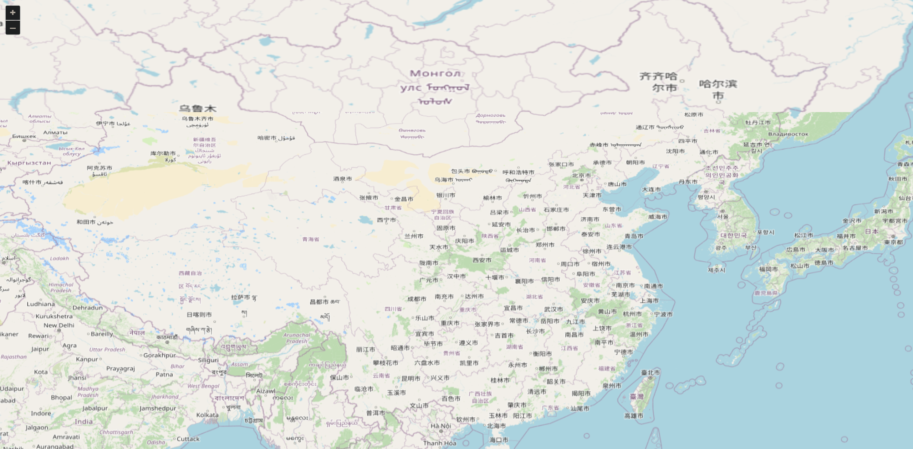

# 快速入门

> NPM 包：https://www.npmjs.com/package/ol
>
> Github：https://github.com/openlayers/openlayers

[OpenLayers](https://openlayers.org/) 是一个强大的开源 JavaScript 地图库，专注于提供可嵌入网页的交互式地图体验。


## 安装

安装 openlayers 包：

```shell
pnpm i ol
```


## 基础示例

```vue
<template>
  <div id="map"></div>
</template>

<script setup lang="ts">
import { onMounted } from "vue";
import "ol/ol.css";
import { Map, View } from "ol";
import TileLayer from "ol/layer/Tile";
import XYZ from "ol/source/XYZ";

onMounted(() => {
  const map = new Map({
    target: "map",
    layers: [
      new TileLayer({
        source: new XYZ({
          url: "https://tile.openstreetmap.org/{z}/{x}/{y}.png"
        })
      })
    ],
    view: new View({
      projection: "EPSG:4326",
      center: [102.7362, 38.0249],
      zoom: 5,
      minZoom: 4,
      maxZoom: 15,
      rotation: (Math.PI / 180) * 90 // 弧度制
    })
  });
});
</script>
```


