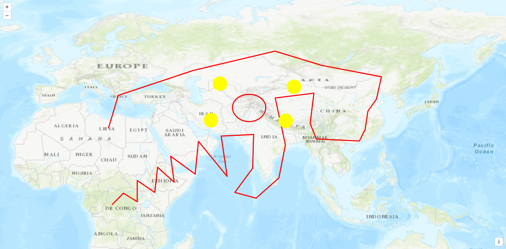

# 矢量地图

## geojson

```typescript
import { onMounted } from "vue";
import "ol/ol.css";
import { Map, View } from "ol";
import { Vector as layerVector } from "ol/layer";
import { Vector as sourceVector } from "ol/source";
import GeoJSON from "ol/format/GeoJSON.js";

onMounted(() => {
  const map = new Map({
    target: "map",
    layers: [
      new layerVector({
        source: new sourceVector({
          url: "https://geo.datav.aliyun.com/areas_v3/bound/geojson?code=100000_full",
          format: new GeoJSON(),
        })
      })
    ],
    view: new View({
      projection: "EPSG:4326",
      center: [102.7362, 38.0249],
      zoom: 5
    })
  });
});
```


## kml

```js {16-21}
import { onMounted } from "vue";
import "ol/ol.css";
import { Map, View } from "ol";
import TileLayer from "ol/layer/Tile";
import XYZ from "ol/source/XYZ";
import VectorLayer from "ol/layer/Vector";
import VectorSource from "ol/source/Vector";
import KML from "ol/format/KML";

const raster = new TileLayer({
  source: new XYZ({
    url: "http://t0.tianditu.com/DataServer?T=img_w&x={x}&y={y}&l={z}&tk=da7665c4b8e7593a2cb6bd910400a71f"
  })
});

const vector = new VectorLayer({
  source: new VectorSource({
    url: "/kml/bikeRide.kml",
    format: new KML()
  })
});

onMounted(() => {
  new Map({
    target: "map",
    layers: [raster, vector],
    view: new View({
      center: [102.7362, 38.0249],
      zoom: 5
    })
  });
});
```


## gpx

GPX（GPS eXchange Format）是一种常用的地理信息交换格式，用于存储和传输 GPS 数据。它包含了一系列的位置点，每个位置点都包括经度、纬度和时间等信息。

其他数据类型转 gpx 类型的网址：https://products.aspose.app/gis/conversion/kml-to-gpx

```js {50-52}
import { onMounted } from "vue";
import "ol/ol.css";
import { Map, View } from "ol";
import GPX from "ol/format/GPX";
import TileLayer from "ol/layer/Tile";
import VectorLayer from "ol/layer/Vector";
import VectorSource from "ol/source/Vector";
import XYZ from "ol/source/XYZ";
import { Circle, Fill, Stroke, Style } from "ol/style";

const raster = new TileLayer({
  source: new XYZ({
    url: "http://server.arcgisonline.com/ArcGIS/rest/services/World_Topo_Map/MapServer/tile/{z}/{y}/{x}",
    attributions: "ArcGISLayers attributions"
  })
});

const style = {
  Point: new Style({
    image: new Circle({
      fill: new Fill({
        color: "rgba(255,255,0)"
      }),
      radius: 20,
      stroke: new Stroke({
        color: "#ff0",
        width: 1
      })
    })
  }),
  LineString: new Style({
    stroke: new Stroke({
      color: "#f00",
      width: 3
    })
  }),
  MultiLineString: new Style({
    stroke: new Stroke({
      color: "#0f0",
      width: 3
    })
  })
};

const vector = new VectorLayer({
  source: new VectorSource({
    url: "/gpx/geojson.gpx",
    format: new GPX()
  }),
  style: function (feature) {
    return style[feature.getGeometry().getType()];
  }
});

onMounted(() => {
  new Map({
    target: "map",
    layers: [raster, vector],
    view: new View({
      projection: "EPSG:4326",
      center: [102.7362, 38.0249],
      zoom: 5
    })
  });
});
```
