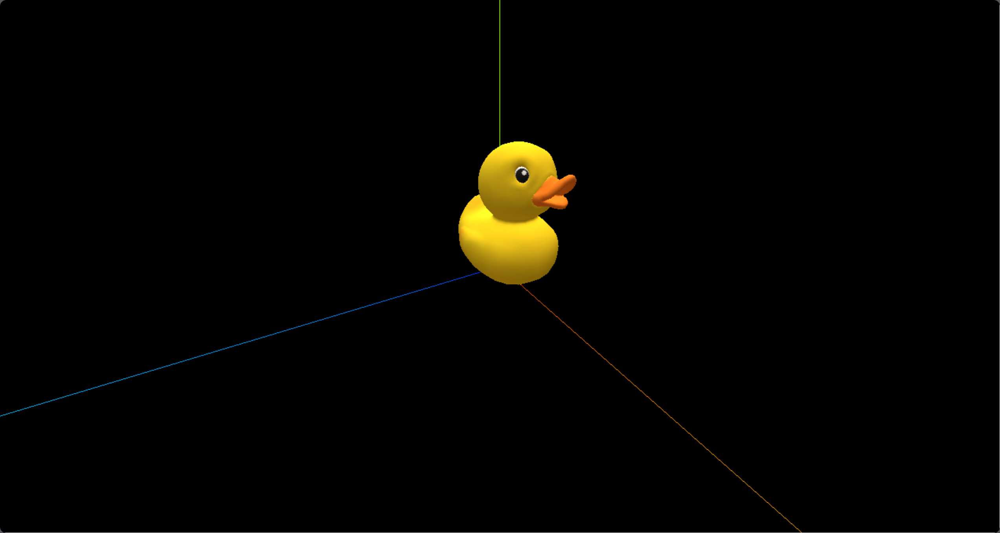
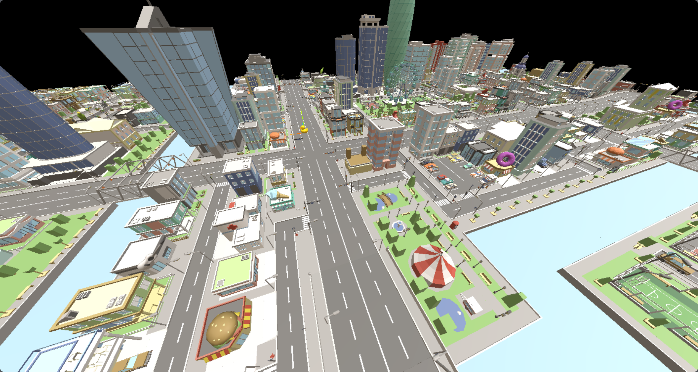

# GLTF加载器

glTF 是一种开放格式的规范，用于更高效地传输、加载3D内容。该类文件以 JSON（.gltf）格式或二进制（.glb）格式提供，外部文件存储贴图（.png、.jpg）和额外的二进制数据（.bin）。

一个 glTF 组件可传输一个或多个场景，包括网格、材质、贴图、蒙皮、骨架、变形目标、动画、灯光以及摄像机。


## 基本使用

```js
// 导入 GLTFLoader
import { GLTFLoader } from 'three/addons/loaders/GLTFLoader.js';
```

```js
// 加载 .glb 模型
const loader = new GLTFLoader()
loader.load("/model/Duck.glb", gltf => {
  scene.add(gltf.scene)
})
```

加载完成以后，我们可以看到模型是纯黑色的，这是因为没有为模型添加 灯光，灯光可以有平行光、全景光等等，但是我们这里使用 环境贴图 来模拟全景光。

```js
// 加载环境贴图，模拟全景光（四面八方照射过来的光）
const rgbeLoader = new RGBELoader()
rgbeLoader.load("/texture/Alex_Hart-Nature_Lab_Bones_2k.hdr", envMap => {
  envMap.mapping = THREE.EquirectangularReflectionMapping
  scene.environment = envMap
})
```




## DRACOLoader库

[DRACOLoader](https://threejs.org/docs/index.html?q=draco#examples/zh/loaders/DRACOLoader) 是一个用于压缩和解压缩三维模型及点云数据的图形库。

当我们想要加载被 压缩过的 gltf 模型时，就可以使用 DRACOLoader库。

```js
import { DRACOLoader } from 'three/addons/loaders/DRACOLoader.js';
```

```js
gltfLoader.load("/model/city.glb", gltf => {
  scene.add(gltf.scene)
})

// 创建DRACOLoader实例
const dracoLoader = new DRACOLoader()
// 设置DRACO解码库文件
dracoLoader.setDecoderPath("/node_modules/three/examples/jsm/libs/draco/")
// 将创建的dracoLoader实例绑定到gltfLoader上，使得gltfLoader能够处理DRACO压缩的gltf模型文件
gltfLoader.setDRACOLoader(dracoLoader)
```




