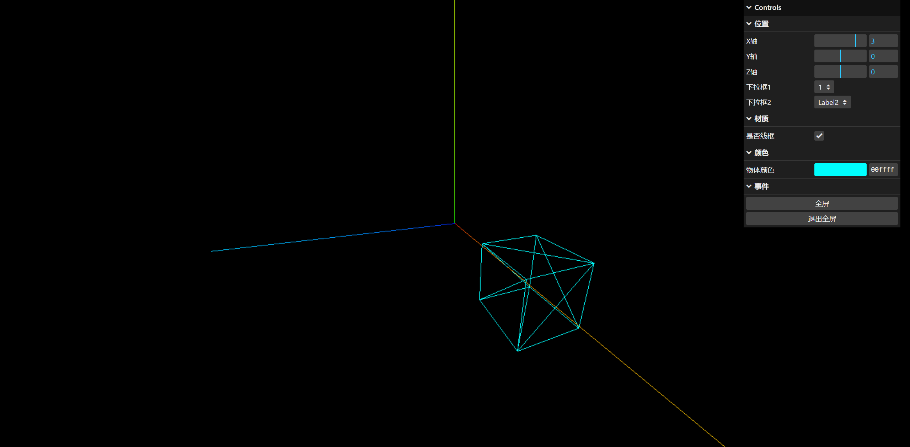

# lil-gui

在 Three.js 中，[lil-gui](https://github.com/georgealways/lil-gui) 是一个用于创建用户界面（UI）控件的库。

lil-gui 提供了各种控件，如复选框、按钮、文本字段、数字字段、滑块、下拉菜单和颜色选择器，使用户能够动态地调整和控制 Three.js 场景中的元素。

```JavaScript
// 引入
import { GUI } from "three/examples/jsm/libs/lil-gui.module.min.js"

// 创建 GUI 控制器
const gui = new GUI()
```


## 复选框

以 cube 物体的 `wireframe` 线框属性作为示例：

```JavaScript
const geometry = new THREE.BoxGeometry(1, 1, 1)
const material = new THREE.MeshBasicMaterial({ color: 0x00ffff })
// 开启物体线框模式
material.wireframe = true
const cube = new THREE.Mesh(geometry, material)
scene.add(cube)
```

```JavaScript
// 创建 folder 组
const boolGruop = gui.addFolder("材质")
boolGruop.add(material, "wireframe").name("是否线框")
```


## 按钮

以 全屏/退出全屏 作为按钮（函数）的示例：

```JavaScript
// 配置对象，更有利于管理
const object = {
  OpenFullScreen: function () {
    renderer.domElement.requestFullscreen()
  },
  ExitFullScreen: function () {
    document.exitFullscreen()
  }
}

// 创建 folder 组
const funGroup = gui.addFolder("事件")
funGroup.add(object, "OpenFullScreen").name("全屏")
funGroup.add(object, "ExitFullScreen").name("退出全屏")
```


## 滑块

以 cube 物体的 `position` 属性作为示例，位置滑块有 2 种方式可以创建：

```JavaScript
const geometry = new THREE.BoxGeometry(1, 1, 1)
const material = new THREE.MeshBasicMaterial({ color: 0x00ffff })
const cube = new THREE.Mesh(geometry, material)
// 物体默认位置
cube.position.set(3, 0, 0)
scene.add(cube)
```

```JavaScript
const object = {
  Position: cube.position,
}

const proGroup = gui.addFolder("位置")

// 方式1
// proGroup.add(object.Position, "x", -5, 5, 1).name("X轴")
// proGroup.add(object.Position, "y", -5, 5, 1).name("Y轴")
// proGroup.add(object.Position, "z", -5, 5, 1).name("Z轴")

// 方式2
proGroup.add(object.Position, "x").min(-5).max(5).step(1).name("X轴")
proGroup.add(object.Position, "y").min(-5).max(5).step(1).name("Y轴")
proGroup
  .add(object.Position, "z")
  .min(-5)
  .max(5)
  .step(1)
  .name("Z轴")
  .onChange(val => {
    console.log("onChange", val)
  })
  .onFinishChange(val => {
    console.log("onFinishChange", val)
  })
```

参数：

|参数|描述|
|-|-|
|min|最小值|
|max|最大值|
|step|步长|
|name|名称|
|onChange|当滑动滑块时，就会触发，会触发多次|
|onFinishChange|滑动滑块时，不会触发，只有滑动结束时才会触发一次|


## 下拉菜单

下拉菜单使用 数值 模拟效果，同样，下拉菜单也有两种方式可以创建。

```JavaScript
const object = {
  Number: 1,
}

// 方式1
proGroup.add(object, "Number", [0, 1, 2]).name("下拉框1")

// 方式2
proGroup.add(object, "Number", { Label1: 0, Label2: 1, Label3: 2 }).name("下拉框2")
```


## 颜色选择器

颜色选择器 与其他几个菜单的添加方式不一样，它需要使用 `addColor()` 方法实现。

:::warning :face_with_spiral_eyes: 疑惑

这里使用 object 和 array 两种方式该怎么设置颜色值呢？

:::

```JavaScript
const geometry = new THREE.BoxGeometry(1, 1, 1)
const material = new THREE.MeshBasicMaterial({ color: 0x00ffff }) // 默认颜色
const cube = new THREE.Mesh(geometry, material)
scene.add(cube)
```

```JavaScript
// 配置对象，下面的 4 种方式都可以实现颜色的变化
const object = {
  ColorFormats: {
    string: "0x00ffff",
    int: 0x00ffff,
    object: { r: 0, g: 255, b: 255 },
    array: [0, 255, 255]
  }
}

const colorGroup = gui.addFolder("颜色")
colorGroup
  .addColor(object.ColorFormats, "string")
  //.addColor(object.ColorFormats, "int")
  .name("物体颜色")
  .onChange(val => {
    cube.material.color.set(val)
  })
```


::: details 完整代码

```Vue
<script setup lang="ts">
import * as THREE from "three"
import { OrbitControls } from "three/addons/controls/OrbitControls.js"
import { GUI } from "three/examples/jsm/libs/lil-gui.module.min.js"

// 创建场景
const scene = new THREE.Scene()
// 创建透视摄像机
const camera = new THREE.PerspectiveCamera(95, window.innerWidth / window.innerHeight, 0.1, 1000)
camera.position.set(0, 0, 5)

// 创建渲染器，并设置大小尺寸
const renderer = new THREE.WebGLRenderer()
renderer.setSize(window.innerWidth, window.innerHeight)
document.body.appendChild(renderer.domElement)

// 创建一个立方体
const geometry = new THREE.BoxGeometry(1, 1, 1)
const material = new THREE.MeshBasicMaterial({ color: 0x00ffff })
material.wireframe = true
const cube = new THREE.Mesh(geometry, material)
cube.position.set(3, 0, 0)
scene.add(cube)

const axesHelper = new THREE.AxesHelper(5)
scene.add(axesHelper)

const controls = new OrbitControls(camera, renderer.domElement)
controls.enableDamping = true

const object = {
  Number: 1,
  ColorFormats: {
    string: "0x00ffff",
    int: 0x00ffff,
    object: { r: 0, g: 255, b: 255 },
    array: [0, 255, 255]
  },
  Position: cube.position,
  OpenFullScreen: function () {
    renderer.domElement.requestFullscreen()
  },
  ExitFullScreen: function () {
    document.exitFullscreen()
  }
}
// 创建 GUI 控制器
const gui = new GUI()
const proGroup = gui.addFolder("位置")
// 方式1
// proGroup.add(object.Position, "x", -5, 5, 1).name("X轴")
// proGroup.add(object.Position, "y", -5, 5, 1).name("Y轴")
// proGroup.add(object.Position, "z", -5, 5, 1).name("Z轴")
// 方式2
proGroup.add(object.Position, "x").min(-5).max(5).step(1).name("X轴")
proGroup.add(object.Position, "y").min(-5).max(5).step(1).name("Y轴")
proGroup
  .add(object.Position, "z")
  .min(-5)
  .max(5)
  .step(1)
  .name("Z轴")
  .onChange(val => {
    console.log("onChange", val)
  })
  .onFinishChange(val => {
    console.log("onFinishChange", val)
  })

proGroup.add(object, "Number", [0, 1, 2]).name("下拉框1")
proGroup.add(object, "Number", { Label1: 0, Label2: 1, Label3: 2 }).name("下拉框2")

const boolGruop = gui.addFolder("材质")
boolGruop.add(material, "wireframe").name("是否线框")

const colorGroup = gui.addFolder("颜色")
colorGroup
  .addColor(object.ColorFormats, "string")
  .name("物体颜色")
  .onChange(val => {
    cube.material.color.set(val)
  })

const funGroup = gui.addFolder("事件")
funGroup.add(object, "OpenFullScreen").name("全屏")
funGroup.add(object, "ExitFullScreen").name("退出全屏")

function animate() {
  requestAnimationFrame(animate)
  controls.update()
  renderer.render(scene, camera)
}
animate()
</script>
```



:::
