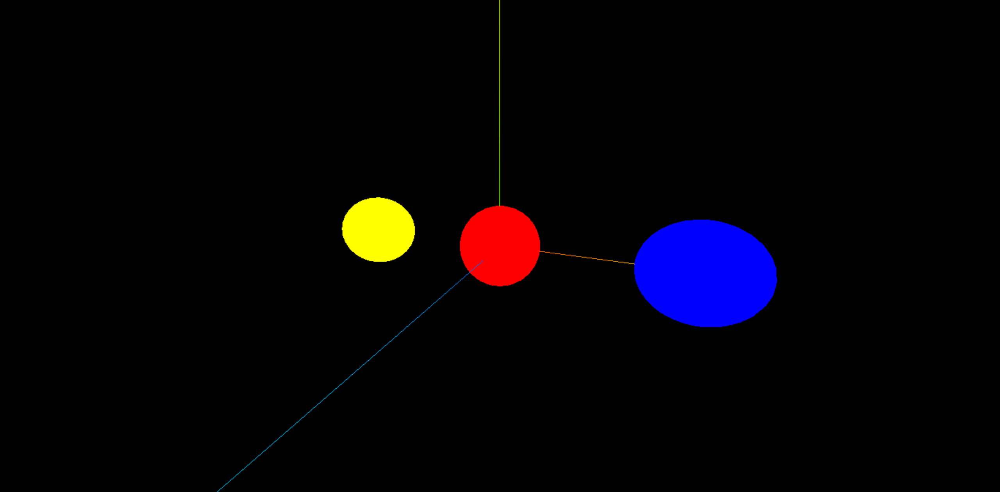

# 光线投射

[光线投射](https://threejs.org/docs/index.html?q=Raycaster#api/zh/core/Raycaster)（raycasting）主要用于进行鼠标拾取（在三维空间中计算鼠标移过了什么物体）。


基本使用：

```js
// 创建三个球体，x 坐标分别为 -4 0 4
const sphere1 = new THREE.Mesh(
  new THREE.SphereGeometry(1, 32, 16),
  new THREE.MeshBasicMaterial({
    color: 0xffff00
  })
)
sphere1.position.x = -4
scene.add(sphere1)

// ...
```

```js
const raycaster = new THREE.Raycaster()
const pointer = new THREE.Vector2()

window.addEventListener("click", e => {
  // 将鼠标位置归一化为设备坐标。x 和 y 方向的取值范围是 (-1 to +1)
  pointer.x = (e.clientX / window.innerWidth) * 2 - 1
  pointer.y = -(e.clientY / window.innerHeight) * 2 + 1

  // 通过摄像机和鼠标位置更新射线
  raycaster.setFromCamera(pointer, camera)
  // 获取与射线相交的物体
  const intersectObject = raycaster.intersectObjects([sphere1, sphere2, sphere3])

  if (intersectObject.length > 0) {
    // 三个球重叠的时候，只获取第一个物体
    const object = intersectObject[0].object as any
    // 如果已经选中，则取消选中
    if (object._isSelect) {
      object.material.color.set(object._originalColor)
      object._isSelect = false
      return
    }

    object._isSelect = true // 标识物体是否处于选中状态
    object._originalColor = object.material.color.getHex() // 标识物体原来的属性
    object.material.color.set(0xff0000)
  }
})
```

