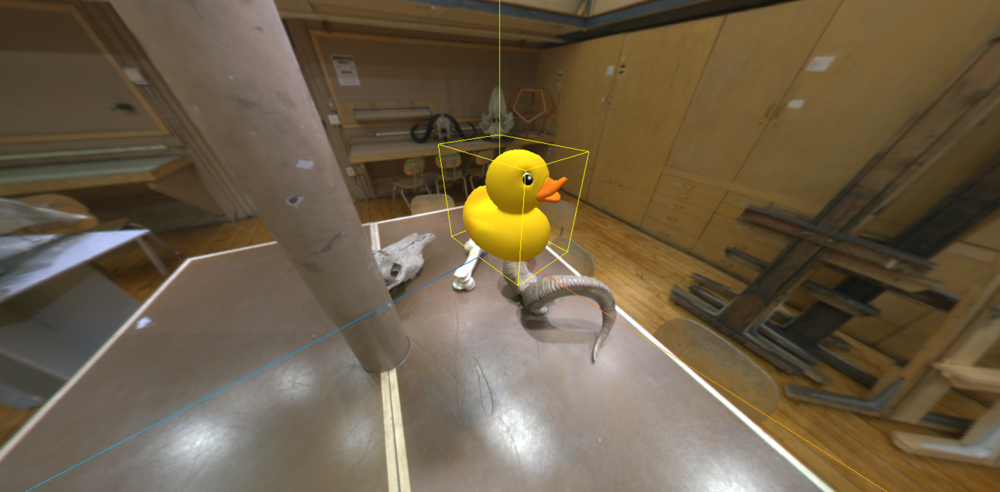
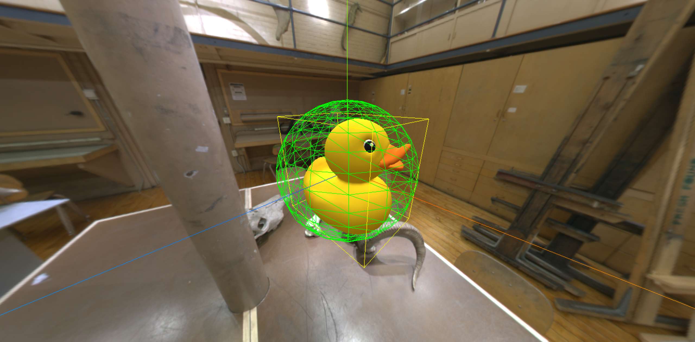
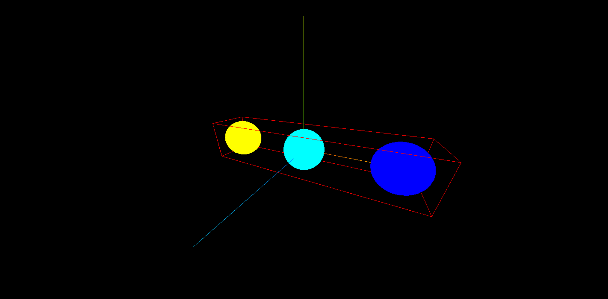

# 包围盒与世界矩阵

## 包围盒

[包围盒](https://threejs.org/docs/index.html?q=buffer#api/zh/core/BufferGeometry.boundingBox)（boundingBox）就是一个模型的 外边界矩形。可以通过 [`.computeBoundingSphere()`](https://threejs.org/docs/index.html?q=buffer#api/zh/core/BufferGeometry.computeBoundingSphere)

计算得到，默认值为 null。


下面的示例，添加 小黄鸭 模型到场景中：

```js
const gltfLoader = new GLTFLoader()
gltfLoader.load("/model/Duck.glb", model => {
  scene.add(model.scene)

  // 获取模型
  const duckMesh = model.scene.getObjectByName("LOD3spShape")
  const duckGeometry = duckMesh.geometry

  // 计算模型包围盒
  duckGeometry.computeBoundingBox()
  const box = duckGeometry.boundingBox

  // 创建包围盒辅助器
  const boxHelper = new THREE.Box3Helper(box, 0xffff00)
  scene.add(boxHelper)
})
```

此时，可以观察到小黄鸭有了包围盒，但是包围盒超级大，并不贴合于小黄鸭所占的体积，这是为什么呢？

原因：因为 小黄鸭模型被加载到场景中时，默认使用的是局部坐标系，它存在局部变换（如位置、缩放、平移等），而在计算包围盒时，没有应用几何体的变化，将其转换为世界坐标即可解决。


### 世界矩阵

[世界矩阵]()（World Matrix）是一个用于描述对象在世界坐标系中的位置、旋转和缩放的矩阵。


为了解决上述小黄鸭包围盒没有贴合模型的问题，我们可以使用 [`updateWorldMatrix()`](https://threejs.org/docs/index.html#api/zh/core/Object3D.updateWorldMatrix) 方法将局部坐标转换为世界矩阵，同时使用 [`applyMatrix4()`](https://threejs.org/docs/index.html#api/zh/core/Object3D.applyMatrix4) 方法为 包围盒box 应用世界坐标得以解决。

```js {7, 13}
const gltfLoader = new GLTFLoader()
gltfLoader.load("/model/Duck.glb", model => {
  scene.add(model.scene)

  // 获取模型
  const duckMesh = model.scene.getObjectByName("LOD3spShape")
  duckMesh.updateWorldMatrix(true, true)
  const duckGeometry = duckMesh.geometry

  // 计算模型包围盒
  duckGeometry.computeBoundingBox()
  const box = duckGeometry.boundingBox
  box.applyMatrix4(duckMesh.matrixWorld)

  // 创建包围盒辅助器
  const boxHelper = new THREE.Box3Helper(box, 0xffff00)
  scene.add(boxHelper)
})
```




### 设置中心点

默认情况下，小黄鸭是位于 X轴 所在平面之上的，我们可以通过 `center()` 方法，将其设置到中心点。

```js {2}
const duckGeometry = duckMesh.geometry
duckGeometry.center()
```


### 获取中心点坐标

使用 `box.getCenter()` 方法获取包围盒中心点坐标，注意该方法需要传递一个 空`new THREE.Vector3()`作为参数。

```js {5}
duckGeometry.computeBoundingBox()
const box = duckGeometry.boundingBox
box.applyMatrix4(duckMesh.matrixWorld)

const center = box.getCenter(new THREE.Vector3())
```


## 包围球

[包围球](https://threejs.org/docs/index.html#api/zh/core/BufferGeometry.boundingSphere) （boundingSphere）和包围盒一样，只是外观从正方体变味了球体。

```js
// 创建包围球
const duckSphere = duckGeometry.boundingSphere
// 应用世界矩阵
duckSphere.applyMatrix4(duckMesh.matrixWorld)

const sphereGeometry = new THREE.SphereGeometry(duckSphere.radius, 16, 16)
const sphereMaterial = new THREE.MeshBasicMaterial({ color: 0x00ff00, wireframe: true })
const sphereMesh = new THREE.Mesh(sphereGeometry, sphereMaterial)
sphereMesh.position.copy(duckSphere.center)

scene.add(sphereMesh)
```




## 多个物体包围盒

使用 `setFromObject()` 方法，可以创建多个盒子的包围盒，然后使用 `union()` 方法合并为一个包围盒。

```js {16,17}
const box = new THREE.Box3()
const arrSphere = [sphere1, sphere2, sphere3]

// 方式一
for (const sphere of arrSphere) {
  // 计算包围盒
  sphere.geometry.computeBoundingBox()
  // 获取包围盒
  const box3 = sphere.geometry.boundingBox
  // 更新为世界矩阵，并应用矩阵
  sphere.updateWorldMatrix(true, true)
  box3?.applyMatrix4(sphere.matrixWorld)
  // 联合每个 box3 到大的 box 中
  box.union(box3!)
}

// 方式二
for (const sphere of arrSphere) {
  const box3 = new THREE.Box3().setFromObject(sphere)
  box?.union(box3!)
}

const boxHelper = new THREE.Box3Helper(box, 0xff0000)
scene.add(boxHelper)
```


