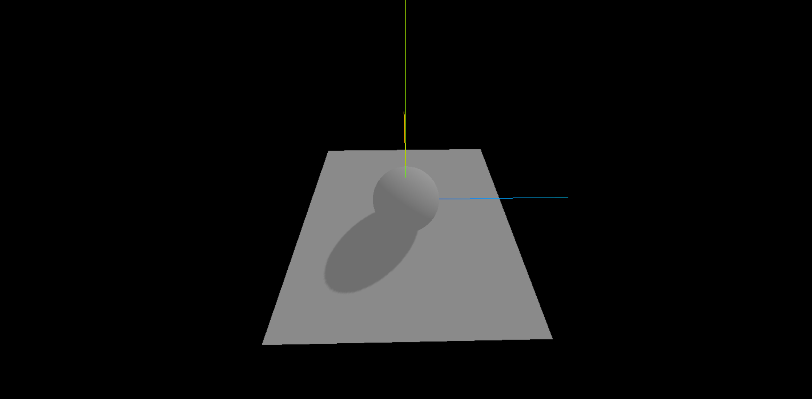
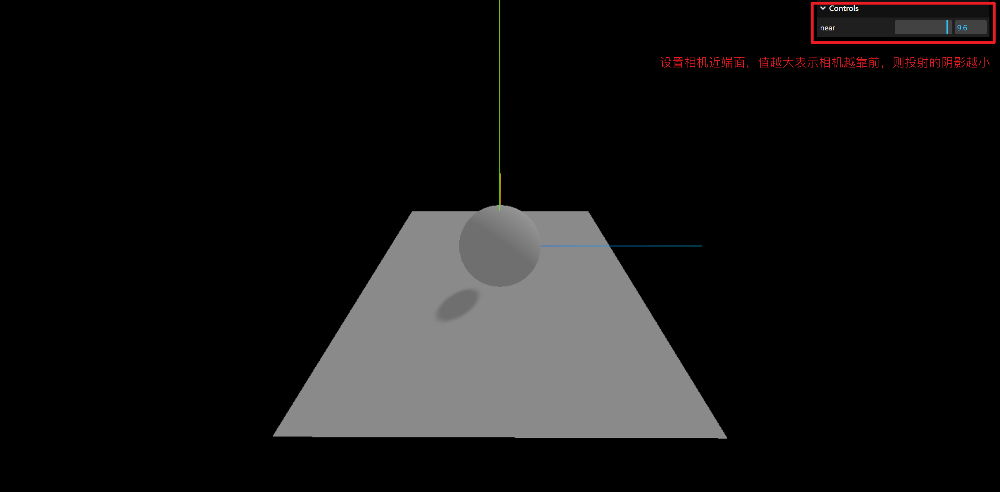
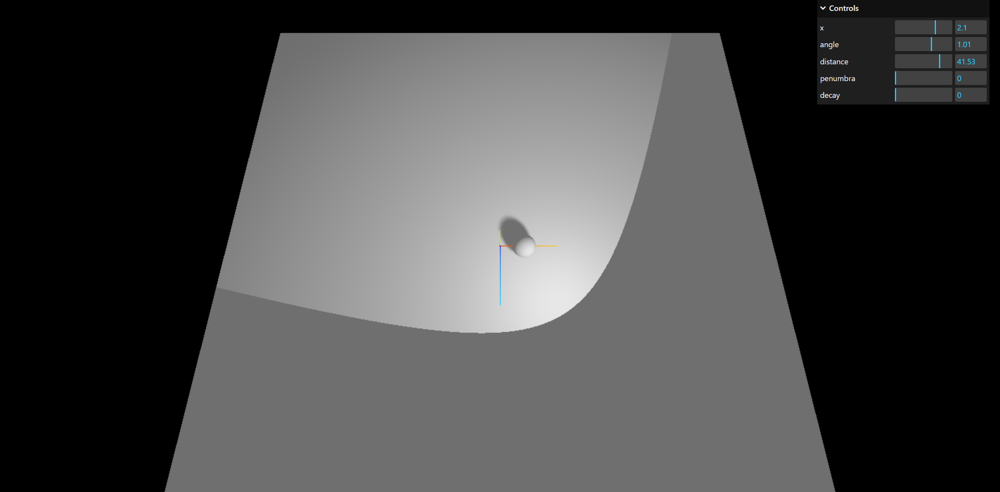
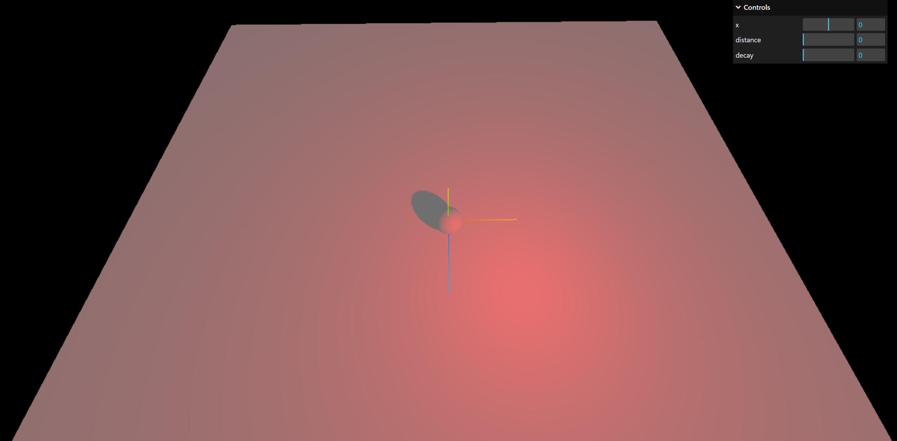

# 光照与阴影

## 环境光

[环境光](https://threejs.org/docs/index.html?q=light#api/zh/lights/AmbientLight)（AmbientLight）会均匀的照亮场景中的所有物体，因此它不能用来投射阴影，因为它没有方向。

```js
const ambientLight = new THREE.AmbientLight(0xffffff, 0.5) // 柔和的白光
scene.add(ambientLight)
```

## 平行光

[平行光](https://threejs.org/docs/index.html?q=light#api/zh/lights/DirectionalLight)（DirectionalLight）是沿着特定方向发射的光。

这种光的表现是照射的无限远，从它发出的光线都是平行的。因此常常被用来模拟太阳光的效果。

```js
const directionalLight = new THREE.DirectionalLight(0xffffff, 0.5)
// 设置光源所在位置
directionalLight.position.set(5, 5, 5)
scene.add(directionalLight)
```

常用属性：

| 属性                 | 类型    | 描述                                           |
| -------------------- | ------- | ---------------------------------------------- |
| castShadow           | boolean | 只有此属性设置为 true 时，灯光才会投射阴影     |
| position             | vector3 | 设置光源照射位置，`(0, 1, 0)` 表示从正上方照射 |
| shadow.radius        | number  | 设置阴影模糊度                                 |
| shadow.mapSize       | number  | 设置阴影模糊度的宽度和高度，值越高阴影会越清晰 |
| shadow.camera.near   | number  | 相机近端面                                     |
| shadow.camera.far    | number  | 相机远端面                                     |
| shadow.camera.top    | number  | 相机形成矩阵的上面                             |
| shadow.camera.right  | number  | 相机形成矩阵的右面                             |
| shadow.camera.bottom | number  | 相机形成矩阵的下面                             |
| shadow.camera.left   | number  | 相机形成矩阵的左面                             |

详见 [示例 1](#示例1)、[示例 2](#示例2)。

## 聚光灯

[聚光灯](https://threejs.org/docs/index.html?q=light#api/zh/lights/SpotLight)（SpotLight） 光线从一个点沿一个方向射出，随着光线照射的变远，光线圆锥体的尺寸也逐渐增大。想象手电筒照射的光。

```js
const spotLight = new THREE.SpotLight(0xffffff, 0.5)
spotLight.position.set(5, 5, 5)

spotLight.castShadow = true
scene.add(spotLight)
```

常用属性：

| 属性               | 类型   | 描述                                              |
| ------------------ | ------ | ------------------------------------------------- |
| intensity          | number | [构造函数] 光照强度，默认值 1                     |
| angle              | 弧度   | [构造函数] 光线照射范围的角度，默认值 Math.PI / 3 |
| decay              | number | [构造函数] 沿着光照距离的衰减量                   |
| distance           | number | [构造函数] 光源照射的最大距离，默认值 0（无限远） |
| penumbra           | number | 半影衰减                                          |
| target             | object | 设置聚光灯的照射对象                              |
| shadow.radius      | number | 阴影模糊度                                        |
| shadow.mapSize     | number | 阴影模糊尺寸                                      |
| shadow.camera.near | number | 相机近端                                          |
| shadow.camera.far  | number | 相机远端                                          |
| shadow.camera.fov  | number | 相机雾化？                                        |

详见 [示例 3](#示例3)。

## 点光源

[点光源](https://threejs.org/docs/index.html?q=light#api/zh/lights/PointLight)（PointLight） 是指从一个点向各个方向发射的光源。想象一个灯泡发出的光。

```js
const light = new THREE.PointLight(0xff0000, 1, 100)
light.position.set(50, 50, 50)
scene.add(light)
```

详见 [示例 4](#示例4)。

## 示例 1

::: tip

灯光与阴影，必须要满足以下 5 个条件，才可以展示：

1. 材质要能够对光照有反应，如 MeshStandardMaterial 可以，而 MeshBasicMaterial 不受光照影响；
2. 开启渲染器对阴影的计算：`renderer.shadowMap.enabled = true`
3. 设置光照投射阴影：`directionalLight.castShadow = true`
4. 设置物体投射阴影：`sphere.castShadow = true`
5. 设置物体接收阴影：`plane.receiveShadow = true`

:::

```js {10,15,18,24,35}
import * as THREE from "three"
import { OrbitControls } from "three/addons/controls/OrbitControls.js"

const scene = new THREE.Scene()
const camera = new THREE.PerspectiveCamera(95, window.innerWidth / window.innerHeight, 0.1, 1000)
camera.position.set(0, 0, 5)

const renderer = new THREE.WebGLRenderer()
// 开启渲染器对阴影的计算
renderer.shadowMap.enabled = true
renderer.setSize(window.innerWidth, window.innerHeight)
document.body.appendChild(renderer.domElement)

const sphereGeometry = new THREE.SphereGeometry(1, 32, 32)
const material = new THREE.MeshStandardMaterial()
const sphere = new THREE.Mesh(sphereGeometry, material)
// 开启物体投射阴影
sphere.castShadow = true
scene.add(sphere)

const planeGeometry = new THREE.PlaneGeometry(7, 7)
const plane = new THREE.Mesh(planeGeometry, material)
// 设置平面接收投影
plane.receiveShadow = true
plane.position.set(0, -1, 0)
plane.rotation.x = -Math.PI / 2
scene.add(plane)

// 开启环境光
const ambientLight = new THREE.AmbientLight(0xffffff, 0.5)
scene.add(ambientLight)
// 开启平行光
const directionalLight = new THREE.DirectionalLight(0xffffff, 0.5)
directionalLight.position.set(5, 5, 5)
directionalLight.castShadow = true
scene.add(directionalLight)

const axesHelper = new THREE.AxesHelper(5)
scene.add(axesHelper)

const controls = new OrbitControls(camera, renderer.domElement)
controls.enableDamping = true

function animate() {
  requestAnimationFrame(animate)
  controls.update()
  renderer.render(scene, camera)
}
animate()
```



## 示例 2

平行光常用的 3 个属性：`shadow.radius`、`shadow.mapSize`、`shadow.camera`。

```js {41,43,45-50}
import * as THREE from "three"
import { OrbitControls } from "three/addons/controls/OrbitControls.js"
import { GUI } from "three/examples/jsm/libs/lil-gui.module.min.js"

const scene = new THREE.Scene()
const camera = new THREE.PerspectiveCamera(95, window.innerWidth / window.innerHeight, 0.1, 1000)
camera.position.set(0, 0, 5)

const renderer = new THREE.WebGLRenderer()
// 渲染器开启阴影计算
renderer.shadowMap.enabled = true
renderer.setSize(window.innerWidth, window.innerHeight)
document.body.appendChild(renderer.domElement)

// 创建球
const sphereGeometry = new THREE.SphereGeometry(1, 32, 32)
const material = new THREE.MeshStandardMaterial()
const sphere = new THREE.Mesh(sphereGeometry, material)
// 开启物体投射阴影
sphere.castShadow = true
scene.add(sphere)

// 创建平面
const planeGeometry = new THREE.PlaneGeometry(7, 7)
const plane = new THREE.Mesh(planeGeometry, material)
// 设置平面接收投影
plane.receiveShadow = true
plane.position.set(0, -1, 0)
plane.rotation.x = -Math.PI / 2
scene.add(plane)

// 开启环境光
const ambientLight = new THREE.AmbientLight(0xffffff, 0.5)
scene.add(ambientLight)
// 开启平行光
const directionalLight = new THREE.DirectionalLight(0xffffff, 0.5)
directionalLight.position.set(5, 5, 5)
directionalLight.castShadow = true

// 设置阴影模糊度
directionalLight.shadow.radius = 20
// 设置阴影模糊度的宽度和高度，值越高阴影会越清晰
directionalLight.shadow.mapSize.set(4096, 4096)

directionalLight.shadow.camera.near = 0.5 // 近端面
directionalLight.shadow.camera.far = 500 // 远端面
directionalLight.shadow.camera.top = 5 // 上面
directionalLight.shadow.camera.right = 5 // 右面
directionalLight.shadow.camera.bottom = -5 // 下面
directionalLight.shadow.camera.left = -5 // 左面

scene.add(directionalLight)

const gui = new GUI()
gui
  .add(directionalLight.shadow.camera, "near")
  .min(5)
  .max(10)
  .step(0.1)
  .onChange(() => {
    directionalLight.shadow.camera.updateProjectionMatrix()
  })

// 创建坐标辅助器
const axesHelper = new THREE.AxesHelper(5)
scene.add(axesHelper)

// 创建轨道控制器
const controls = new OrbitControls(camera, renderer.domElement)
controls.enableDamping = true

function animate() {
  requestAnimationFrame(animate)
  controls.update()
  renderer.render(scene, camera)
}
animate()
```



## 示例 3

介绍聚光灯常见的属性。

```js
import * as THREE from "three"
import { OrbitControls } from "three/addons/controls/OrbitControls.js"
import { GUI } from "three/examples/jsm/libs/lil-gui.module.min.js"

const scene = new THREE.Scene()
const camera = new THREE.PerspectiveCamera(95, window.innerWidth / window.innerHeight, 0.1, 1000)
camera.position.set(0, 0, 5)

const renderer = new THREE.WebGLRenderer()
// 渲染器开启阴影计算
renderer.shadowMap.enabled = true
renderer.setSize(window.innerWidth, window.innerHeight)
document.body.appendChild(renderer.domElement)

// 创建球
const sphereGeometry = new THREE.SphereGeometry(1, 32, 32)
const material = new THREE.MeshStandardMaterial()
const sphere = new THREE.Mesh(sphereGeometry, material)
// 开启物体投射阴影
sphere.castShadow = true
scene.add(sphere)

// 创建平面
const planeGeometry = new THREE.PlaneGeometry(50, 50)
const plane = new THREE.Mesh(planeGeometry, material)
// 设置平面接收投影
plane.receiveShadow = true
plane.position.set(0, -1, 0)
plane.rotation.x = -Math.PI / 2
scene.add(plane)

// 开启环境光
const ambientLight = new THREE.AmbientLight(0xffffff, 0.5)
scene.add(ambientLight)
// 开启聚光灯
const spotLight = new THREE.SpotLight(0xffffff)
spotLight.position.set(5, 5, 5)
spotLight.castShadow = true

// 聚光灯亮度
spotLight.intensity = 2
// 光线照射范围的角度
spotLight.angle = Math.PI / 3
// 沿着光照距离的衰减量
spotLight.decay = 0
// 光源照射的最大距离
spotLight.distance = 0
// 半影衰减
spotLight.penumbra = 0
// 设置聚光灯的照射对象
spotLight.target = sphere

// 阴影模糊度
spotLight.shadow.radius = 20
// 阴影模糊尺寸
spotLight.shadow.mapSize.set(4096, 4096)

scene.add(spotLight)

const gui = new GUI()
gui.add(sphere.position, "x").min(-5).max(5).step(0.1)
gui
  .add(spotLight, "angle")
  .min(0)
  .max(Math.PI / 2)
  .step(0.01)
gui.add(spotLight, "distance").min(10).max(50).step(0.01)
gui.add(spotLight, "penumbra").min(0).max(1).step(0.01)
gui.add(spotLight, "decay").min(0).max(5).step(0.01)

// 创建坐标辅助器
const axesHelper = new THREE.AxesHelper(5)
scene.add(axesHelper)

// 创建轨道控制器
const controls = new OrbitControls(camera, renderer.domElement)
controls.enableDamping = true

function animate() {
  requestAnimationFrame(animate)
  controls.update()
  renderer.render(scene, camera)
}
animate()
```



## 示例 4

点光源示例。

```js {36,41,43,45,48,50}
import * as THREE from "three"
import { OrbitControls } from "three/addons/controls/OrbitControls.js"
import { GUI } from "three/examples/jsm/libs/lil-gui.module.min.js"

const scene = new THREE.Scene()
const camera = new THREE.PerspectiveCamera(95, window.innerWidth / window.innerHeight, 0.1, 1000)
camera.position.set(0, 0, 5)

const renderer = new THREE.WebGLRenderer()
// 渲染器开启阴影计算
renderer.shadowMap.enabled = true
renderer.setSize(window.innerWidth, window.innerHeight)
document.body.appendChild(renderer.domElement)

// 创建球
const sphereGeometry = new THREE.SphereGeometry(1, 32, 32)
const material = new THREE.MeshStandardMaterial()
const sphere = new THREE.Mesh(sphereGeometry, material)
// 开启物体投射阴影
sphere.castShadow = true
scene.add(sphere)

// 创建平面
const planeGeometry = new THREE.PlaneGeometry(50, 50)
const plane = new THREE.Mesh(planeGeometry, material)
// 设置平面接收投影
plane.receiveShadow = true
plane.position.set(0, -1, 0)
plane.rotation.x = -Math.PI / 2
scene.add(plane)

// 开启环境光
const ambientLight = new THREE.AmbientLight(0xffffff, 0.5)
scene.add(ambientLight)
// 开启点光源
const pointLight = new THREE.PointLight(0xff0000)
pointLight.position.set(5, 5, 5)
pointLight.castShadow = true

// 聚光灯亮度
pointLight.intensity = 2
// 沿着光照距离的衰减量
pointLight.decay = 0
// 光源照射的最大距离
pointLight.distance = 0

// 阴影模糊度
pointLight.shadow.radius = 20
// 阴影模糊尺寸
pointLight.shadow.mapSize.set(4096, 4096)

scene.add(pointLight)

const gui = new GUI()
gui.add(sphere.position, "x").min(-5).max(5).step(0.1)
gui.add(pointLight, "distance").min(10).max(50).step(0.01)
gui.add(pointLight, "decay").min(0).max(5).step(0.01)

// 创建坐标辅助器
const axesHelper = new THREE.AxesHelper(5)
scene.add(axesHelper)

// 创建轨道控制器
const controls = new OrbitControls(camera, renderer.domElement)
controls.enableDamping = true

function animate() {
  requestAnimationFrame(animate)
  controls.update()
  renderer.render(scene, camera)
}
animate()
```



下面演示 点光源随着小球的运动而变化的示例。

```js {14-18,57,59,69,72-75}
import * as THREE from "three"
import { OrbitControls } from "three/addons/controls/OrbitControls.js"

const scene = new THREE.Scene()
const camera = new THREE.PerspectiveCamera(95, window.innerWidth / window.innerHeight, 0.1, 1000)
camera.position.set(0, 0, 5)

const renderer = new THREE.WebGLRenderer()
// 渲染器开启阴影计算
renderer.shadowMap.enabled = true
renderer.setSize(window.innerWidth, window.innerHeight)
document.body.appendChild(renderer.domElement)

const smallMesh = new THREE.Mesh(
  new THREE.SphereGeometry(0.1, 32, 32),
  new THREE.MeshBasicMaterial({ color: 0xff0000 })
)
smallMesh.position.set(2, 2, 2)

// 创建球
const sphereGeometry = new THREE.SphereGeometry(1, 32, 32)
const material = new THREE.MeshStandardMaterial()
const sphere = new THREE.Mesh(sphereGeometry, material)
// 开启物体投射阴影
sphere.castShadow = true
scene.add(sphere)

// 创建平面
const planeGeometry = new THREE.PlaneGeometry(50, 50)
const plane = new THREE.Mesh(planeGeometry, material)
// 设置平面接收投影
plane.receiveShadow = true
plane.position.set(0, -1, 0)
plane.rotation.x = -Math.PI / 2
scene.add(plane)

// 开启环境光
const ambientLight = new THREE.AmbientLight(0xffffff, 0.5)
scene.add(ambientLight)
// 开启聚光灯
const pointLight = new THREE.PointLight(0xff0000)
pointLight.position.set(5, 5, 5)
pointLight.castShadow = true

// 聚光灯亮度
pointLight.intensity = 2
// 沿着光照距离的衰减量
pointLight.decay = 0
// 光源照射的最大距离
pointLight.distance = 0

// 阴影模糊度
pointLight.shadow.radius = 20
// 阴影模糊尺寸
pointLight.shadow.mapSize.set(4096, 4096)

smallMesh.add(pointLight)

scene.add(smallMesh)

// 创建坐标辅助器
const axesHelper = new THREE.AxesHelper(5)
scene.add(axesHelper)

// 创建轨道控制器
const controls = new OrbitControls(camera, renderer.domElement)
controls.enableDamping = true

const clock = new THREE.Clock()

function animate() {
  const time = clock.getElapsedTime()
  smallMesh.position.x = Math.sin(time) * 3
  smallMesh.position.z = Math.cos(time) * 3
  smallMesh.position.y = 2 + Math.sin(time * 10)

  requestAnimationFrame(animate)
  controls.update()
  renderer.render(scene, camera)
}
animate()
```


