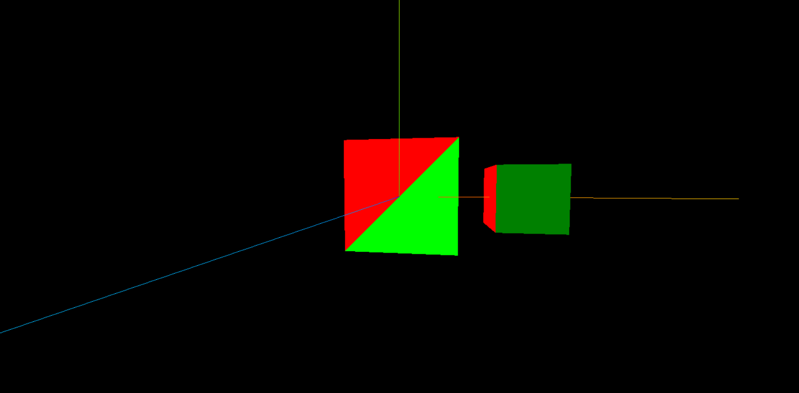

# geometry

## BufferGeometry

`BufferGeometry` 是一个基类，几乎所有的几何物体都继承自它，同时它也是 面片、线和点几何体的有效表述。

包括顶点位置、面片索引、法向量、颜色值、UV坐标和自定义缓存属性值等。


### 顶点位置

在 three.js 中，一个正方形的平面，本质上是由两个三角形而构成，并且两个三角形之间可以共用相同的顶点，也可以不共用。

下面的示例，使用 `new Float32Array()` 方法创建了三个顶点，并作为了 `BufferGeometry` 的位置属性。

```js {2,4}
const geometry = new THREE.BufferGeometry()
const vertices = new Float32Array([-1, -1, 0, 1, -1, 0, 1, 1, 0])
// 将生成的顶点作为 geometry 的 position 属性，其中 3 表示 3个值为一组点
geometry.setAttribute("position", new THREE.BufferAttribute(vertices, 3))
const meterial = new THREE.MeshBasicMaterial({
  color: 0x00ff00,
  //wireframe: true,        // 开启线框模式
  //side: THREE.DoubleSide  // 正反面均可见
})
const plane = new THREE.Mesh(geometry, meterial)
scene.add(plane)
```

:::tip 注意

请注意 new Float32Array() 方法中数组的顶点顺序，逆时针表示平面正面可见，顺时针表示平面背面可见。当然也可以通过 `MeshBasicMaterial` 的  `side: THREE.DoubleSide` 属性，设置两面均可见。

:::


### 顶点共用

通过上面示例中的方式创建一个 正方形平面，通过打印 geometry.attributes.position 属性，可以发现 count: 6，这意味着两个三角形的顶点并未共用，这样就造成了一定的冗余。

下面的案例将通过 顶点共用（顶点索引）的方式，两个三角形共用其中的两个顶点，从而降低冗余。

```js {5}
// 正方形的 4 个顶点
const vertices = new Float32Array([-1, -1, 0, 1, -1, 0, 1, 1, 0, -1, 1, 0])
geometry.setAttribute("position", new THREE.BufferAttribute(vertices, 3))
// [0, 1, 2]表示一个三角形，[2, 3, 0]代表另一个三角形
const indexes = new Uint16Array([0, 1, 2, 2, 3, 0])
// 设置顶点索引
geometry.setIndex(new THREE.BufferAttribute(indexes, 1))
const meterial = new THREE.MeshBasicMaterial({
  color: 0x00ff00
})
const plane = new THREE.Mesh(geometry, meterial)
scene.add(plane)
```


### 颜色值

BufferGeometry 中提供了 groups 组的属性，可以**将当前几何体分割成组进行渲染**，每个部分都会在单独的 WebGL 的 draw call 中进行绘制。

下面的示例使用 `.addGroup()` 方法，将正方形的两个三角形面加入不同的组，并通过不同的颜色材质展示：

```js {7,8,15}
const geometry = new THREE.BufferGeometry()
const vertices = new Float32Array([-1, -1, 0, 1, -1, 0, 1, 1, 0, -1, 1, 0])
geometry.setAttribute("position", new THREE.BufferAttribute(vertices, 3))
const indexes = new Uint16Array([0, 1, 2, 2, 3, 0])
geometry.setIndex(new THREE.BufferAttribute(indexes, 1))
// 添加组，把正方形的两个面分为两组，分别为每个组设置不同的材质
geometry.addGroup(0, 3, 0) // 对应 [0, 1, 2]
geometry.addGroup(3, 3, 1) // 对应 [2, 3, 0]
const meterial1 = new THREE.MeshBasicMaterial({
  color: 0x00ff00
})
const meterial2 = new THREE.MeshBasicMaterial({
  color: "#ff0000"
})
const plane = new THREE.Mesh(geometry, [meterial1, meterial2])
scene.add(plane)
```

[`.addGroup(start, count, meterialIndex)`](https://threejs.org/docs/index.html?q=geometry#api/zh/core/BufferGeometry.groups) 参数：

| 参数          | 描述       |
| ------------- | ---------- |
| start         | 开始值     |
| count         | 索引间隔   |
| meterialIndex | 材质索引值 |




## BoxGeometry

立方缓冲几何体（BoxGeometry）是 three.js 中所有立方体的基类，它通过 `width`、`height`、`depth` 三个参数来创建立方体。

::: tip Tip

 **几何体** 和 **材质** 结合，才能构建一个物体哦！

:::

```JavaScript
// 创建几何体
const geometry = new THREE.BoxGeometry(1, 1, 1)
// 创建材质
const material = new THREE.MeshBasicMaterial({ color: 0x00ff00 })

// 构建物体
const cube = new THREE.Mesh(geometry, material)
scene.add(cube)
```

BoxGeometry 立方体常用的 3 个参数：

|参数|描述|
|-|-|
|width|x 轴上的宽度，默认值 1|
|height|y 轴上的宽度，默认值 1|
|depth|z 轴上的宽度，默认值 1|


### 位置

几何体可以有 2 种方式设置位置属性。

:::tip 提示

在下面默认的情况下，cube 物体的坐标是**世界坐标**，相对于原点而言的，<u>如果给它设置父元素，则坐标会相对于父元素而移动</u>。

:::

```JavaScript
const geometry = new THREE.BoxGeometry(1, 1, 1)
const material = new THREE.MeshBasicMaterial({ color: 0x00ff00 })
const cube = new THREE.Mesh(geometry, material)

// 方式1
cube.position.set(3, 0, 0)

// 方式2
cube.position.x = 3
cube.position.y = 3
cube.position.z = 3

scene.add(cube)
```

给 cube 物体设置了父元素之后，则 cube 物体的移动就不再是相对于原点了，而是相对于父元素的位置。

```JavaScript
const geometry = new THREE.BoxGeometry(1, 1, 1)
const material = new THREE.MeshBasicMaterial({ color: 0x00ff00 })
const cube = new THREE.Mesh(geometry, material)

// 创建父元素
const parentMeterial = new THREE.MeshBasicMaterial({ color: 0xff0000 })
const parentCube = new THREE.Mesh(geometry, parentMeterial)
// 将子元素添加到父元素中
parentCube.add(cube)

// 可以发现子元素的位置位于原点处，因为父元素带着子元素整体向左移动了
cube.position.set(3, 0, 0)
parentCube.position.set(-3, 0, 0)

scene.add(parentCube)
```


### 缩放

几何体的缩放属性和位置属性一样，也有 2 种方式设置，它也是个 **局部属性**，也就意味着当给它设置父元素时，它也会随着父元素变化。

```JavaScript
// 子元素放大 1 倍
cube.scale.set(2, 2, 2)

// 父元素也放大 1 倍，相当于子元素放大了 2 倍
parentCube.scale.set(2, 2, 2)
```


### 旋转

几何体旋转和前面两个属性的用法一样，注意旋转时使用的是 弧度 。

```JavaScript
// 子元素旋转 45 度
cube.rotation.set(Math.PI / 4, 0, 0)

// 父元素也旋转 45 度，相当于子元素旋转了 90 度
parentCube.rotation.set(Math.PI / 4, 0, 0)
```


