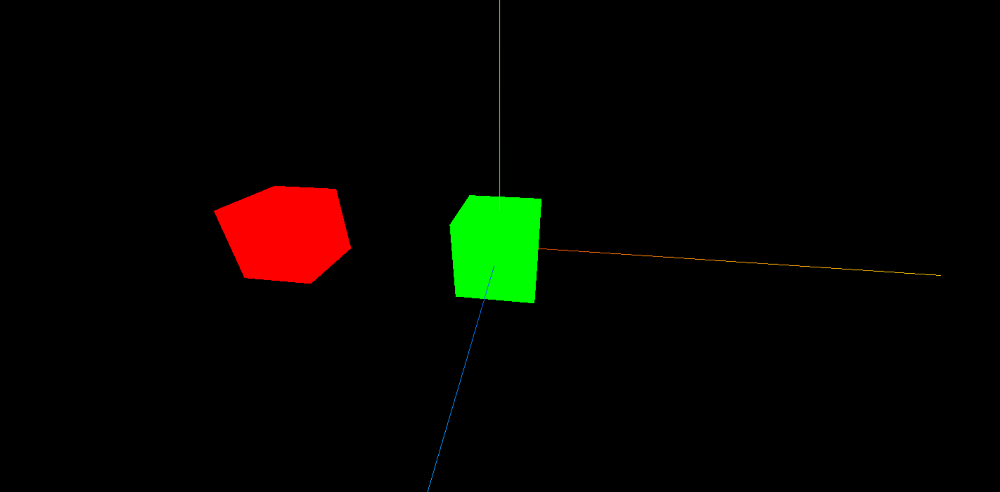
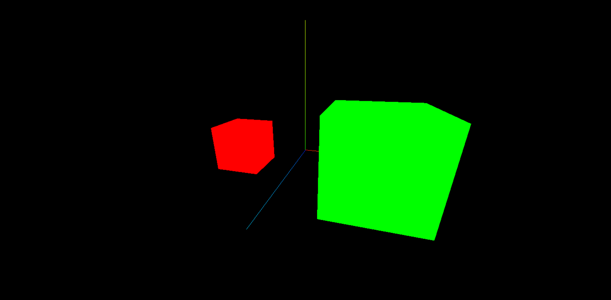
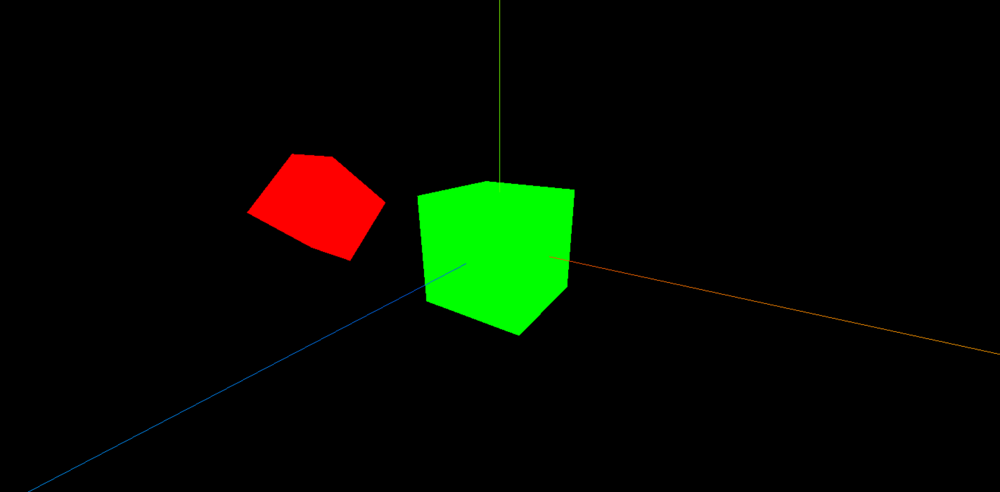

# 物体

## 几何体

立方缓冲几何体（BoxGeometry）是 three.js 中所有立方体的基类，它通过 `width`、`height`、`depth` 三个参数来创建立方体。

::: tip Tip

 **几何体** 和 **材质** 结合，才能构建一个物体哦！

:::

```JavaScript
// 创建几何体
const geometry = new THREE.BoxGeometry(1, 1, 1)
// 创建材质
const material = new THREE.MeshBasicMaterial({ color: 0x00ff00 })

// 构建物体
const cube = new THREE.Mesh(geometry, material)
scene.add(cube)
```

BoxGeometry 立方体常用的 3 个参数：

|参数|描述|
|-|-|
|width|x 轴上的宽度，默认值 1|
|height|y 轴上的宽度，默认值 1|
|depth|z 轴上的宽度，默认值 1|


### 位置

几何体可以有 2 种方式设置位置属性。

:::tip 提示

在下面默认的情况下，cube 物体的坐标是**世界坐标**，相对于原点而言的，<u>如果给它设置父元素，则坐标会相对于父元素而移动</u>。

:::

```JavaScript
const geometry = new THREE.BoxGeometry(1, 1, 1)
const material = new THREE.MeshBasicMaterial({ color: 0x00ff00 })
const cube = new THREE.Mesh(geometry, material)

// 方式1
cube.position.set(3, 0, 0)

// 方式2
cube.position.x = 3
cube.position.y = 3
cube.position.z = 3

scene.add(cube)
```

给 cube 物体设置了父元素之后，则 cube 物体的移动就不再是相对于原点了，而是相对于父元素的位置。

```JavaScript
const geometry = new THREE.BoxGeometry(1, 1, 1)
const material = new THREE.MeshBasicMaterial({ color: 0x00ff00 })
const cube = new THREE.Mesh(geometry, material)

// 创建父元素
const parentMeterial = new THREE.MeshBasicMaterial({ color: 0xff0000 })
const parentCube = new THREE.Mesh(geometry, parentMeterial)
// 将子元素添加到父元素中
parentCube.add(cube)

// 可以发现子元素的位置位于原点处，因为父元素带着子元素整体向左移动了
cube.position.set(3, 0, 0)
parentCube.position.set(-3, 0, 0)

scene.add(parentCube)
```




### 缩放

几何体的缩放属性和位置属性一样，也有 2 种方式设置，它也是个 **局部属性**，也就意味着当给它设置父元素时，它也会随着父元素变化。

```JavaScript
// 子元素放大 1 倍
cube.scale.set(2, 2, 2)

// 父元素也放大 1 倍，相当于子元素放大了 2 倍
parentCube.scale.set(2, 2, 2)
```




### 旋转

几何体旋转和前面两个属性的用法一样，注意旋转时使用的是 弧度 。

```JavaScript
// 子元素旋转 45 度
cube.rotation.set(Math.PI / 4, 0, 0)

// 父元素也旋转 45 度，相当于子元素旋转了 90 度
parentCube.rotation.set(Math.PI / 4, 0, 0)
```


