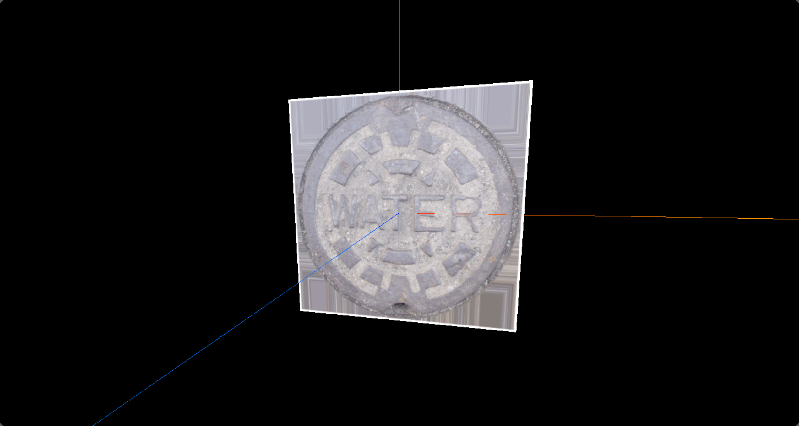
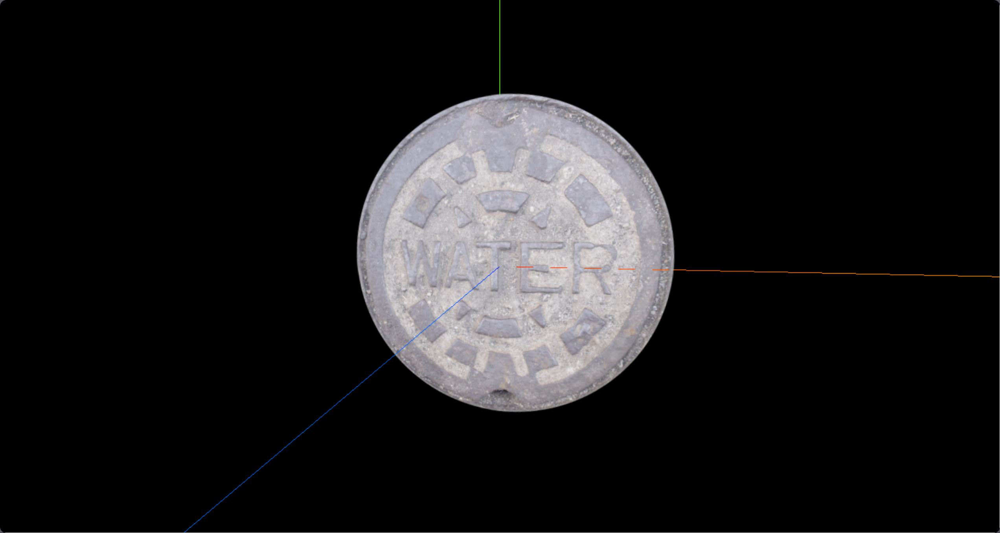
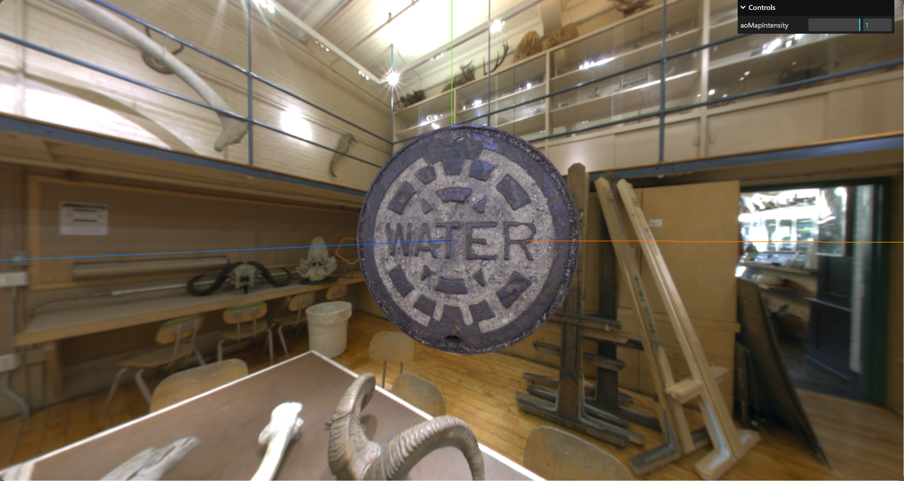
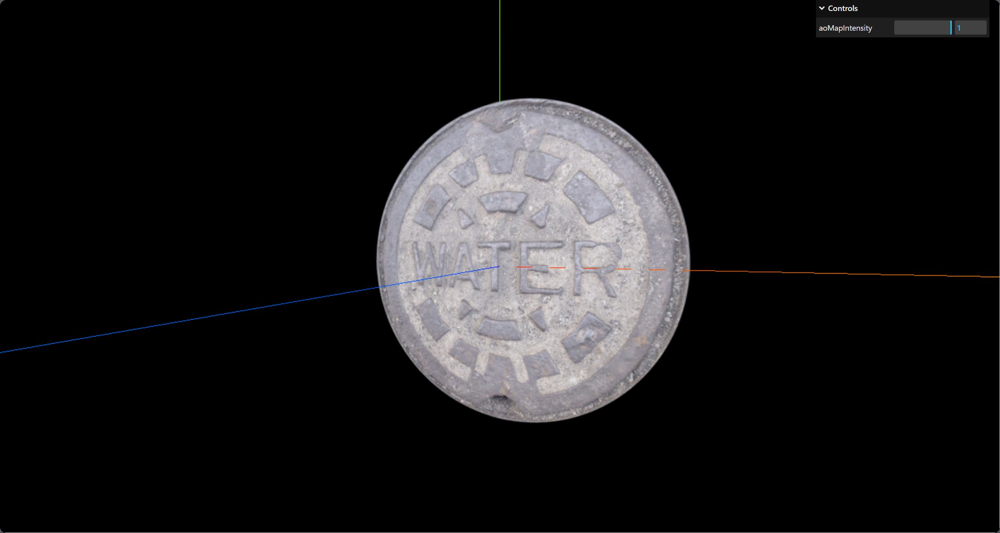
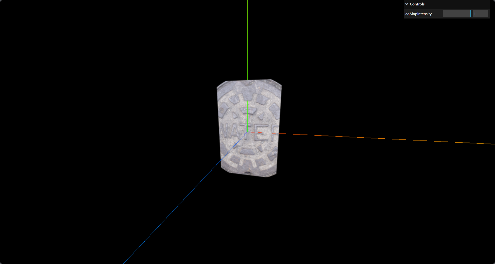
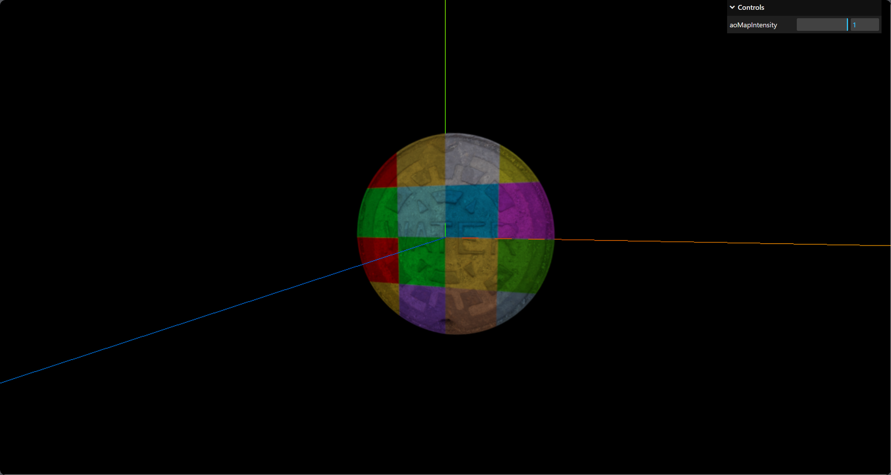
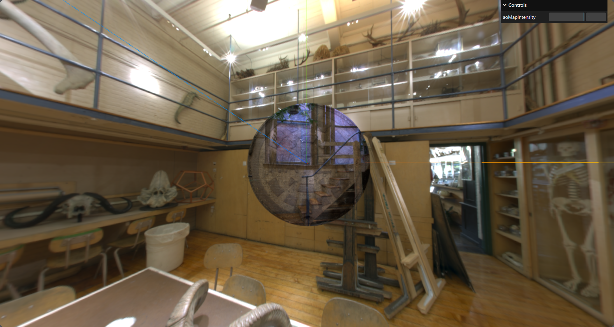
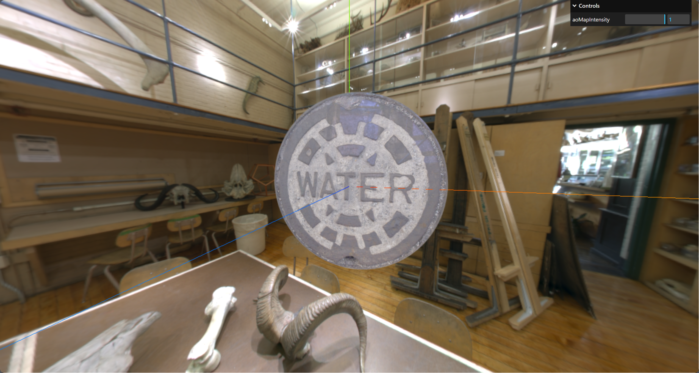

# 基础网格材质

[基础网格材质](https://threejs.org/docs/index.html?q=mater#api/zh/materials/MeshBasicMaterial)（MeshBasicMaterial）是平时使用比较多的一种材质，这种材质不受光照的影响。

下面使用一个平面（PlaneGeometry）来绘制几何体的材质。


## 颜色贴图（map）

首先，先创建一个平面：

```js
const plane = new THREE.PlaneGeometry(2, 2)
const meterial = new THREE.MeshBasicMaterial({
  color: "#fff",
})
const mesh = new THREE.Mesh(plane, meterial)
scene.add(mesh)
```

使用颜色贴图之前，需要一个纹理加载器（[TextureLoader](https://threejs.org/docs/index.html?q=texturelo#api/zh/loaders/TextureLoader)）：

```js {7,9}
const loader = new THREE.TextureLoader()
// 加载颜色贴图
const texture = loader.load("/texture/watercover/CityNewYork002_COL_VAR1_1K.png")

const meterial = new THREE.MeshBasicMaterial({
  color: "#fff",
  map: texture // 设置颜色贴图
})
// meterial.map = texture
```




### 透明度

透明度（transparent）可以定义材质是否透明。

设置为 true 时，通过设置材质的 opacity 属性可以控制材质透明的程度，默认值为 false。

```js {4,5}
const meterial = new THREE.MeshBasicMaterial({
  color: "#fff",
  map: texture,
  transparent: true, //允许透明
  opacity: 1 // 透明程度，默认 1
})
```

上面通过设置 transparent 属性，可以把井盖周围的四个角变为透明。




### 颜色空间

颜色空间（ColorSpace）的作用主要是确保渲染出来的物体颜色在不同设备和环境中看起来是一致的。

颜色空间定义了颜色的表示方式和范围，可以解决颜色显示不准确的问题。就比如 Three.js 的编辑器中的物体颜色要暗于示例中的颜色，怎么修改一致呢？

```js
// sRGB颜色空间，最接近人眼
texture.colorSpace = THREE.SRGBColorSpace
// Linear线性颜色空间
texture.colorSpace = THREE.LinearSRGBColorSpace
// 无颜色空间，默认值
texture.colorSpace = THREE.NoColorSpace
```




## ao 贴图（aoMap）

用作环境遮挡贴图，默认为 null。

```js {8}
const aoMap = loader.load("/texture/watercover/CityNewYork002_AO_1K.jpg")

const meterial = new THREE.MeshBasicMaterial({
  color: "#fff",
  map: texture,
  transparent: true,
  aoMap: aoMap, 	// ao贴图
  aoMapIntensity: 1 // 环境遮挡效果的强度
})
```




## 透明度贴图（alphaMap）

透明度贴图，也称 alpha贴图，它是一种灰度贴图，用于控制整个表面的不透明度。

黑色：完全透明；白色：完全不透明；灰色：介于二者之间的半透明。

```js {8}
const alphaMap = loader.load("/texture/door/alpha.jpg")

const meterial = new THREE.MeshBasicMaterial({
  color: "#fff",
  map: texture,
  transparent: true,
  aoMap: aoMap,
  alphaMap: alphaMap
})
```




## 光照贴图（lightMap）

光照贴图。

```js {8}
const lightMap = loader.load("/texture/colors.png")

const meterial = new THREE.MeshBasicMaterial({
  color: "#fff",
  map: texture,
  transparent: true,
  aoMap: aoMap,
  lightMap: lightMap
})
```




## 环境贴图（envMap）

环境贴图，可以用来模拟全景光（即四面八方的光）。

环境贴图需要使用 RGBELoader() 加载器来进行加载：

```js
// 引入
import { RGBELoader } from "three/examples/jsm/Addons.js"
```

```js
const rgbeLoader = new RGBELoader()
rgbeLoader.load("/texture/Alex_Hart-Nature_Lab_Bones_2k.hdr", envMap => {
  // 设置环境贴图的映射方式为球形映射
  envMap.mapping = THREE.EquirectangularReflectionMapping
  // 将环境贴图设置为场景的背景和环境
  scene.background = envMap
  scene.environment = envMap
})
```


将平面的贴图也设置为环境贴图，此时可以看到平面可以反光了。

```js {7, 17}
rgbeLoader.load("/texture/Alex_Hart-Nature_Lab_Bones_2k.hdr", envMap => {
  envMap.mapping = THREE.EquirectangularReflectionMapping
  scene.background = envMap
  scene.environment = envMap

  // 将材质的环境贴图设置为envMap
  meterial.envMap = envMap
})

...
const meterial = new THREE.MeshBasicMaterial({
  color: "#fff",
  map: texture,
  transparent: true,
  aoMap: aoMap,

  reflectivity: 0.2 // 物体反光的强度，默认1，可搭配 envMap 使用
})
```




## 高光贴图（specularMap）

材质的高光贴图。

贴图较亮的地方，反光会更加强烈，较暗的地方，反光则比较弱（白色：反射越强；黑色：反射越弱；灰色：介于二者之间）。

```js {7}
const specularMap = loader.load("/texture/watercover/CityNewYork002_GLOSS_1K.jpg")
const meterial = new THREE.MeshBasicMaterial({
  color: "#fff",
  map: texture,
  transparent: true,
  aoMap: aoMap,
  specularMap: specularMap,
  reflectivity: 0.5 // 调节反射的强度
})
```

