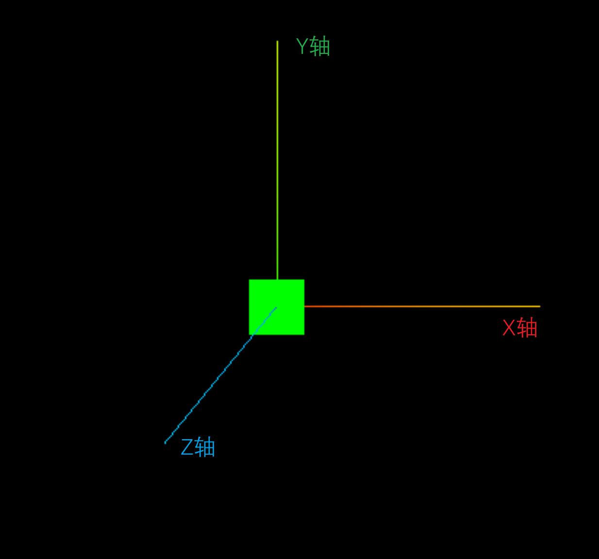

# 轨道控制器

## 坐标辅助器

坐标辅助器（AxesHelper）：用于简单模拟 3 个坐标轴的对象。红色代表 X 轴. 绿色代表 Y 轴. 蓝色代表 Z 轴。

:::tip Tip

  Z轴 永远是垂直于电脑屏幕，垂直于我们的眼睛的哦！

:::

```JavaScript
// 创建坐标辅助器
const axesHelper = new THREE.AxesHelper(5)
scene.add(axesHelper)
```




## 轨道控制器

轨道控制器（OrbitControls）可以使得相机围绕目标进行轨道运动，也就是可以使用鼠标对物体进行滑动、缩放等操作。

:::tip Tip

轨道控制器，看似物体发生了动画，但是本质上是相机视角在发生变化！

:::

```JavaScript
// 轨道控制器需要单独导入
import { OrbitControls } from "three/addons/controls/OrbitControls.js"
```

```JavaScript
// 创建轨道控制器
const controls = new OrbitControls(camera, renderer.domElement)

function animate() {
  requestAnimationFrame(animate)
  // 每帧渲染的时候更新轨道控制器
  controls.update()
  renderer.render(scene, camera)
}
```

轨道控制器的 2 个参数：

|参数|描述|
|-|-|
|object|要被控制的相机|
|domElement|用于事件监听的 HTML 元素|


### 阻尼效果

所谓阻尼效果，就是在旋转或拖动物体时，带有一定的金属感，对用户的体验感更强、更真实！

```JavaScript
const controls = new OrbitControls(camera, renderer.domElement)

// 设置阻尼效果
controls.enableDamping = true
// 设置阻尼惯性，默认 0.05
controls.dampingFactor = 0.05
```

注意：当设置阻尼效果之后，需要在动画中设置 `controls.update()` 才会生效！


### 自动旋转

物体会围绕着中心点开始旋转，默认绕 y 轴旋转。

```JavaScript
const controls = new OrbitControls(camera, renderer.domElement)

// 开启自动旋转
controls.autoRotate = true
// 旋转速度，默认 2，即 60FPS 时旋转一周要 30 秒
controls.autoRotateSpeed = 0.5
```


### 操作禁用

开启轨道控制器时，默认会打开 用户交互 相关的操作，当然也可以关闭它们。

```JavaScript
const controls = new OrbitControls(camera, renderer.domElement)

// 禁用相机平移
controls.enablepan = false
// 禁用相机旋转
controls.enableRotate = false
// 禁用相机缩放
controls.enableZoom = false
```


完整示例：

```Vue {45}
<script setup lang="ts">
import * as THREE from "three"
import { OrbitControls } from "three/addons/controls/OrbitControls.js"

// 创建场景
const scene = new THREE.Scene()
// 创建透视摄像机
const camera = new THREE.PerspectiveCamera(95, window.innerWidth / window.innerHeight, 0.1, 1000)
camera.position.set(0, 0, 5)

// 创建渲染器，并设置大小尺寸
const renderer = new THREE.WebGLRenderer()
renderer.setSize(window.innerWidth, window.innerHeight)
document.body.appendChild(renderer.domElement)

// 创建一个立方体
const geometry = new THREE.BoxGeometry(1, 1, 1)
const material = new THREE.MeshBasicMaterial({ color: 0x00ff00 })
const cube = new THREE.Mesh(geometry, material)
scene.add(cube)

// 创建坐标辅助器
const axesHelper = new THREE.AxesHelper(5)
scene.add(axesHelper)

// 创建轨道控制器
const controls = new OrbitControls(camera, renderer.domElement)
// 阻尼效果
controls.enableDamping = true
controls.dampingFactor = 0.05
// 自动旋转
controls.autoRotate = true
controls.autoRotateSpeed = 0.5

// 禁用相机平移
// controls.enablepan = false
// 禁用相机旋转
// controls.enableRotate = false
// 禁用相机缩放
// controls.enableZoom = false

function animate() {
  requestAnimationFrame(animate)
  // 更新控制器
  controls.update()

  renderer.render(scene, camera)
}

animate()
</script>
```
