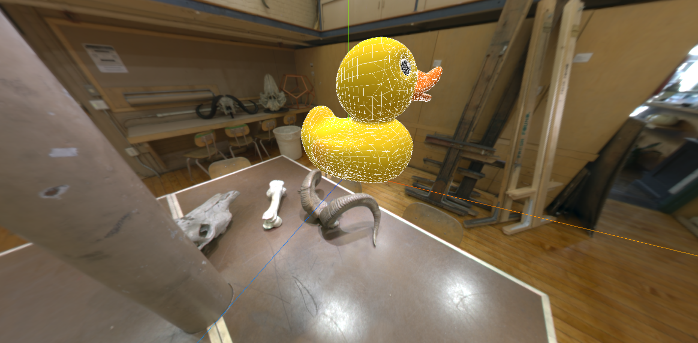
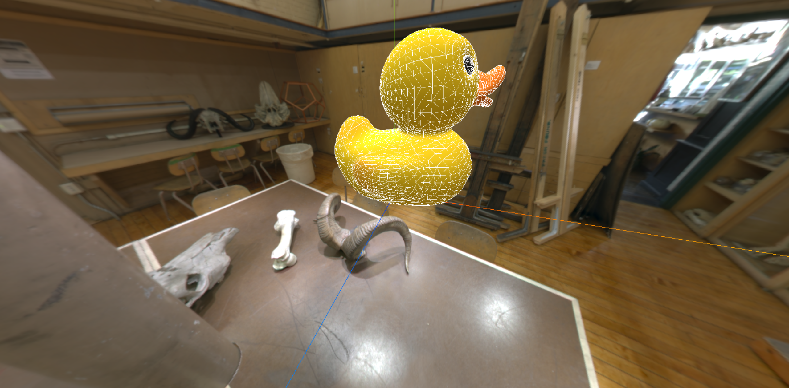

# 边缘几何体和线框几何体

## 边缘几何体

[边缘几何体](https://threejs.org/docs/index.html?q=edge#api/zh/geometries/EdgesGeometry)（EdgesGeometry）是指物体表面的边缘线的集合，通常用于表示和渲染几何体的轮廓和边界。

```js {10,11,17}
const gltfLoader = new GLTFLoader()
gltfLoader.load("/model/Duck.glb", model => {
  scene.add(model.scene)

  // 获取模型的 geometry
  const duck = scene.getObjectByName("LOD3spShape") as any
  const duckGeometry = duck?.geometry

  // 创建边缘几何体
  const edgesGeomeetry = new THREE.EdgesGeometry(duckGeometry)
  const edgesMaterial = new THREE.LineBasicMaterial({ color: 0xffffff })

  // 更新世界矩阵，让边缘几何体和模型处于相同大小
  duck.updateWorldMatrix(true, true)
  edgesGeomeetry.applyMatrix4(duck.matrixWorld)

  const edgesMesh = new THREE.LineSegments(edgesGeomeetry, edgesMaterial)
  scene.add(edgesMesh)
})
```




## 网格几何体

[网格几何体](https://threejs.org/docs/index.html?q=wi#api/zh/geometries/WireframeGeometry)（WireframeGeometry）是用于表示和渲染3D模型的集合结构，仅显示其边缘而不是面。

线框模式通过展示模型的骨架结构，可以更清楚的看到模型的拓扑关系和各个部分之间的连接。

```js {6,7,17}
const gltfLoader = new GLTFLoader()
gltfLoader.load("/model/Duck.glb", model => {
  scene.add(model.scene)

  // 获取模型的 geometry
  const duck = scene.getObjectByName("LOD3spShape") as any
  const duckGeometry = duck?.geometry
  
  // 线框几何体
  const wifeGeometry = new THREE.WireframeGeometry(duckGeometry)
  wifeGeometry.applyMatrix4(duck.matrixWorld)

  // 更新世界矩阵，让边缘几何体和模型处于相同大小
  duck.updateWorldMatrix(true, true)
  edgesGeomeetry.applyMatrix4(duck.matrixWorld)

  const edgesMesh = new THREE.LineSegments(wifeGeometry, edgesMaterial)
  scene.add(edgesMesh)
})
```




边缘几何体和网格几何体的区别：

|          | 边缘几何体                                             | 网格几何体                                                 |
| -------- | ------------------------------------------------------ | ---------------------------------------------------------- |
| 表示内容 | 强调物体的轮廓和外形，突出展示显著角度差的地方         | 展示的是模型的完整集合结构，显示处所有的顶点和边的连接方式 |
| 适用场景 | 如卡通渲染、边缘检测、需要清晰展示模型形状的应用       | 全面了解模型拓扑结构的场景，如建模工具                     |
| 视觉效果 | 只显示显著的边缘，其他部门不显示，强调形状的清晰和简洁 | 展示模型的所有细节，包括内部结构，提供完整的集合结构视图   |
| 性能     | 渲染较少的边线，性能开销较小                           | 渲染所有的边线，性能开销较大                               |

