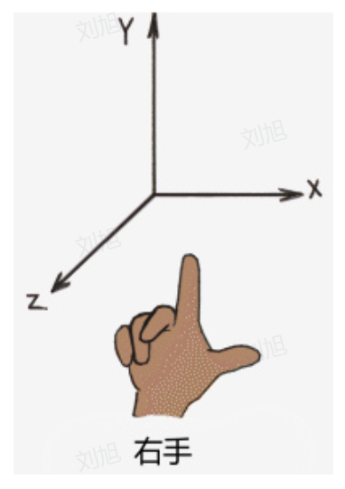
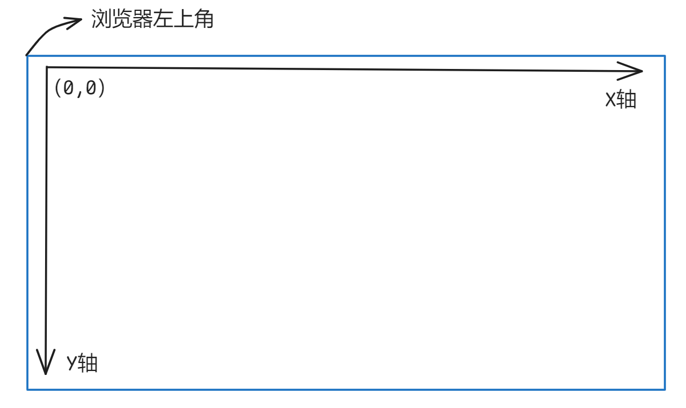
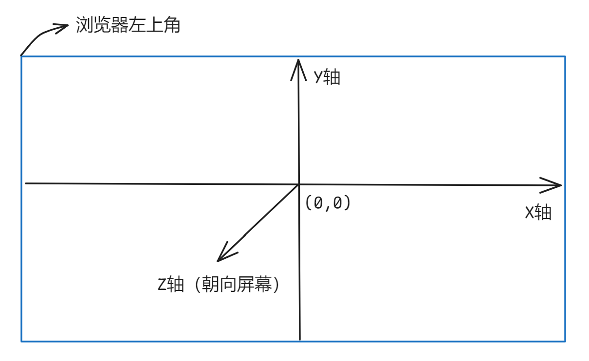

# 基础入门

WebGL 全称叫做 Web Graphics Library，它是 JavaScript API。用于在任何兼容的Web浏览器中渲染交互式的3D图形，并且无序使用插件。

它基于 OpenGL ES2.0（一个用于嵌入式系统的图形库），并于其他Web标准完全集成，使开发者能够利用 GPU 加速图形处理直接在网页上实现复杂的图形效果。

在网页上实现丰富的图形效果，就需要在网页上有一块专门用来绘制图形的区域，这块区域叫做**画布**。因此在Web网页上实现WebGL效果，需要用到 **`canvas`** 画布元素。

## WebGL坐标系

在 WebGL 中，坐标系使用的是**右手坐标系**。

::: warning 注意

X、Y、Z轴正方向的最大值都是 1，负方向的最大值都是 -1。

:::

## Canvas画布坐标系

`Canvas` 画布支持2D，同时也支持3D，但是 2D 和 3D 的坐标方向是完全不同的。

2D 坐标系的原点是 `Canvas` 画布的左顶点，水平方向向右是 X轴，竖直向下是 Y轴。

3D 坐标系原点是 `Canvas` 画布的中心点，水平方向向右是 X轴，竖直向上是 Y轴，屏幕朝外方向是 Z轴。

## WebGL渲染管线

渲染管线是指将多个数据从 3D 场景转换成 2D 图像，最终在屏幕上展示出来的总过程。

