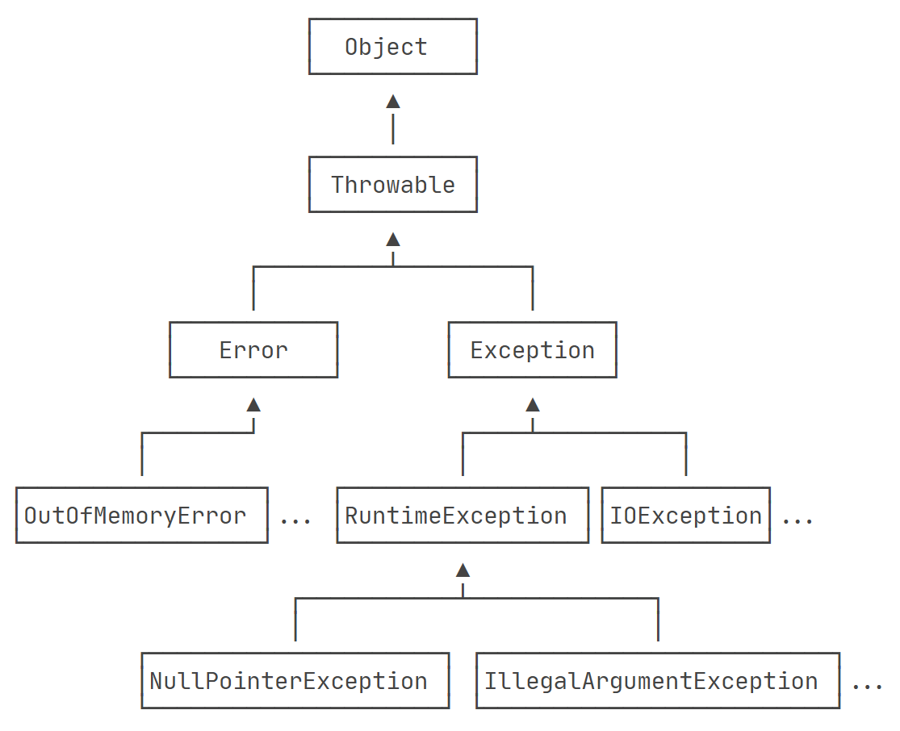

# 异常简介

Java 中异常类型分为两大类：

- 检查型异常（Checked Exceptions）
- 非检查型异常（Unchecked Exceptions）
- *<u>错误（Errors）</u>*

## 检查型异常

检查型异常是 编译时异常，必须在代码中显式地捕获或声明抛出，否则编译器会报错。

他们通常用于表示可以合理预见并且必须在运行时进行处理的异常情况。

常见的检查型异常：

| 异常类型                     | 描述                                                        |
| ---------------------------- | ----------------------------------------------------------- |
| IOException                  | 处理 I/O 操作时抛出的异常，如文件未找到、无法读取或写入文件 |
| SQLException                 | 在执行SQL操作时抛出的异常，如数据库连接失败、SQL语法错误    |
| ClassNotFoundException       | 尝试加载类时，指定的类不存在                                |
| FileNotFoundException        | 尝试打开一个不存在的文件                                    |
| IllegalArgumentException     | 表示方法收到的参数非法或不合适                              |
| UnsupportedEncodingException | 表示请求的字符编码不受支持                                  |

## 非检查型异常

非检查型异常 是运行时异常，不需要显式的捕获或声明抛出。

它们通常用于表示编程错误，如逻辑错误或非法操作。非检查型异常继承自 `RuntimeException` 类。

常见的非检查型异常：

| 异常类型                       | 描述                                           |
| ------------------------------ | ---------------------------------------------- |
| NullPointerException           | 在空对象上调用方法或访问成员变量时，抛出此异常 |
| ArrayIndexOutOfBoundsException | 当程序访问数组时，索引超限，抛出此异常         |
| ArithmeticException            | 当程序中发生算术错误时，抛出此异常，如 除以零  |
| ClassCastException             | 当试图将对象强制转换为非实例化类时，抛出此异常 |

## 错误

除了异常，Java 中还有一类称为 错误（Errors），他们是程序中严重的错误，通常表示运行时环境中的问题，引用程序一般不应该捕获或处理这些错误。

常见的错误包括：

| 错误类型           | 描述                                      |
| ------------------ | ----------------------------------------- |
| StackOverflowError | 当应用程序递归调用太多次而导致堆栈溢出    |
| OutOfMemoryError   | 当 JVM 无法分配对象，因为它没有足够的内存 |