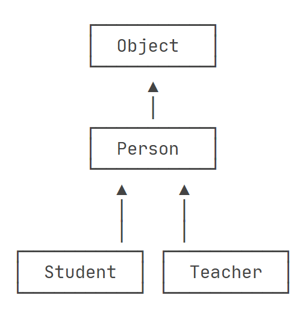

# 继承

继承就是子类继承父类的属性和方法，使得子类对象可以使用父类中公开的属性和方法。

>父类更通用，子类更具体。


继承的特性：

- 子类可以继承父类中的所有属性和方法，当父类中的属性使用 `private` 定义时，子类同样继承了，只是不能直接访问而已；
- 子类继承父类的属性和方法后，子类还可以拓展自己特有的属性和方法；
-  类不支持多继承，但支持多重继承；
- 继承提高了类之间的耦合性（但是耦合度高就会造成代码联系越紧密，代码独立性越差）；


## 类的继承

在 java 中，类不支持多继承，但是支持多重继承。


>示例：开发 Animal 父类，然后声明 Cat 子类，子类继承父类的属性和方法。

::: code-group

```java [Animal]
class Person {
  public int id;
  public String name;

  public Person(int id, String name) {
    this.id = id;
    this.name = name;
  }

  public void eat() {
    System.out.println("Person can eat food.");
  }
}
```

```java [Cat]
class Student extends Person {
  public String hobby;

  public Student(int id, String name, String hobby) {
    //super() 调用父类的构造函数
    super(id, name);
    this.hobby = hobby;
  }

  public void study() {
    System.out.println("cat can study Math.");
  }
}
```

:::

在 OOP 的术语中，我们把 `Person` 称为超类（super class）、父类（parent class）、基类（base class），把 `Student` 称为子类（subclass）、扩展类（extended class）、派生类。


## 继承树

上面示例中 `Person` 类没有使用 `extends` 关键字，但是它其实是继承了 `Object` 类的（任何类都是继承自 Object 对象的）。

下图是`Object`，`Person`、`Student` 、`Teacher` 四个类的继承树：




## 关键字

### extends

在 java 中，类的继承是单一继承，即**一个子类只能继承自一个父类**。因此 `extends` 关键字只能继承一个父类。

```java [11]
class Animal {
  public String name;

  public Animal(String name) {
    this.name = name;
  }
}

class Cat extends Animal {
}
```


### implements

使用 `implements` 关键字可以变相的使子类继承多个父类，但是父类只能是 `interface` 定义的接口。

```java [9]
interface A {
  void method1();
}
interface B {
  void method2();
}

// 子类需实现接口中定义的方法
class C implements A, B {
  @Override
  public void method1() {
  }

  @Override
  public void method2() {
  }
}
```


### super

`super` 关键字 可以在子类中调用父类的 属性、方法、构造器。

::: info TIP

1. 一般情况下，我们可以省略 `super.` 的接口，直接使用 属性名 / 方法名 简写就可以了；
2. 但是当子类重写了父类的方法，或子类和父类中存在相同名称的属性或方法时，就必须使用 `super.` 的方式；
3. 在<span style="color:#CC0000;">子类构造器中使用 `super()` 方法时，必须写到构造器的第一行</span>；

:::

```java [18,23,26]
class Person {
  String name;
  int age;

  public Person(int age, String name) {
    this.age = age;
    this.name = name;
  }

  public void eat() {
    System.out.println("eating...");
  }
}

class Student extends Person {
  public Student(int age, String name) {
    //super向父类传递参数
    super(age, name);
  }

  public void test() {
    //super调用父类属性
    System.out.println(super.name);
    //super调用父类方法
    super.eat();
  }
}
```


### this

`this` 关键字 指向当前类自己的引用。`this` 可以调用类内部的 成员变量、方法、构造器。

```java [9,14,24,29]
public class Person {
  private String name;
  private int age;

  public Person() {
  }

  public Person(String name) {
    this(); //调用上面的空构造函数
    this.name = name;
  }

  public Person(String name, int age) {
    this(name); //调用上面一个参数的构造函数
    this.name = name;
    this.age = age;
  }

  public String getName() {
    return name;
  }
  
  public void setName(String name) {
    this.name = name;
  }
}
```


### final

`final` 关键字可以用来修饰变量（包括 类属性、对象属性、局部属性和形参）、方法 和 类。

`final` 意味 “最终的”，即使用 `final` 声明的类就是最终类，**不能被继承**、**不能使用修饰方法**、**不能被子类重写**。

```java
final class Person {
}

class p extends Person { // ❌无法从 final 'Person' 继承
}
```


## 阻止继承

正常情况下，只要类没有被 `final` 修饰，那么任何类都可以继承该类。

从 java15 开始，允许使用 `sealed` 关键字修饰类，并通过 `permits` 关键字明确写出能够从该类继承的子类名称。

```java
sealed class Shape permits Rectangle, Circle {
}

final class Rectangle extends Shape {
}

final class Circle extends Shape {
}

// ❌ sealed层次结构中不允许使用'Polygon'
final class Polygon extends Shape {
}
```

原因是 `Polygon` 类并未出现在 `permits` 的类表中，这种 `sealed` 类主要用于一些框架中，防止类被随意继承。


## 向上转型

向上转型 指把一个子类型安全的变为抽象的父类型。

```java
//常规实例化类
Person p1 = new Person();
Student s1 = new Student();

//向上转型
Person p2 = new Student();
Object o1 = p2;
```

因为 `Student` 类是继承自 `Person` 类，因此子类拥有了父类的所有属性和方法。此时 `Person` 父类可以承载 `Student` 子类，因此**父类的引用指向子类的对象**是可以的！


## 向下转型

和向上转型相反，如果把一个**父类类型强制转换为子类类型**，就是向下转型。

```java
Person p1 = new Student();
Person p2 = new Person();

Student s1 = (Student) p1; // ✅
Student s3 = (Student) s1; // ❌
```

`p1` 强制转为 `Student` 类时，可以转换成功，因为 p1 确实指向了 Student 实例。

`p2` 强制转为 `Student` 类时，转换失败，因为 p2 指向了父类 Person 对象，子类的功能可能会比父类多，多的功能父类无法凭空变出来！


### instanceof

为了避免 向下转换 时出错，导致程序无法正常运行，java 提供了 `instanceof` 操作符，可以判断一个实例是否是某种类型：

```java
Person p1 = new Student();
Person p2 = new Person();

Student s1 = (Student) p1; // ✅

System.out.println(p1 instanceof Student); // true
System.out.println(p2 instanceof Student); // false

if (p2 instanceof Student) { //不会执行
  Student s = (Student) s1;
}

if (p1 instanceof Student) {
  Student s = (Student) p1;
  s.saveMoney(); //可以执行
}
```

从 java14 开始，判断 `instanceof` 之后，可以直接转型为指定变量，避免再次强制转型：

```java
if (p1 instanceof Student s) {
    s.saveMoney();
}
```