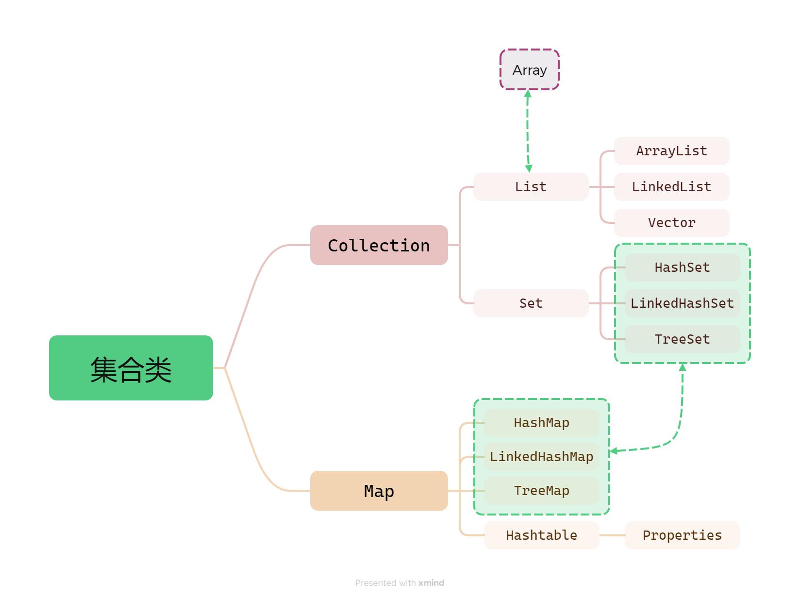

# 集合框架

前面已经学习了数组可以存储数组，为什么还要学习 集合 呢？

::: danger 数组的缺点

1. **数组一旦创建，其长度就固定了**。如果要存储更多的元素，就必须重新创建一个更大的数组，并将原有元素复制过去，效率不高；

2. **数组只能存储同一类型的数据**，如果要存储不同类型的数据，只能使用 Object 类型，但这样失去了类型安全性，容易出现类型转换错误；

3. 数组提供的方法较少，**对于添加、删除、插入等操作非常不便**，且效率不高；

4. 数组的 length 属性只能告诉我们数组的容量，而不能直接获取实际存储的元素个数；

:::

## Collection

Java 标准库自带的 java.util 包提供了主要的集合类 `Collection`，它是除了 Map 外其他所有集合类的根接口。

Java 的 java.util 包主要提供了三种类型的集合：

- `List`：一种有序列表的集合；
- `Set`：一种保证没有重复元素的集合；
- `Map`：一种通过键值对查找的映射表集合；

Java 访问集合总是通过统一的方式——迭代器（Iterator）来实现，它最明显的好处在于无需知道集合内部元素是按照什么方式存储的。

由于 Java 的集合类设计的比较早，所以有部分集合类是遗留类，不建议再继续使用：

- `Hashtable`：一种线程安全的 Map 实现；
- `Vector`：一种线程安全的 List 实现；
- `Stack`：基于 Vector 实现的 LIFO 的栈；

还有一小部分接口是遗留接口，也不建议继续使用：

- `Enumeration<E>`：已被 `Iterator<E>` 代替；

