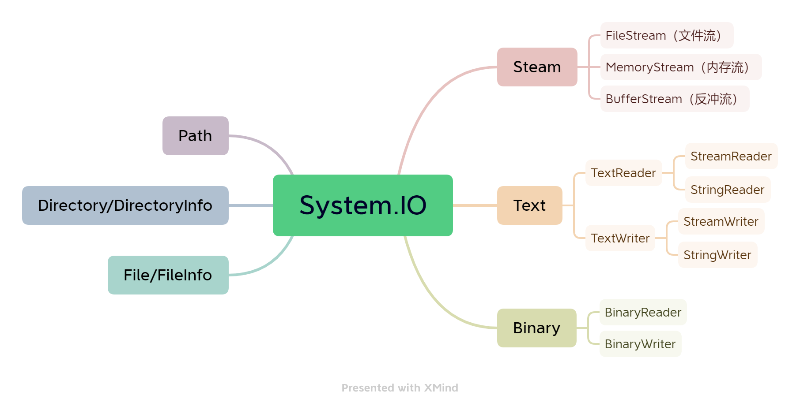

# 文件IO操作

流 是一个字节序列，可用于对后备存储进行 读取 和 写入操作，后备存储可以是多个存储媒介之一，例如磁盘和内存。




## Path操作

Path类主要用于处理文件和目录路径。

常用方法：

| 方法                          | 描述                   |
| ----------------------------- | ---------------------- |
| GetExtension()                | 获取文件扩展名         |
| ChangeExtension()             | 修改文件扩展名         |
| HasExtension()                | 判断文件是否带有扩展名 |
| Combine()                     | 合并两个路径           |
| GetFileName()                 | 获取文件名，带有扩展名 |
| GetFileNameWithoutExtension() | 获取文件名，不带扩展名 |
| GetFullPath()                 | 获取文件的绝对路径     |
| GetDirectoryName()            | 获取路径中的目录部分   |
| GetPathRoot()                 | 获取路径中的根目录部分 |

```C#
string path1 = "E:\\code";
string path2 = "file\\test.txt";

// 获取文件扩展名
var extension = Path.GetExtension(path2);//.txt
// 修改文件扩展名
var newExtension = Path.ChangeExtension(path2, "pdf");// /file/test.pdf
// 判断文件是否带有扩展名
var isExtension = Path.HasExtension(path1);//false
// 合并两个路径
var combinePath = Path.Combine(path1, path2);//E:\\code\\file\\test.txt
// 获取文件名
var fileName = Path.GetFileName(path2);//test.txt
var fileNameWithoutExtension = Path.GetFileNameWithoutExtension(path2);//test
// 获取文件绝对路径
var fullPath = Path.GetFullPath(path2);
// 获取路径中的目录部分
var dirPath = Path.GetDirectoryName(fullPath);
// 获取路径中的根路径
var rootPath = Path.GetPathRoot(fullPath);
```


## Directory操作

`Directory` 用于通过目录和子目录进行 创建、移动、删除、枚举的 **静态方法**。

常用方法：

| 方法               | 描述                           |
| ------------------ | ------------------------------ |
| Exists()           | 判断目录是否存在               |
| CreateDirectory()  | 创建目录                       |
| Delete(path)       | 删除文件夹，只能删除空文件夹   |
| Delete(path, true) | 删除文件夹，递归删除所有文件夹 |
| Move()             | 移动文件夹                     |
| GetDirectories()   | 获取子目录文件夹               |
| GetFiles()         | 获取目录下的文件               |

```C#
string path = @"E:/code/test/test001";

if (!Directory.Exists(path))
{
    Directory.CreateDirectory(path);
}
// 删除文件夹，只能删除空文件夹
Directory.Delete(path);
// 递归删除目录下所有空文件夹
Directory.Delete(@"E:/code", true);
// 移动文件
Directory.Move(@"E:/code/test", @"E:/code/test2");
// 获取子目录
var childDirs = Directory.GetDirectories(@"E:/code/");
// 获取文件
var files = Directory.GetFiles(path);
```


## DirectoryInfo操作

`DirectoryInfo` 用于 创建、移动、删除、枚举目录和子目录的 **实例方法**（就是要 `new DirectoryInfo()`）。

常用方法：

| 方法                       | 描述                                              |
| -------------------------- | ------------------------------------------------- |
| Exists                     | 一个属性，判断是否存在当前路径                    |
| Create()                   | 创建文件夹                                        |
| Delete(true)               | 递归删除文件夹                                    |
| Refresh()                  | 刷新文件夹                                        |
| EnumerateDirectories()     | 获取文件夹集合                                    |
| EnumerateFiles()           | 获取文件集合                                      |
| EnumerateFileSystemInfos() | 获取文件夹和文件的集合                            |
| GetDirectories()           | 获取文件夹数组（效果和 EnumerateDirectories相同） |
| GetFiles()                 | 获取文件集合                                      |
| GetFileSystemInfos()       | 获取文件夹和文件的集合                            |

```C# {2}
string path = @"E:/code/test";
DirectoryInfo dir = new DirectoryInfo(path);

if (!dir.Exists) dir.Create();
// 删除目录下的文件
dir.Delete(true);
// 刷新文件夹
dir.Refresh();

// 获取目录下子文件夹的集合
List<DirectoryInfo>? enumDirs = dir.EnumerateDirectories().ToList();
// 获取目录下文件的集合
List<FileInfo>? enumFiles = dir.EnumerateFiles().ToList();
// 获取目录下文件夹和文件的集合
List<FileSystemInfo>? enumAll = dir.EnumerateFileSystemInfos().ToList();

// 获取目录下子文件夹数组
DirectoryInfo[]? arrDirs = dir.GetDirectories();
// 获取目录下子文件数组
FileInfo[]? arrFiles = dir.GetFiles();
// 获取目录下文件夹和文件的数组
FileSystemInfo[]? arrAll = dir.GetFileSystemInfos();
```


