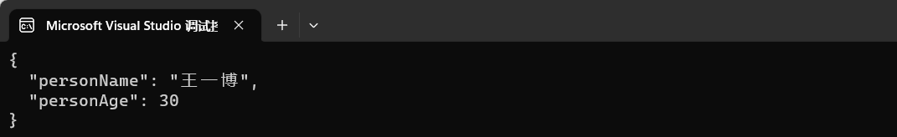
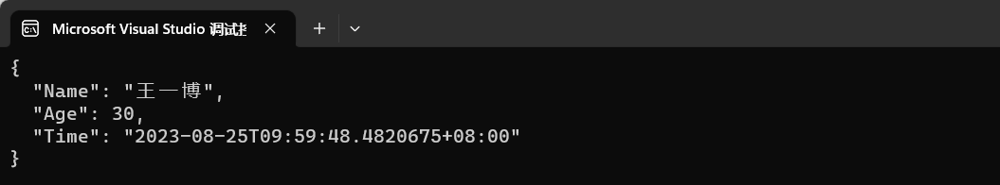

# 序列化与反序列化

微软提供了两个 序列化与反序列化 的包，分别是 `Newtonsoft.Json` 和 `System.Text.Json`。

推荐使用 `System.Text.Json` 包，因为微软正在将前者的功能往后者中迁移。

### Newtonsoft.Json

#### 序列化

- 序列化：对象类型 转换为 json 字符串。

```C#
//定义一个 Person 类
public record Person(string Name, int Age);
```

```C#
Person person = new Person("王一博", 40);

//对象 序列化为 json字符串
string? json = JsonConvert.SerializeObject(person);
Console.WriteLine(json);

Console.WriteLine(json.GetType());    //System.String
```

#### 反序列化

- 反序列化：json 字符串 转换为 对象类型。

```C#
string str = "{\"Name\":\"王一博\",\"Age\":40}";

//json字符串 反序列化为 对象
object? obj = JsonConvert.DeserializeObject(str);
Console.WriteLine(obj);

Console.WriteLine(obj!.GetType());    //Newtonsoft.Json.Linq.JObject
```

#### 格式化

1. **对 json 字符串格式化**

`JsonConvert.SerializeObject`的第二个参数`Formatting`是用来设置 JSON 字符串的格式化选项的。

默认情况下，JSON 字符串是不进行格式化的。如果想在输出时进行格式化，可以将 Formatting 设置为`Formatting.Indented`。

```C#
Person person = new Person("王一博", 40);

//对象 序列化为 json字符串
string? json = JsonConvert.SerializeObject(person, Formatting.Indented);
Console.WriteLine(json);
```

未格式化：


格式化后：




2. **对属性名进行格式化**

在某些情况下，我们需要将对象的属性名序列化为不同的名称。可以使用`JsonPropertyAttribute`来指定序列化时的属性名。

```C#
//定义一个 Person 类
public class Person
{
    [JsonProperty(PropertyName = "personName")]
    public string? Name { get; set; }

    [JsonProperty(PropertyName = "personAge")]
    public int Age { get; set; }
}
```

```C#
//运行结果如上图所示！
string? res = JsonConvert.SerializeObject(person, Formatting.Indented);
Console.WriteLine(res);
```


3. **对日期格式化**

```C#
//定义一个 Person 类
public class Person
{
    public string? Name { get; set; }
    public int Age { get; set; }
    public DateTime Time { get; set; } //新增日期字段
}
```

```C#
Person person = new Person
{
    Name = "王一博",
    Age = 30,
    Time = DateTime.Now
};

JsonSerializerSettings settings = new JsonSerializerSettings
{
    DateFormatString = "yyyy-MM-dd HH:mm:ss" //设置日期格式化字符串
};

string? res = JsonConvert.SerializeObject(person, Formatting.Indented, settings);
Console.WriteLine(res);
```

未格式化：



格式化后：


<br />
### System.Text.Json

#### 序列化

```C#
//定义一个Person类
public record Person(string Name, string Age, string Hobby);
```

```C#
//对象序列化为 JSON
var obj = new Person("sunny", "20", "Singsong");

string json = JsonSerializer.Serialize(obj);
Console.WriteLine(json);
```

#### 反序列化

```C#
//JSON 反序列化为对象
string jsonString = "{\"Name\":\"sunny\",\"Age\":\"20\",\"Hobby\":\"Singsong\"}";

//此处需要指定泛型(反序列化的对象类型)
var person = JsonSerializer.Deserialize<Person>(jsonString);
Console.WriteLine($"Name: {person!.Name}, Age: {person!.Age}, Hobby: {person!.Hobby}");
```

#### 字典的序列化

序列化：

```C#
//定义一个字典类型
var dictionary = new Dictionary<string, string>()
{
    { "Name", "sunny" },
    { "Age", "25" },
    { "Hobby", "Singsong" }
};
//字典序列化为JSON
string json = JsonSerializer.Serialize(dct);
Console.WriteLine(json);
```

反序列化：

```C#
//定义一个字符串
string jsonString = "{\"Name\":\"sunny\",\"Age\":\"20\",\"Hobby\":\"Singsong\"}";
//JSON 反序列化为 字典
var deserializedObj = JsonSerializer.Deserialize<Dictionary<string, string>>(jsonString);

foreach (var (key, value) in deserializedObj)
{
    Console.WriteLine($"{key}: {value}");
}
```
