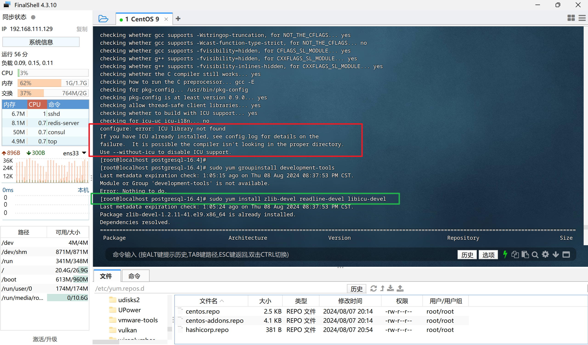

# postgres部署

## 单机部署

**第 1 步：**

[下载 postgresql](https://www.postgresql.org/ftp/source/) 的 tar包：

```shell
postgresql-16.4.tar.gz 
```


**第 2 步：**

```shell
# 解压 tar 包
tar -xvf postgresql-16.4.tar.gz
# 切换到解压文件夹
cd postgresql-16.4.tar.gz
# 检查系统环境与扫描依赖包
./configure
```

::: warning 报错

如果在检查系统环境与扫描依赖包时报错：



解决方案：

1. 执行下面的命令，安装相关依赖：

   ```shell
   sudo yum install zlib-devel readline-devel libicu-devel
   ```

2. 重新扫描依赖包：

   ```shell
   ./configure
   ```

:::


**第 3 步：**

```shell
# 编译并安装
make && make install
# 添加用户
adduser postgres
# 设置密码
passwd postgres	# 761102lfy
# 创建data目录
mkdir /usr/local/pgsql/data
# 授权data目录给postgres账户
chown postgres /usr/local/pgsql/data
# 切换到postgres账户
su - postgres
# 初始化安装与生成数据目录
/usr/local/pgsql/bin/initdb -D /usr/local/pgsql/data
# 启动postgres
/usr/local/pgsql/bin/pg_ctl -D /usr/local/pgsql/data -l logfile start
```


**第 4 步：**

配置 postgres 的环境变量：

```shell
vim /etc/profile
```

```shell
# 新增内容
export PATH=$PATH:/usr/local/pgsql/bin
```

```shell
source /etc/profile
```


**第 4 步：**

```shell
# 登录到PostgreSQL命令行（注意：如果psql未生效，则进入到安装目录执行：/usr/local/pgsql/bin/）
psql -U postgres
 
# 创建新用户
CREATE USER admin WITH PASSWORD 'admin';
# 设置用户权限
CREATE ROLE admin WITH LOGIN SUPERUSER PASSWORD 'admin';
```


**第 5 步：**

在 `/usr/local/pgsql/data/postgresql.conf` 中修改 **端口 **和 **监听IP**：

```shell
port = 5432

listen_addresses = '*'
```

在 `/usr/local/pgsql/data/pg_hba.conf` 中添加内容：

```shell
host    all     all      0.0.0.0/0      md5
```

```shell
# 重启 postgres
/usr/local/pgsql/bin/pg_ctl -D /usr/local/pgsql/data restart
```


**第 6 步：**

设置开机自启：

```shell
vim /etc/rc.local
```

```shell
# 开机自启
su - postgres -c "/usr/local/pgsql/bin/pg_ctl -D /usr/local/pgsql/data -l logfile start"
```

```shell
sudo chmod +x /etc/rc.local
```

重新启动 linux 即可实现开机自启！


