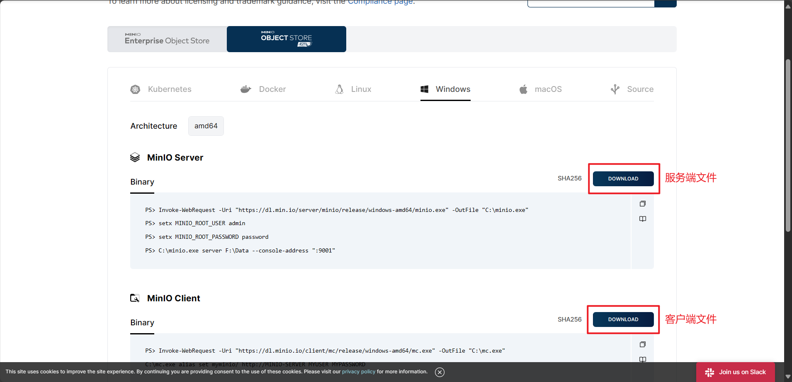
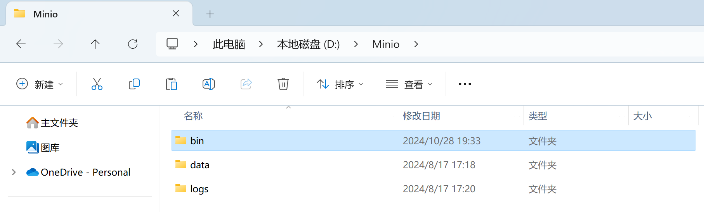

# MinIO安装教程

## 下载MinIO

>MinIO 下载地址：https://min.io/download?license=agpl&platform=windows#/windows


::: warning 注意

1. 下载 MinIO 时选择普通版本，不要选择为商业版本了，否则启动 MinIO 会要商业证书。

:::




## 创建MinIO文件目录

::: warning 注意

新建 MinIO 文件夹时，尽量选择路径中**没有空格**和**特殊符号**的路径，否则后续会出现一些意想不到的问题。

:::

新建 MinIO 文件夹，用于存储所有 MinIO 相关内容：

- 新建 `bin` 文件夹，存储下载的 mc.exe 和 minio.exe 程序；

- 新建 `data` 文件夹，存放相关数据文件；

- 新建 `logs` 文件夹，存放日志文件；




## 命令启动

1. 设置用户名和密码：

```shell
# 设置用户名，默认用户名 minioadmin
setx MINIO_ROOT_USER minioadmin

# 设置密码，默认密码 minioadmin
setx MINIO_ROOT_PASSWORD minioadmin
```

2. 在 MinIO 的 `bin` 文件夹下打开 cmd，启动 MinIO：

```shell
.\minio.exe server D:\Minio\data --console-address "127.0.0.1:9000" --address "127.0.0.1:9005"
```

::: tip 注意

1. 其中 `data` 文件夹的路径，需要替换为自己电脑的路径，用于存放相关数据；
2. 127.0.0.1:9000 是启动 MinIO 后可视化界面的地址，**<span style="color:#FF3333;">127.0.0.1:9005 是 MinIO 服务端地址</span>**；

:::


启动成功后，在浏览器打开 127.0.0.1:9000 即可查看到 MinIO Web 可视化界面了。


## 脚本启动

::: code-group

```bash [控制台输出日志]
@echo off

REM 设置窗口标题
title MinIO Start

REM MinIO 执行文件路径
set MINIO_PATH="D:\Minio\bin\minio.exe"

REM 数据文件夹路径
set DATA_PATH="D:\Minio\data"

REM 设置 MinIO 用户名密码
set MINIO_ROOT_USER=minioadmin
set MINIO_ROOT_PASSWORD=minioadmin

REM 以管理员权限运行 MinIO 服务
start "" /B %MINIO_PATH% server %DATA_PATH% --console-address "127.0.0.1:9000" --address "127.0.0.1:9005"

pause
```

```bash [日志文件输出]
@echo off

REM 设置字符集为 UTF-8
chcp 65001
echo.

REM 设置窗口标题
title MinIO文件服务

REM MinIO 执行文件路径
set MINIO_PATH="D:\Minio\bin\minio.exe"

REM 数据文件夹路径
set DATA_PATH="D:\Minio\data"

REM 日志文件夹路径
set LOG_PATH="D:\Minio\logs\minio.log"

REM 设置 MinIO 用户名密码
set MINIO_ROOT_USER=minioadmin
set MINIO_ROOT_PASSWORD=minioadmin

REM 以管理员权限运行 MinIO 服务
start "" /B %MINIO_PATH% server %DATA_PATH% --console-address "127.0.0.1:9000" --address "127.0.0.1:9005" > %LOG_PATH% 2>&1

REM 检查 MinIO 是否成功启动
if %ERRORLEVEL% equ 0 (
    echo MinIO 启动成功.
    echo.

    REM 显示启动信息
    echo WebUI：http://127.0.0.1:9000
    echo RootUser：%MINIO_ROOT_USER%
    echo RootPass：%MINIO_ROOT_PASSWORD%
    echo.
) else (
    echo MinIO启动失败, 请检查配置和日志文件.
)

pause
```

:::


::: details 参数解释

```shell
start "" /B %MINIO_PATH% server %DATA_PATH% 
--console-address "127.0.0.1:9000" 
--address "127.0.0.1:9005" > %LOG_PATH% 2>&1
```

::: info

1. `""`：表示启动窗口的名称，上面已经通过 title 设置，这里为 "" 即可；
2. `/B`：表示就在当前窗口启动，不开启新窗口启动；
3. `2>&1`：2表示标准错误，>表示重定向，1表示标准输出，合起来表示将标准错误重定向到标准输出的日志文件；

:::

:::
