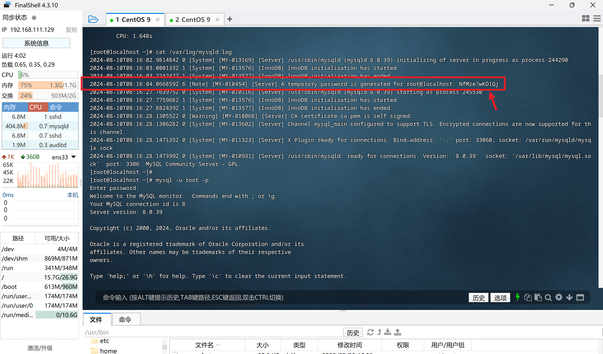

# MySQL部署

>教程：https://blog.csdn.net/xp178171640/article/details/123611639


**第一步：**

[下载 MySQL 安装包](https://dev.mysql.com/downloads/mysql/)，如图所示：


第 2 步：

新建文件夹 mysql-8.0.39，将下载后的安装包复制到该文件夹中：

```shell
tar -xvf mysql-8.0.39-1.el9.x86_64.rpm-bundle.tar
# 强制安装 MySQL
rpm -ivh *.rpm --nodeps --force
# 查看 MySQL 安装路径
whereis mysql
```


第 3 步：

```shell
# 初始化数据库
mysqld --initialize --console
# 目录授权
chown -R mysql:mysql /var/lib/mysql/
# 启动 MySQL
systemctl start mysqld
# 设置开机自启
systemctl enable mysqld
```


第 4 步：

启动 MySQL 后，会给 root 账户分配默认密码，使用下面命令查看默认密码：

```shell
# 查看默认密码
cat /var/log/mysqld.log
# 使用 root 登录 MySQL （注意，这里手输密码，复制了好像不对）
mysql -u root -p
# 修改默认密码
ALTER USER 'root'@'localhost' IDENTIFIED BY '123456'
```




第 5 步：

授权远程登录，执行下面所有命令：

```shell
SHOW databases;	
USE mysql;
UPDATE user SET host = "%" WHERE user='root';
SELECT host, user, authentication_string, plugin FROM user;
FLUSH privileges;
```


第 6 步：

修改防火墙，向外暴漏 3306 端口：

```shell
firewall-cmd --zone=public --add-port=3306/tcp --permanent
systemctl restart firewalld
```

然后就可以使用 Navicat 连接 MySQL 啦！