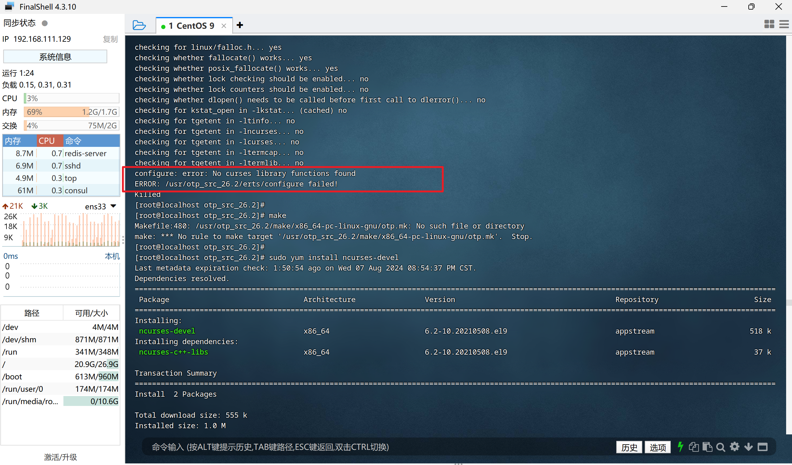
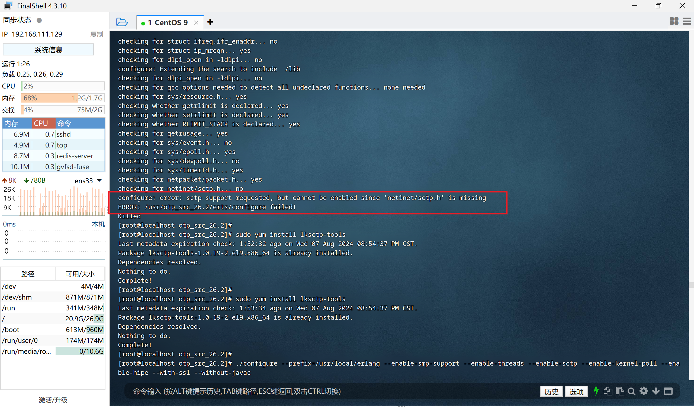

# RabbitMQ部署

## 单机部署

>视频教程：https://www.bilibili.com/video/BV14A411q7pF?p=5
>
>https://www.bilibili.com/video/BV1zo4y157Tx


**第 1 步：**

下载对应版本的 [erlang包](https://www.erlang.org/downloads) 和 [RabbitMQ包](https://www.rabbitmq.com/docs/install-generic-unix) （注意版本要对应，[点击](https://www.rabbitmq.com/docs/install-generic-unix)查看版本对应信息）：

```shell
# 使用最新版本的 rabbitmq 包（注意是 unix 版本）
rabbitmq-server-generic-unix-3.13.6.tar.xz
# 使用 26 版本的 erlang
otp_src_26.2.5.2.tar.gz
```


**第 2 步：**

```shell
# 卸载默认 erlang
yum remove erlang*
# 安装 c++ 环境
yum -y install make gcc gcc-c++
```


**第 3 步：**

解压 erlang包，并配置JDK：

```shell
# 解压 erlang
tar -xvf otp_src_26.2.tar.gz
# 进入解压后的目录
cd otp_src_26.2
# 配置JDK
./configure --prefix=/usr/local/erlang --enable-smp-support --enable-threads --enable-sctp --enable-kernel-poll --enable-hipe --with-ssl --without-javac

# 编译并安装
make && make install
```

::: warning 报错1

如果在 配置JDK 时，出现这样的报错，如下：



解决方案：

- 安装 `ncurses-devel` 包：

  ```shell
  sudo yum install ncurses-devel
  ```

:::

::: warning 报错2

如果上面的配置完成后，又报了新的错，如下：



解决方案：

- 安装 `lksctp-tools-devel` 包：

  ```shell
  yum -y install lksctp-tools
  
  yum -y install lksctp-tools-devel
  ```

:::


**第 4 步：**

```shell
# 配置 erlang 环境变量
vim /etc/profile
```

```shell
export PATH=$PATH:/usr/local/erlang/bin
```

```shell
# 重新编译文件
source /etc/profile
```


**第 5 步：**

由于下载的 rabbitmq包 是 `*.tar.xz` 格式的，先将它解压为 `*.tar` 格式，再解压 tar 格式：

```shell
# 解压 .tar.xz
xz -d rabbitmq-server-generic-unix-3.13.6.tar.xz
# 解压 .tar
tar -xvf rabbitmq-server-generic-unix-3.13.6.tar
```


**第 6 步：**

进入解压后的文件夹的 sbin 文件夹：

```shell
cd rabbitmq_server-3.13.6/sbin/

# 启动 rabbitmq
./rabbitmq-server -detached
# 安装客户端工具
./rabbitmq-plugins enable rabbitmq_management

# 添加新用户 admin
rabbitmqctl add_user admin admin
# 为 admin 设置管理员角色
rabbitmqctl set_user_tags admin administrator
# 为 admin 设置权限
rabbitmqctl set_permissions -p / admin ".*" ".*" ".*"
# 重新启动 rabbitmq
./rabbitmq-server -detached
```

::: warning 报错

如果在添加新用户时，报错提示：bash: rabbitmqctl: command not found...

解决方案（和第4步相同，需要配置环境变量）：

- 在 /etc/profile 中添加下面内容：

  ```shell
  export PATH=$PATH:/usr/rabbitmq_server-3.13.6/sbin
  ```

- 重新编译文件：

  ```shell
  source /etc/profile
  ```

:::

**第 7 步：**

修改防火墙，并向外暴漏 5672 和 15672 端口：

```shell
firewall-cmd --zone=public --add-port=5672/tcp --permanent
firewall-cmd --zone=public --add-port=15672/tcp --permanent
systemctl restart firewalld
```

然后在浏览器中输入 http://192.168.111.129:15672/ 就可以看到 rabbitmq 的客户端啦！
