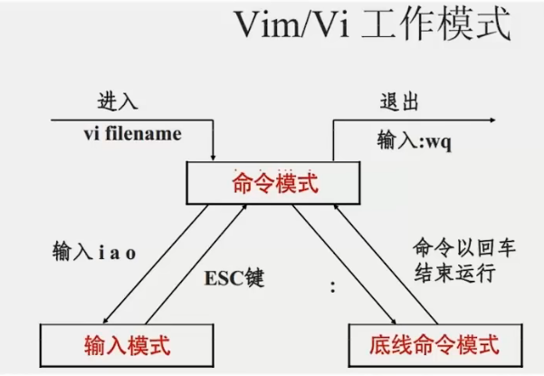

# vim

vim 是 linux 中最经典的文本编辑器，通图形化界面中的文本编辑器一样，在 linux 中，vim 是在命令行对文本编辑的最佳选择。


## vim 的工作模式

- **命令模式：**
  - 命令模式下，所敲的按键编辑器都可以理解为命令，以命令执行不同的功能；
  - 此模式下，不能自由进行文本编辑；
- **输入模式：**
  - 就是对文本进行编辑的模式，此模式下可以对文本自由进行编辑；
- **底线命令模式：**
  - 以 `:` 开始，通常用于文件的保存、退出；




### 基本使用

```shell
vim 文件名称
```

::: info 注意

1. 如果文件路径表示的文件 不存在，那么命令会用于 创建新文件并编辑；

2. 如果文件路径表示的文件 存在，那么命令会用于 编辑已有文件；

:::


### 命令模式快捷键

| 命令 | 描述                                |
| :--: | ----------------------------------- |
|  i   | 在当前光标位置进入 输入模式         |
|  a   | 在当前光标位置 之后 进入 输入模式   |
|  I   | 在当前行的开头，进入 输入模式       |
|  A   | 在当前行的结尾，进入 输入模式       |
|  o   | 在当前光标的下一行进入 输入模式     |
|  O   | 在当前光标的上一行进入 输入模式     |
| esc  | 任何情况下输入 esc 都可回到命令模式 |

|      命令      | 描述                   | 命令     | 描述                             |
| :------------: | ---------------------- | -------- | -------------------------------- |
| 键盘上、键盘 k | 向上移动光标           | dd       | 删除光标所在行                   |
| 键盘下、键盘 j | 向下移动光标           | ndd      | n是数字，表示删除当前光标向下n行 |
| 键盘左、键盘 h | 向左移动光标           | yy       | 复制当前行                       |
| 键盘右、键盘 l | 向右移动光标           | nyy      | n是数字，表示复制当前光标向下n行 |
|       0        | 移动光标到当前行的开头 | p        | 粘贴复制的内容                   |
|       $        | 移动光标到当前行的结尾 | u        | 撤销修改                         |
|      PgUp      | 向上翻页               | ctrl + r | 反向撤销修改                     |
|      PgDn      | 向下翻页               | gg       | 跳到首行                         |
|       /        | 进入搜索模式           | G        | 跳到行尾                         |
|       n        | 向下继续搜索           | dG       | 从当前行开始，向下全部删除       |
|       m        | 向上继续搜索           | dgg      | 从当前行开始，向上全部删除       |
|                |                        | d$       | 从当前光标开始，删除到本行的结尾 |
|                |                        | d0       | 从当前光标开始，删除到本行的开头 |


### 底线命令模式

| 命令       | 描述         |
| ---------- | ------------ |
| :wq        | 保存并退出   |
| :q         | 仅退出       |
| :q!        | 强制退出     |
| :w         | 仅保存       |
| :set nu    | 显示行号     |
| :set paste | 设置粘贴模式 |


