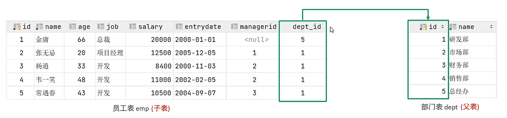
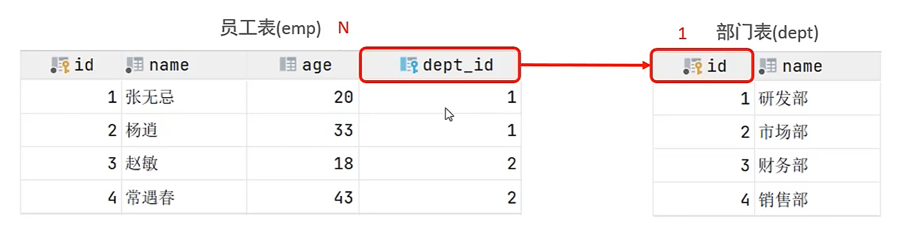
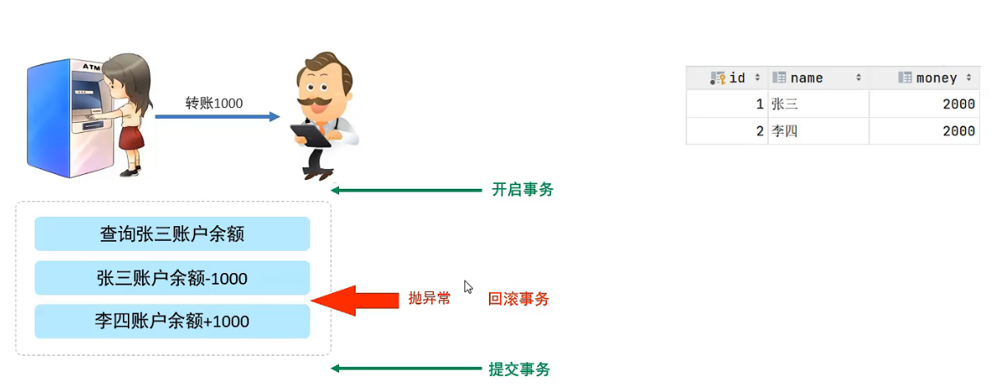

# 函数/约束/多表查询/事务

## 函数

函数：是指一段可以直接被另一段程序调用程序或代码，例如 聚合函数。


### 字符串函数

| 字符串函数                    | 功能                                                                |
| ----------------------------- | ------------------------------------------------------------------- |
| concat(str1, str2, ...)       | 字符串拼接，将 str1, str2, ..... 拼接为一个字符串                   |
| lower(str)                    | 将字符串 str 全部转为小写                                           |
| upper(str)                    | 将字符串 str 全部转为大写                                           |
| lpad(str, n, padstring)       | 左填充，用字符串 padstring 对 str 左边进行填充，达到 n 个字符串长度 |
| rpad(str, n, padstring)       | 右填充，用字符串 padstring 对 str 右边进行填充，达到 n 个字符串长度 |
| trim(str)                     | 去除字符串首尾的空格                                                |
| substring(str, start, length) | 截取字符串，从 start 开始截取 length 个字符                         |

示例：

```SQL
select concat('Hello', ' MySQL'); -- Hello MySQL

select upper('hello'); -- HELLO

select lower('HELLO'); -- hello

select lpad('1', 5, '0'); -- 00001

select rpad('1', 5, '0'); -- 10000

select trim('  Hello MySQL  '); -- Hello MySQL

select substring('Hello MySQL', 1, 5); -- Hello

-- 练习：员工工号统一修为5位数，不足5位数的全部在前面补0。比如: 1号员工的工号应该为00001.
update emp set workno = lpad(workno, 5, '0');
```


### 数值函数

| 数值函数      | 功能                               |
| ------------- | ---------------------------------- |
| ceil()        | 向上取整                           |
| floor()       | 向下取整                           |
| mod(x, y)     | x 对 y 取模                        |
| rand()        | 返回 0 ~ 1 之间的随机数            |
| round(num, n) | 对参数 num 四舍五入，保留 n 位小数 |

示例：

```SQL
select ceil(1.3); -- 2

select floor(1.9); -- 1

select mod(4, 3); -- 1

select rand();

select round(1.345, 2); -- 1.35

-- 练习：生成 6 位的随机验证码
select lpad(round(rand() * 1000000, 0), 6, '0');
```


### 日期函数

| 日期函数                           | 功能                                           |
| ---------------------------------- | ---------------------------------------------- |
| curdate()                          | 当前日期                                       |
| curtime()                          | 当前时间                                       |
| now()                              | 当前日期和时间                                 |
| year(date)                         | 获取指定 date 的年份                           |
| month(date)                        | 获取指定 date 的月份                           |
| day(date)                          | 获取指定 date 的日期                           |
| date_add(date, interval expr type) | 返回一个日期加上一个时间间隔 expr 后的时间值   |
| datediff(date1, date2)             | 返回起始时间 date1 和结束时间 date2 之间的天数 |

示例：

```SQL
select curdate(); -- 2023-09-23

select curtime(); -- 19:03:36

select now(); -- 2023-09-23 19:03:36

select year(now()); -- 2023

select  month(now()); -- 9

select day(now()); -- 23

select date_add(now(), interval 70 year); -- 2093-01-23 19:05:21
select date_add(now(), interval 70 day); -- 2023-12-02 19:05:21

select datediff('2023-12-1', '2023-11-1'); -- 30

-- 练习：查询所有员工的入职天数，按照倒序排序
select name, datediff(curdate(), entrydate) as 'days' from emp order by days desc;
```

### 流程函数

| 流程函数                                                   | 功能                                                             |
| ---------------------------------------------------------- | ---------------------------------------------------------------- |
| if(flag, x, y)                                             | 如果 flag 为 true，返回 x，否则返回 y                            |
| ifnull(x, y)                                               | 如果 x 不为空，返回 x，否则返回 y                                |
| case when [val1] then [res1] ... else [default] end        | 如果 val1 为 true，返回 res1，...，否则返回 default 默认值       |
| case [expr] when [val1] then [res1] ... else [default] end | 如果 expr 的值等于 val1，返回 res1，...，否则返回 default 默认值 |

示例：

```SQL
select if(true, 'ok', 'error'); -- ok

select if(false, 'ok', 'error'); -- error

select ifnull('ok', 'error'); -- ok

select ifnull(null, 'error'); -- error

-- 查询员工姓名和性别，如果性别是男，修改为 男生，否则修改为女生
select
    name,
    (case gender when '男' then '男生' else '女生' end) as '性别'
from emp;
```

## 约束

### 概述

概念：约束是作用于表中字段上的规则，用于限制存储在表中的数据。

目的：保证数据库中数据的正确性、有效性、完整性。

分类：

| 约束     | 描述                                                     | 关键字        |
| -------- | -------------------------------------------------------- | ------------- |
| 非空约束 | 限制该字段的数据不能为 null                              | `not null`    |
| 唯一约束 | 保证该字段的所有数据都是唯一、不重复的                   | `unique`      |
| 主键约束 | 主键是一行数据的唯一标识，非空且唯一                     | `primary key` |
| 默认约束 | 保存数据时，如果未指定该字段的值，则采用默认值           | `default`     |
| 外键约束 | 用来让两张表的数据之间建立连接，保证数据的一致性和完整性 | `foreing key` |
| 检查约束 | 保证字段值满足某个条件（数据库版本必须大于 8.0.16）      | `check`       |

示例：

新建一张表：

| 字段名 | 字段含义          | 字段类型         | 约束条件         | 约束关键字                  |
| ------ | ----------------- | ---------------- | ---------------- | --------------------------- |
| id     | 主键，Id 唯一标识 | int8             | 主键，自增       | primary key，auto_increment |
| name   | 姓名              | varChar(10)      | 不为空，并且唯一 | not null，unique            |
| age    | 年龄              | tinyint unsigned | 0-255，无符号    |                             |
| status | 状态              | char(1)          | 默认值为 1       | default                     |
| gender | 性别              | char(1)          | 无               |                             |

代码：

```SQL
create table user(
    id int8 primary key auto_increment comment '主键Id',
    name varchar(10) not null unique comment '姓名',
    age tinyint unsigned comment '年龄',
    status char(1) default '1' comment '状态',
    gender char(1) comment '性别'
) comment '用户表';
```

### 外键约束

概念：外键用来让两张表的数据之间建立连接，从而保证数据的一致性和完整性。



1. 添加外键

```SQL
# 语法
alter table 表名 add constraint 外键名称 foreign key (外键字段名) references 主表(主表列名);

alter table emp add constraint fk_emp_dept_id foreign key (dept_id) references dept(id);
```

2. 删除外键

```SQL
# 语法
alter table 表名 drop foreign key 外键名称;

alter table emploee drop foreign key fk_emploee_dept_id;
```

3. **删除/更新行为**

| 行为              | 说明                                                                                                                      |
| ----------------- | ------------------------------------------------------------------------------------------------------------------------- |
| no action（默认） | 当在父表中删除/更新对应记录时，首先检查该记录是否有对应外键，如果有则不允许删除/更新（等价于 restrict）                   |
| restrict          | 当在父表中删除/更新对应记录时，首先检查该记录是否有对应外键，如果有则不允许删除/更新（等价于 no action）                  |
| cascade           | 当在父表中删除/更新对应记录时，首先检查该记录是否有对应外键，如果有，则也删除/更新子表中的记录                            |
| set null          | 当在父表中删除/更新对应记录时，首先检查该记录是否有对应外键，如果有，则设置子表中该外键值为 null（前提是该外键允许 null） |
| set default       | 父表有变更时，子表将外键列设置为一个默认的值（Innodb 不支持）                                                             |

示例：

```SQL
alter table emploee
    add constraint fk_emploee_dept_id
    foreign key (dept_id) references dept(id)
    on update cascade
    on delete cascade;

alter table emploee
    add constraint fk_emploee_dept_id
    foreign key (dept_id) references dept(id)
    on update set null
    on delete set null;
```

## 多表查询

### 多表关系

多表关系根据业务可以划分为三种：

- 一对多（多对一），例如：员工与部门

- 多对多，例如：学生和课程

- 一对一 ，例如：学生信息拆分

#### 一对多（多对一）

案例：部门 与 员工 的关系

关系：一个部门对应多个员工，一个员工对应一个部门

实现：在多的一方建立外键，指向一的一方的主键



#### 多对多

案例：学生 和 课程 的关系

关系：一个学生可以选修多门课程，一个课程也可以供多个学生选择

实现：建立第三张中间表，中间表至少包含两个外键，分别关联两方主键


#### 一对一

案例：用户 和 用户详情的关系

关系：一对一关系，多用于单表拆分，将一张表的基础字段放在一张表中，其他字段放在另一张表中，以提升效率

实现：在任意一方加入主键，关联另外一方的主键，并且设置外键为**唯一的**（unique）


### 多表查询

多表查询分类：

- 连接查询

  - 内连接：相当于查询 A、B 交集部分数据

  - 外连接：

    - 左外连接：查询**左表**的所有数据，以及两张表交集部分数据

    - 右外连接：查询**右表**的所有数据，以及两张表交集部分数据

  - 自连接：当前表与自身的连接查询，自连接必须使用表别名

- 子查询


#### 内连接

概念：查询两张表的交集部分。

隐式内连接：

```SQL
# 语法
select 列 from 表1, 表2 where 条件

-- 查询每一个员工的姓名，及关联的部门的名称（隐式内连接实现）
-- 查询涉及表：emp、dept
-- 查询条件：emp.dept_id = dept.id
select emp.name, dept.name from emp,dept where emp.dept_id = dept.id;
```

显式内连接：

```SQL
# 语法
select 列 from 表1 inner join 表2 on 条件

-- 查询每一个员工的姓名，及关联的部门的名称（显式内连接实现）
select emp.name, dept.name from emp inner join dept on emp.dept_id = dept.id;
```

#### 外连接

> 左外连接：左表全部+交集；右外连接：右表全部+交集。

左外连接：

```SQL
# 语法
select 列 from 表1 left join 表2 on 条件

-- 查询emp表中的所有数据，和对应的部门信息（左外连接）
-- 设计表：emp、dept
-- 条件：left join ... on emp.dept_id = dept.id
select e.*, d.name from emp e left join dept d on e.dept_id = d.id;
```

右外连接：

```SQL
# 语法
select 列 from 表1 right join 表2 on 条件

-- 查询dept表中的所有数据，和对应的员工信息（右外连接）
select e.*,d.* from emp e right join dept d on e.dept_id = d.id;
```

#### 自连接

概念：当前表与自身的连接查询，自连接必须使用表别名。

自连接可以是 内连接，也可以是 外连接。

```SQL
# 语法
select 列 from 表1 别名1 join 表1 别名2 on 条件

-- 查询员工 及其 所属 领导 的名字（内连接）
select a.name,b.name from emp a, emp b where a.managerid = b.id;

select a.name,b.name from emp a inner join emp b on a.managerid = b.id;

-- 查询员工 及其 所属 领导 的名字,若员工没有名字，也需要查询出来（外连接）
select a.name,b.name from emp a left join emp b on a.managerid = b.id;
```

### 联合查询

对于 union 查询，就是把多次查询的结果合并起来，形成一个新的查询结果集。

| 关键字    | 结果               |
| --------- | ------------------ |
| union     | 会对查询结果去重   |
| union all | 不会对查询结果去重 |

```SQL
# 语法
select 列 from 表1
union [all]
select 列 from 表2

-- 将员工薪资低于5000，和年龄大于50岁的全部查询出来
select * from emp where salary < 5000
union [all]
select * from emp where age > 50;

-- 用 or 的语法，相当于 union（已去重）
select * from emp where salary < 5000 or age > 50;
```

### 子查询

概念：SQL 语句中嵌套 select 语句，成为嵌套查询，也叫子查询。

```SQL
# 语法
select * from 表 where column = (select * from 表);
```

注意：子查询外部的语句可以是 insert / update / delete / select 中的任何一个。

根据子查询结果不同，分为：

- 标量子查询（子查询结果为单个值）

- 列子查询（子查询结果为一列）

- 行子查询（子查询结果为一行）

- 表子查询（子查询结果为多行多列）

#### 标量子查询

概念：子查询放回的结果是单个值（数字、字符串、日期等），这种子查询称为标量子查询。

常用的操作符： =、<>、>、≥、<、≤

```SQL
-- 查询“销售部”的所有员工信息

-- 1.查询“销售部”部门的Id
select id from emp where name = '销售部';
-- 2.根据“销售部”部门Id查询员工信息
select * from emp where dept_id = 4;

select * from emp where dept_id = (select id from dept where name = '销售部');
```

#### 列子查询

概念：子查询返回的结果是一列（可以是多行），这种子查询称为列子查询。

常用的操作符：

| 操作符 | 功能                                 |
| ------ | ------------------------------------ |
| in     | 在指定的集合范围之内，多选一         |
| not in | 不在指定的集合范围之内               |
| any    | 子查询返回列表中，有任意一个满足即可 |
| some   | 与 any 等同                          |
| all    | 子查询返回列表的而所有值都必须满足   |

```SQL
-- ----------------------------- in演示 -----------------------------
-- 查询“销售部”和“市场部”所有员工的信息
-- 1、查询“销售部”和“市场部”的部门Id
select id from dept where name = '销售部' or name = '市场部';

-- 2、根据部门Id，查询员工信息
select * from emp where dept_id in
  (select id from dept where name = '销售部' or name = '市场部');

-- ----------------------------- all演示 -----------------------------
-- 查询比“财务部”所有人工资都高的员工信息
-- 1、查询“财务部”部门Id
select id from dept where name = '财务部';

-- 2、根据部门Id，查询所有员工的工资
select salary from emp where dept_id = (select id from dept where name = '财务部');

-- 3、使用all关键字，表示比任何一个都高
select * from emp where salary > all (select salary from emp where dept_id = (select id from dept where name = '财务部'));

-- ----------------------------- any演示 -----------------------------
-- 查询比“研发部”任何一个人工资都高的员工信息
select salary from emp where dept_id = (select id from dept where name = '研发部');

select * from emp where salary > any (select salary from emp where dept_id = (select id from dept where name = '研发部'));
```

#### 行子查询

概念：子查询返回的结果是一行（可以是多列），这种子查询成为行子查询。

常用操作符：=、<>、in、not in

```SQL
-- 查询与“张无忌”的薪资及直属领导相同的员工信息
select salary,managerid from emp where name = '张无忌';

select * from emp where (salary,managerid) = (select salary,managerid from emp where name = '张无忌');
```

#### 表子查询

概念：子查询返回的结果是多行多列，这种子查询称为表子查询。

常用的操作符：in

```SQL
# 查询与“鹿杖客”，“宋远桥”的职位和薪资相同的员工信息

-- 1、查询与“鹿杖客”，“宋远桥”的职位和薪资
select job,salary from emp where name = '鹿杖客' or name = '宋远桥';
-- 2、查询与“鹿杖客”，“宋远桥”的职位和薪资相同的员工信息
select * from emp where (job,salary) in (select job,salary from emp where name = '鹿杖客' or name = '宋远桥');

# 查询入职日期是“2006-01-01”之后的员工信息，及其部门信息

-- 1、查询入职日期是“2006-01-01”之后的员工信息
select * from emp where entrydate > '2006-01-01';
-- 2、查询入职日期是“2006-01-01”之后的员工信息，及其部门信息
select * from (select * from emp where entrydate > '2006-01-01') e left join dept d on e.dept_id = d.id;
```

## 事务

概念：事务是一组操作的集合，事务会把所有的操作作为一个整体一起向系统提交或撤销操作请求，这些请求要么同时成功，要么同时失败。



### 事务操作

一旦 SQL 语句执行失败，**立即回滚事务**，切忌提交事务！！

#### 手动事务

```SQL
-- 1、查看当前事务模式（1: 自动事务; 0: 手动事务）
select @@autocommit;
-- 2、将事务设置为 手动事务
set autocommit = 0;

......

-- 3、提交事务
commit;

-- 4、回滚事务
rollback;
```

#### 自动事务

```SQL
-- 1、查看当前事务模式（1: 自动事务; 0: 手动事务）
select @@autocommit;
-- 2、将事务设置为 自动事务
set autocommit = 1;

......

-- 3、提交事务
commit;

-- 4、回滚事务
rollback;
```

### 事务四大特性

- 原子性（**A**tomicity）：事务时不可分割的最小操作单元，要么全部失败，要么全部成功；

- 一致性（**C**onsistency）：事务完成时，必须使所有的数据都保持一致状态；

- 隔离性（Isolation）：数据库系统提供的隔离机制，保证事务在不受外部并发操作影响的独立环境下运行；

- 持久性（**D**urability）：事务一旦提交或回滚，它对数据库中的数据的改变就是永久的。

### 并发事务问题

| 问题       | 描述                                                                                                     |
| ---------- | -------------------------------------------------------------------------------------------------------- |
| 脏读       | 一个事务读到另一个事务还没有提交的数据                                                                   |
| 不可重复读 | 一个事务先后读取同一条记录，但两次读取的数据不同，称之为不可重复读                                       |
| 幻读       | 一个事务按照条件查询数据时，没有对应的数据行，但是在插入数据时，又发现这行数据已经存在，好像出现了“幻读” |

### 事务隔离级别

| 隔离级别                | 脏读 | 不可重复读 | 幻读 |
| ----------------------- | ---- | ---------- | ---- |
| Read uncommited         | √    | √          | √    |
| Read commited           | ×    | √          | √    |
| Repeatable Read（默认） | ×    | ×          | √    |
| Serializable            | ×    | ×          | ×    |

注意：√：表示此隔离级别下，会发生事务问题；×：表示此隔离级别下，不会发生事务问题。

隔离级别等级：Serializable > Repeatable Read > Read commited > Read uncommited

Serializable 隔离级别最高，数据最安全，但是性能最差；
Read uncommited 隔离级别最低，数据最不安全，但是性能最高。

```SQL
-- 查看事务隔离级别
select @@transaction_isolation;

-- 设置事务隔离级别
set [session|global] transaction isolation level {Read uncommited|Read commited|Repeatable Read|Serializable};

set session transaction isolation level serializable;
```
