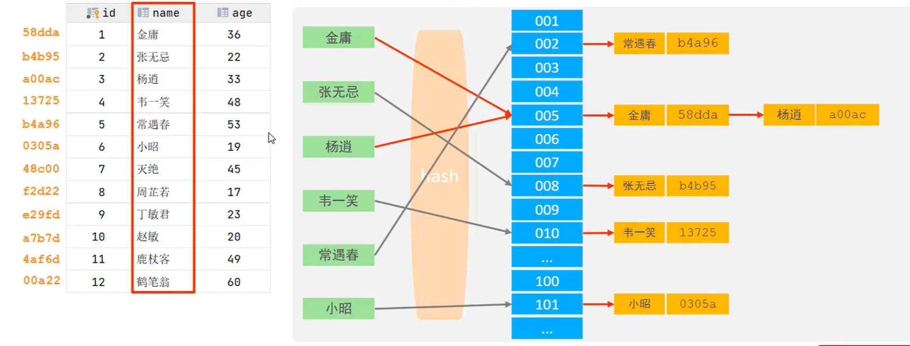
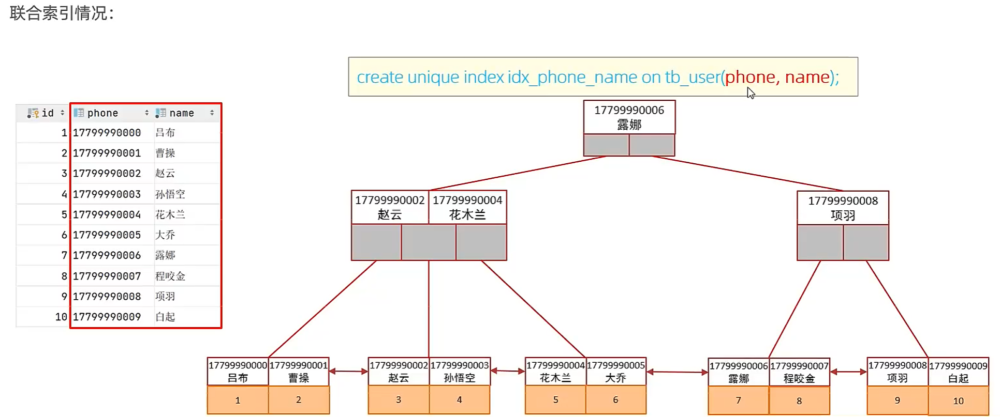
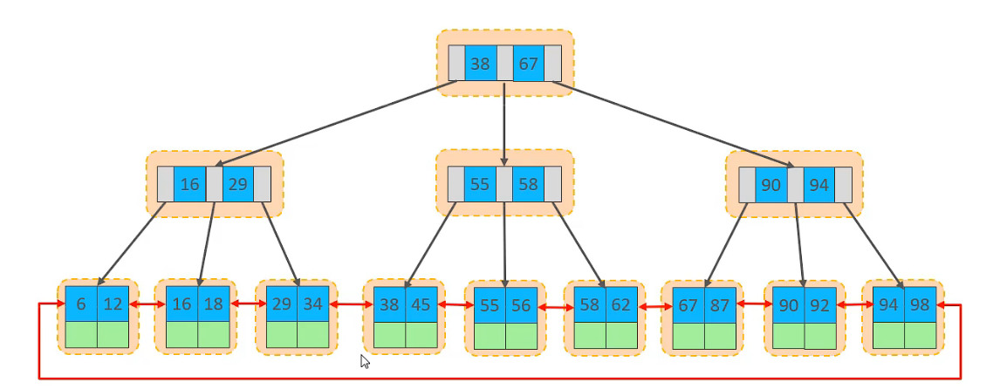
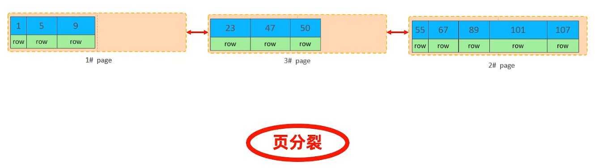
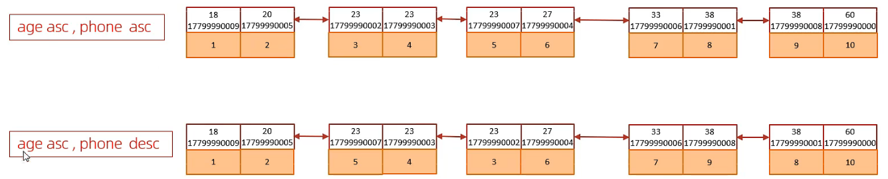

# 索引/SQL优化

## 索引

### 索引概述

索引（index）：是帮助 MySQL 高效获取数据 的 有序数据结构。

|优势|劣势|
|-|-|
|提高数据检索的效率，降低数据库的IO成本|索引列也要占用内存空间|
|通过索引列对数据进行排序，可降低CPU的消耗|索引提高 查询 效率的同时，降低了 增、删、改 的速度|


### 索引结构

MySQL的索引是在 存储引擎层 实现的，不同的存储引擎有不同的结构，主要包含一下几种：

|索引结构|描述|
|-|-|
|B+Tree索引|最常见的索引类型，大部分引擎都支持 B+树 索引|
|Hash索引|底层数据结构使用哈希表实现，只支持精确匹配，不支持范围查询|
|R-Tree索引|空间索引是MyISAM引擎的一个特殊索引类型，主要用于地理空间数据类型，比较少见|
|Full-text全文索引|是一种通过建立倒排索引，快速匹配文档的方式|


#### B+Tree索引

MySQL 索引数据结构对经典的 B+Tree 进行了优化，在原有B+Tree的基础上，增加了一个指向相邻子节点的链表指针，就形成了带有顺序指针的B+Tree，提高区间访问的性能。


#### Hash索引

Hash索引就是采用一定的 hash 算法，将键值对换算成新的 hash 值，映射到对应的槽位上，然后存储在 hash 表中。

如果两个（或多个）键值，映射到同一个槽位上，他们就产生了 hash 冲突（也称hash碰撞），可以通过链表来解决。

Hash索引的特点：

- hash索引只能用于对等比较（=、in），不支持范围查询（between、>、<、....）

- 无法利用索引完成排序操作

- 查询效率高，同查只需要一次检索就可以了，效率通常要高于 B+Tree 索引


在MySQL中，支持 Hash索引 的是Memory引擎，而 InnoDB 中具有自适应Hash功能，Hash索引是存储引擎根据B+Tree索引在指定条件下自动构建的。




---

- ⭐⭐ 思考题

    问题：为什么InnoDB存储引擎选择使用B+Tree索引结构，而不使用 二叉树、红黑树、B-Tree树、Hash索引呢？

    答案：

    1. 红黑树也是二叉树，B+Tree树相对于 二叉树，层级更少，搜索效率更高。

    2. B-Tree树无论是非叶子节点或是叶子节点，都会保存数据，这样导致一页中的key和指针都会减少，存储同样的数据，B-Tree的层级会变多，性能会变低；同时B-Tree是单向列表，不利于范围查询。

    3. Hash索引只支持精确匹配，不支持范围查询以及排序操作，不考虑。

---


### 索引分类

|分类|含义|特点|关键字|
|-|-|-|-|
|主键索引|针对表中主键创建的索引|默认自动创建，只能有一个|primary|
|唯一索引|避免同一个表中某数据列中的值重复|可以有多个|unique|
|常规索引|快速定位特定数据|可以有多个||
|全文索引|查找的是文本中的关键字，而不是比较索引中的值|可以有多个|fulltext|

在 InnoDB 存储引擎中，更具索引的存储形式，又分为以下两种：

|分类|含义|特点|
|-|-|-|
|**聚集索引**（Clustered Index）|将数据存储和索引放到一块，索引结构的叶子节点保存了行数据|必须有，且只有一个|
|**二级索引**（Secondary Index）|将数据与索引分开存储，索引结构的叶子节点关联的是对应的主键|可以存在多个|

聚集索引选取规则：

- 如果存在主键，主键索引就是聚集索引

- 如果不存在主键，将使用第一个唯一索引作为聚集索引

- 如果表没有主键，或没有合适的唯一索引，则InnoDB会自动生成一个rowid作为隐藏的聚集索引


聚集索引与二级索引示例：


聚集索引与二级索引执行过程：


### 索引语法

**创建索引：**

```SQL
create [unique|fulltext] index idx_user_name on table(name,...);
```

**查看索引：**

```SQL
show index from table;
```

**删除索引：**

```SQL
drop index idx_user_name on table;
```


```SQL
-- name 字段为姓名字段，该字段的值可能会重复，为该字段创建索引
create index idx_user_name on tb_user(name);
-- phone 手机号字段的值，是非空，且唯一的，为该字段创建唯一索引
create unique index idx_user_phone on tb_user(phone);
-- 为profession、age、status创建联合索引
create index idx_pro_age_sta on tb_user(profession, age, status);
-- 为email建立合适的索引来提升查询效率
create index idx_user_email on tb_user(email);
```


### SQL性能分析

#### **SQL执行频率**

```SQL
-- Com后面跟着 7个下划线
show global status like 'Com_______'
```


#### 慢查询日志

慢查询日志记录了所有执行时间超过指定参数（long_query_time，单位：秒，默认10秒）的所有SQL语句的日志。

MySQL的慢查询日志默认没有开启，需要在 MySQL 的配置文件（/etc/my.cnf）中配置如下信息：

```SQL
# 开启MySQL慢查询日志开关
slow_query_log=1

# 设置慢查询日志的时间为 2秒，SQL语句执行时间超过2秒，就会视为慢查询，并进行记录
long_query_time=2
```

配置完成之后，重新启动MySQL：

```SQL
systemctl restart mysqld
```

查看慢查询日志状态是否开启，并查看 慢查询文件是否生成：

```SQL
-- 查看慢查询日志状态
show variables like 'slow_query_log'

-- 查看慢查询文件，文件路径：/var/lib/mysql/localhost-slow.log
cat /var/lib/mysql/localhost-slow.log
```


示例：

Finalshell中，新增一个终端，实时监控 localhost-slow.log 文件的内容：

```SQL
tail -f localhost-slow.log
```

在第一个终端中，分别执行如下语句，进行查询：

```SQL
-- 查询 tb_user 表，表中数据较少，耗时不会超过 2秒，因此慢日志文件中不会记录
select * from tb_user;

-- 查询 tb_sku 表，表中数据100000000条，耗时必超过 2秒，因此慢日志文件中会记录
select count(*) from tb_sku;
```


#### profile详情

> 慢查询日志虽然可以记录超时 2秒 的SQL执行情况，但是有时候某些SQL语句执行耗时 1.9999 秒，此时我们也可以认为这句SQL是比较慢的，但是慢查询日志并不会记录，那么我们就可以使用 profile 了。

`show profile;` 能够在做 SQL优化时帮助我们了解耗费的时间到哪里去了。

通过 have_profiling 参数，能够看到当前MySQL是否支持 profile 操作：

```SQL
-- 查看当前MySQL是否支持 profile 操作
select @@have_profiling;

-- 默认 profiling 是关闭的（0表示关闭）
select @@profiling;

-- 开启 profiling
set global profiling = 1;
```


示例：

执行如下的语句，查看SQL语句的耗时情况：

```SQL
select * from tb_user;
select * from tb_user where id = 1;
select * from tb_user where name = '白起';
select count(*) from tb_sku;

-- 查看每条SQL语句的耗时情况
show profiles;

-- 查看指定 query_id 的SQL语句各个阶段的耗时情况
show profile for query query_id;
```


#### explain执行计划

explain 命令用于获取 MySQL 如何执行 select 语句的信息，包括在 select 语句执行过程中表如何连接和连接的顺序。

语法：

```SQL
-- 直接在 select 语句之前加上关键字 explain
explain select * from tb_user where id = 1;
```


字段简介：

- id：select 查询的序列号，表示查询中执行select字句或者是操作表的顺序（id相同，执行顺序从上到下，Id不同，值越大，越先执行）

- select_type：表示select 的类型，常见的值有：SIMPLE（简单表）、PRIMARY（主查询）、UNION（UNION中第二个或者后面的查询语句）、SUBQUERY（子查询）

- **type**：表示连接类型，性能由好到差依次为：null、system、const、eq_ref、ref、range、index、all

- **possible_key**：显示可能应用在这张表上的索引，一个或多个

- **key**：实际使用的索引，如果为 null，则没有使用索引

- key_len：表示索引中使用的字节数，在不丢失精度的情况下，长度越短越好

- rows：要执行查询的行数，估计值，不准确

- **filtered**：表示返回结果的行数占读取行数 的百分比，filtered的值越大越好

- **extra**：额外信息


### 索引使用规则

#### 最左前缀法则

联合索引必须遵守最左前缀法则，最左前缀法则指的是 **查询从索引的最左列开始，并且不跳过索引中的列**。如果**跳跃了某一列，索引将部分失效**（后面的字段索引失效）。

联合索引中，出现范围查询（>、<），**范围查询右侧的列索引失效**。

```SQL
-- 会走联合索引查询，三个条件都会执行
explain select * from tb_user where profession = "软件工程" and age = 31 and status = "0";

-- 会走联合索引，最左前缀法则和顺序无关
explain select * from tb_user where age = 31 and status = "0" and profession = "软件工程";

-- 会走联合索引查询，两个条件都会执行
explain select * from tb_user where profession = "软件工程" and age = 31;

-- 会走联合索引查询，一个条件会执行
explain select * from tb_user where profession = "软件工程";

-- 会走联合索引，但不执行 status = "0" 这个条件，因为条件跳跃了联合索引的 age 列
explain select * from tb_user where profession = "软件工程" and status = "0";

-- 不会走联合索引，不满足最左前缀法则：因为联合索引的最左列不存在了
explain select * from tb_user where age = 31 and status = "0";


-- 会走联合索引，但不执行 status = "0" 这个条件，因为前面出现了范围查询
explain select * from tb_user where profession = "软件工程" and age > 31 and status = "0";

-- 解决方案：在范围查询时，修改为 >= 或 <= ，则会走全部的联合索引
explain select * from tb_user where profession = "软件工程" and age >= 31 and status = "0";
```


#### 索引失效情况

1. **索引列运算**

在索引列上进行运算操作，索引将失效。

```SQL
-- 不走索引，因为索引列上进行了运算操作
explain select * from tb_user where substring(phone, 10, 2) = "15";
```

2. **字符串不加引号**

字符串类型字段使用时，不加引号，索引将失效。

```SQL
-- 不走索引，因为查询条件为字符串类型，但没有加引号
explain select * from tb_user where phone = 17799990015;
```

3. **模糊查询**

如果是尾部模糊，索引不会失效，如果是头部模糊，索引会失效。

```SQL
-- 会走索引，因为查询条件的模糊查询为后面模糊
explain select * from tb_user where profession like "工程%";

-- 不走索引，因为查询条件的模糊查询为前面模糊
explain select * from tb_user where profession like "%工程";
explain select * from tb_user where profession like "%工程%";
```

4. **or 连接的条件**

用 or 进行连接的条件，如果其中一个字段没有索引，那么查询时索引会失效。

```SQL
-- 不走索引，因为 age 字段没有索引
explain select * from tb_user where phone = "17799990015" or age = 23;
```

解决方案：为其中没有索引的字段创建索引即可。

```SQL
-- 为 age 字段创建索引
create index idx_user_age on tb_user(age);

-- 走索引，因为 age 字段有索引了
explain select * from tb_user where phone = "17799990015" or age = 23;
```

5. **数据分布影响**

如果 MySQL 评估使用 索引比扫描全表更慢，则不适用索引。

```SQL
-- 会走索引，因为按照表中数据来说，满足条件的数据比较少，走索引更快
explain select * from tb_user where phone > "17799990019";

-- 不走索引，因为按照表中数据来说，满足条件的数据比较多，此时MySQL会进行评估：走全表扫描比走索引更快
explain select * from tb_user where phone > "17799990009";
```


#### SQL提示

SQL提示，是优化数据库的一个重要手段，就是再SQL语句中加入一些人为的提示来达到优化操作的目的。

**use index**（使用指定 索引）：

```SQL
-- 为 tb_user 表的 profession 新增索引
create index idx_user_pro on tb_user(profession);

-- MySQL自动评估，选择 idx_user_pro_age_status 索引
explain select * from tb_user where profession = '软件工程';

-- 使用 idx_user_pro 索引
explain select * from tb_user use index(idx_user_pro) where profession = '软件工程';
```

**ignore index**（忽略指定 索引）：

```SQL
-- 忽略 idx_user_pro_age_status 索引
explain select * from tb_user ignore index(idx_user_pro_age_status) where profession = '软件工程';
```

**force index**（强制执行指定 索引）：

```SQL
-- 强制使用 idx_user_pro_age_status 索引
explain select * from tb_user force index(idx_user_pro_age_status) where profession = '软件工程';
```


#### 覆盖索引

覆盖索引：指在二级索引中就可以获取到想要的字段信息，不在需要回表查询。

有了覆盖索引的存在，所以应该减少 `select *` 的操作（非常容易引起回表查询）。

示例：

```SQL
-- Extra: Using index condition，发生回表查询
explain select * from tb_user where profession = '软件工程' and age = 23 and status = 6;
-- Extra: Using index condition，发生回表查询
explain select id,name,profession,age,status from tb_user where profession = '软件工程' and age = 23 and status = 6;
-- Extra: Using where; Using index，不会回表查询
explain select id,profession,age,status from tb_user where profession = '软件工程' and age = 23 and status = 6;
```

- Using index condition / null：查询使用了索引，但是要回表查询

- Using where; Using index：查询使用了索引，但是要查询的数据再索引列中都能找到，不会回表查询


#### 前缀索引

当字段类型为 字符串（varchar、text等）时，有时候需要索引很长的字符串，这会让索引变得很大，查询时浪费大量的磁盘IO，影响查询效率。

此时可以将字符串的一部分前缀，建立索引，这样可以大大节约索引空间，从而提高索引效率。

语法：

```SQL
create index index_user_text on table(text(n));
-- n: 表示要截取的字符
```

示例：

```SQL
-- 计算前缀长度
select count(distinct substring(email,1,5)) / count(*) from tb_user;
-- 创建前缀索引
create index idx_user_emial_5 on tb_user(email(5));
-- 使用前缀索引查询
explain select * from tb_user where email = 'baiqi666@sina.com';
```


#### 单例/联合索引

单例索引：及一个索引只包含单个列。

联合索引：即一个索引包含了多个列。

在业务场景中，如果存在多个查询条件，考虑针对查询字段建立索引时，**建议使用联合索引**，而非单例索引。

联合索引的B+Tree结构：




示例：

```SQL
-- Extra: null 两个单例索引组合在一起，默认走第一个单例索引，并且会 回表查询
explain select id,phone,name from tb_user where phone = '17799990010' and name = '韩信';

-- 创建联合索引
create unique index idx_user_phone_name on tb_user(phone,name);
-- Extra: Using index 使用 phone 和 name 创建的联合索引，不会发生回表查询
explain select id,phone,name from tb_user use index(idx_user_phone_name) where phone = '17799990010' and name = '韩信';
```


#### 索引设计原则

1. 针对于数据量较大，且查询比较频繁的表建立索引。

2. 针对于常作为查询条件（where）、排序（order by）、分组（group by）操作的字段建立索引。

3. 尽量选择区分度高的列作为索引，尽量建立唯一索引，区分度越高，使用索引的效率越高。

4. 如果是字符串类型的字段，字段的长度较长，可以针对于字段的特点，建立前缀索引。

5. 尽量使用联合索引，减少单列索引，查询时，联合索引很多时候可以覆盖索引，节省存储空间，避免回表。

6. 要控制索引的数量，索引并不是多多益善，索引越多，维护索引结构的代价也就越大，会影响增删改的效率。

7. 如果索引列不能存储null值，请在创建表时使用 not null 约束它。当优化器知道每列是否包含 null 时，他可以更好的确定哪个索引最有效地用于查询。


## SQL优化

### 插入数据

#### insert 语句

正常情况下，我们会使用 insert into 一条一条的向数据库插入数据，在数据量比较大时，这样的效率是极其低下的。

```SQL
insert into tb_test values(1,'tom');
insert into tb_test values(2,'cat');
....
```

如果我们需要一次性往数据库表中插入多条记录，可以从以下三个方面进行优化。

1. **批量插入数据**

```SQL
insert into tb_test values(1,'Tom'), (2,'Cat');
```

2. **手动控制事务**

```SQL
start transaction;
insert into tb_test values(1,'Tom'),(2,'Cat'),(3,'Jerry');
insert into tb_test values(4,'Tom'),(5,'Cat'),(6,'Jerry');
commit;
```

3. **主键顺序插入**

```SQL
# 主键顺序插入，性能要高于乱序插入

主键顺序插入 : 1 2 3 4 5 7 8 9 15 21 88 89

主键乱序插入 : 8 1 9 21 88 2 4 15 89 5 7 3
```


#### load 语句

如果一次性需要插入大批量数据(比如: 几百万的记录)，使用 insert 语句插入性能较低，此时可以使 用MySQL数据库提供的 load 指令进行插入。

示例：

```SQL
-- 查看全局参数local_infile（默认为0）
select @@local_infile
-- 修改全局参数local_infile为1
set global local_infile = 1;

-- 创建 tb_user 表
CREATE TABLE `tb_user` (
  `id` INT(11) NOT NULL AUTO_INCREMENT,
  `username` VARCHAR(50) NOT NULL,
  `password` VARCHAR(50) NOT NULL,
  `name` VARCHAR(20) NOT NULL,
  `birthday` DATE DEFAULT NULL,
  `sex` CHAR(1) DEFAULT NULL,
  PRIMARY KEY (`id`),
  UNIQUE KEY `unique_user_username` (`username`)
) ENGINE=INNODB DEFAULT CHARSET=utf8 ;

-- 执行 load 命令将数据加载到表结构（注意：文件路径需要转义字符）
load data local infile 'D:\\load_user_100w_sort.sql' into table tb_user fields terminated by ',' lines terminated by '\n';
```

通过 load 命令，向表中添加100w条数据，耗时 35 秒左右，性能很好了。


### 主键优化

上一节中，我们提到一句话：**“主键顺序插入的性能高于乱序插入”**。这节就来分析一下为什么。

一句话：“乱序插入会产生 页分裂，严重影响效率”。


#### 数据组织方式

在 InnoDB 存储引擎中，表数据都是根据主键顺序组织存放的，这种存储方式的表称为 索引组织表。



行数据都是**存储在 聚集索引 的叶子节点上**的。


#### 页分裂

页可以为空，也可以填充50%，也可以填充100%。每个页至少包含 2 行数据（如果一行数据过大，会行溢出），根据主键排列。


**主键顺序插入**

1. 从磁盘中申请页，按照主键顺序插入，第一页写满以后，再申请第二页写入，页与页之间通过指针连接；


**主键乱序插入**

1. 第一页、第二页都写满了，此时插入 id=50 的数据，会发生什么？


2. 它不会直接在第三页写入，而是将第一页的后 50% 的数据，挪到第三页中，然后 id=50 的数据紧随其后；


3. 此时，存储引擎会再次根据主键顺序排序，重新设置链表指针；




#### 页合并

当删除一行记录时，实际上记录并没有被物理删除，只是记录被标记（flaged）为删除并且它的空间变得允许被其他记录声明使用。

1. 当页中删除的记录达到 MERGE_THRESHOLD（默认为页的50%）时，InnoDB会开始寻找最靠近的页（前或后），看看是否能和前后页合并，以优化索引空间。


1. 第二页中的数据被删除，空间剩余超 50%，则第三页数据会移动到第二页中存储，再有其他数据，再在第三页中写入；


#### 主键设计原则

- 满足业务需求的情况下，尽量减低主键的长度；

- 插入数据时，尽量选择顺序插入，选择以 AUTO_INCREMENT 自增主键；

- 尽量不要使用 UUID 做主键或者其他无序主键，如身份证号等；

- 业务操作时，避免对主键的修改；


### order by 优化

MySQL的排序，有两种方式：

- Using filesort：通过表的索引或全表扫描，读取满足条件的数据行，然后在排序缓冲区sort buffer中完成排序操作，所有不是通过索引直接返回排序结果。

- Using index：通过有序索引顺序扫描直接返回有序数据，不需要额外排序，操作效率高。

对于以上两种排序，Using index 性能高于 Using filesort，在优化时，尽量优化为 Using index。

```SQL
-- Extra: Using filesort
explain select id,age,phone from tb_user1 order by age;

-- 创建 age 和 phone 的联合索引，只有age和phone同时升序或同时降序时才走索引
create index idx_user_age_phone on tb_user1(age,phone);

-- Extra: Using index
explain select id,age,phone from tb_user1 order by age;
explain select id,age,phone from tb_user1 order by age,phone;
explain select id,age,phone from tb_user1 order by age desc,phone desc;

-- Extra: Using index; Using filesort
explain select id,age,phone from tb_user1 order by age asc,phone desc;

-- 优化: 创建 age asc 和 phone desc 的联合索引
create index idx_user_age_phone_ad on tb_user1(age asc, phone desc);

-- Extra: Using index
explain select id,age,phone from tb_user1 order by age asc,phone desc;
```

升序/降序联合索引结构图示：




**order by 优化原则**

- 根据排序字段建立合适的索引，多字段排序时，也遵循最左前缀法则；

- 尽量使用覆盖索引；

- 多字段排序，一个升序一个降序，此时需要注意联合索引在创建时的规则（asc/desc）；

- 如果不可避免的出现filesort，大数据量排序时，可以适当增加排序缓冲区大小sort_buffer_size（默认256k）。


### group by 优化

分组操作，主要分析索引对分组操作的影响。

```SQL
-- 删除所有的索引，只保留主键索引，语句不写了，自己查

-- Extra: Using temporary
explain select profession, count(*) from tb_user1 group by profession;

-- 创建 idx_pro_age_sta 索引
create index idx_pro_age_sta on tb_user1(profession, age, status);

-- Extra: Using index
explain select profession, count(*) from tb_user1 group by profession;
explain select profession, count(*) from tb_user1 group by profession,age;
explain select profession, age, count(*) from tb_user1 where profession = '软件工程' group by age;
```

**group by 优化原则**

- 在分组操作时，可以通过索引来提高效率；

- 分组操作时，索引的使用也需满足最左前缀法则。


### limit 优化

limit 分页查询最大的问题就是，分页越往后，查询速度越慢，请看如下测试：

```SQL
select * from tb_sku limit 100000,10; -- 10w 0.219s
select * from tb_sku limit 1000000,10; -- 100w 3.054s
select * from tb_sku limit 1990000,10; -- 199w 6.182s
```

此时MySQL查询前199w条数据，仅保留 1990000 ~ 19900010 的数据，其他全部舍弃，查询代价太大了。

优化思路：

一般分页查询时，通过创建 **覆盖索引** 能够比较好的提高性能，可以通过**覆盖索引加子查询**的形式进行优化。

```SQL
-- 先查询 1990000 之后 10条 的 id
select id from tb_sku order by id limit 1990000,10;
-- 通过子查询的形式在进行查询
select s.* from tb_sku s, (select id from tb_sku order by id limit 1990000,10) a where s.id = a.id; -- 3.48s
```


### count 优化

count 的几种用法：

- `count(*)`：

    - InnoDB引擎不会把全部字段取出来，而且引擎专门做了优化，不取值，服务层直接按行累加。

- `count(1)`：

    - InnoDB引擎遍历整张表，但不取值，服务层对返回的行放一个1进去，直接进行累加。

- `count(字段)`：

    - 没有not null约束：InnoDB引擎会遍历整张表，把每一行的字段值全部取出来，返回给服务层，服务层判断是否为 null，不为null，计数累加；

    - 有not null 约束：InnoDB引擎会遍历整张表，把每一行的字段值全部取出来，返回给服务层，直接按行进行累加。

- `count(主键)`：

    - InnoDB引擎会遍历整张表，把每一行的主键 id 值全部取出来，返回给服务层，直接按照行进行累加。


按照效率排序：count(*) ≈ count(1) > count(主键) > count(字段)

```SQL
select count(*) from tb_user1;

select count(1) from tb_user1;

select count(id) from tb_user1;

-- profession字段存在null时，不会进行计数
select count(profession) from tb_user1;
```


### update 优化

使用 update 更新时，需要注意的是 InnoDB 的行锁是针对索引加的锁，不是针对记录加的锁，并且该索引不能失效，否则会从行锁升级为表锁。

简单来说，在更新时，涉及的条件必须是有索引的，没有索引的字段作为条件时，很容易引起表锁。

示例：

1. 手动开启事务，左边更新执行之后，右边的更新同样可以执行，因为**条件 id 字段是有索引的**。

```SQL
begin;

update dept set name = '王一博' where id = 1;

commit;
```

```SQL
begin;

update dept set name = '陈伟霆' where id = 4;

commit;
```

2. 手动开启事务，左边更新执行之后，右边的更新会一直卡住（表锁），等到左边提交之后，右边的更新才得以执行，因为**条件 name 字段是没有索引的**。

```SQL
begin;

update dept set name = '王一博123' where name = '市场部';

commit;
```

```SQL
begin;

update dept set name = '白敬亭' where name = '财务部';

commit;
```
