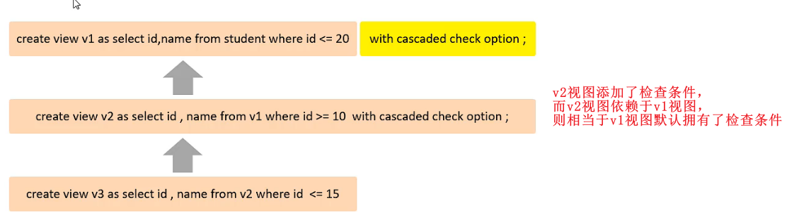

# 视图/存储过程

## 视图

### 视图概述

视图（view）是一种虚拟存在的表。视图中的数据并不在数据库中实际存在，行和列数据来自定义视图的查询中使用的表，并且实在是用视图时动态生成的。

通俗的讲，视图只保留了查询的SQL逻辑，不保存查询结果。所以我们在创建视图的时候，主要的工作就落在创建这条SQL查询语句上。


- 创建视图：

```SQL
create view 视图名称 as select语句 [with [cascaded | local] check option];
```

- 查询视图：

```SQL
-- 查看创建视图的语句
show create view 视图名称;

-- 查看视图数据（和常规查询的语法一样查询即可）
select * from 视图名称;
```

- 修改视图：

```SQL
-- 方式一
create [or replace] view 视图名称 as select语句 [with [cascaded | local] check option];

-- 方式二
alter view 视图名称 as select语句 [with [cascaded | local] check option];
```

- 删除视图：

```SQL
drop view [if exists] 视图名称 [,视图名称, ....];
```


示例：

```SQL
-- 创建视图
create view stu_v_1 as select id, name from student where id < 10;

-- 查询视图
show create view stu_v_1;
select * from stu_v_1;
select * from stu_v_1 where id < 3;

-- 修改视图
create or replace view stu_v_1 as select id, name, no from student where id < 10;

alter view stu_v_1 as select id, name from student where id < 10;

-- 删除视图
drop view if exists stu_v_1;
```


### 查询选项（cascaded）

当使用 with check option 字句创建视图时，MySQL 会通过视图检查正在更新的每个行，例如插入、更新、删除，以使其符合视图的定义。

MySQL允许基于视图创建视图，它还会检查依赖视图中的规则以保持一致性。

为了确定检查的范围，MySQL提供了两个选项：cascaded 和 local。


cascaded：



示例：

```SQL
-- 创建视图，没有携带 条件检查
create view stu_v_1 as select id, name from student where id <= 20;
-- 允许插入
insert into stu_v_1 values(5, 'Tom1');
-- 允许插入，但视图中不展示，基表中有数据
insert into stu_v_1 values(25, 'Tom6');

-- 创建视图，携带cascaded类型的检查条件，且 stu_v_2 依赖 stu_v_1 视图，则 stu_v_1 视图也相当于有了检查条件
create view stu_v_2 as select id, name from stu_v_1 where id >= 10 with cascaded check option;
-- 允许插入
insert into stu_v_2 values(11, 'Tom2');
-- 不允许插入，不满足stu_v_2的条件
insert into stu_v_2 values(21, '王一博');

-- 创建视图，没有携带 条件检查
create view stu_v_3 as select id, name from stu_v_2 where id <= 15;
-- 允许插入
insert into stu_v_3 values(12, 'Tom3');
-- 不允许插入，不满足 stu_v_3 的条件
insert into stu_v_3 values(18, 'Tom4');
-- 不允许插入，不满足 stu_v_2 的条件
insert into stu_v_3 values(9, 'Tom4');
-- 不允许插入，不满足 stu_v_3、stu_v_1 的条件
insert into stu_v_3 values(28, 'Tom5');
```


### 查询选项（local）

local：


示例：

```SQL
-- 创建视图，没有携带 条件检查
create view stu_v_4 as select id, name from student where id <= 20;
-- 允许插入
insert into stu_v_4 values(5, 'Tom1');
-- 允许插入，但视图中不展示，基表中有数据
insert into stu_v_4 values(25, 'Tom6');

-- 创建视图，携带local类型的检查条件，即只对当前视图有效
create view stu_v_5 as select id, name from stu_v_4 where id >= 10 with local check option;
-- 允许插入
insert into stu_v_5 values(11, 'Tom2');
-- 允许插入
insert into stu_v_5 values(21, '王一博');

-- 创建视图，没有携带 条件检查
create view stu_v_6 as select id, name from stu_v_5 where id <= 15;
-- 允许插入
insert into stu_v_6 values(12, 'Tom3');
-- 允许插入
insert into stu_v_6 values(18, 'Tom4');
-- 不允许插入，不满足 stu_v_5 的条件
insert into stu_v_6 values(9, 'Tom4');
-- 允许插入
insert into stu_v_6 values(28, 'Tom5');
```


### 视图更新

要使视图可更新，视图中的行与基表中的行之间必须存在一对一的关系。

如果视图包含以下任何一项，则视图不可更新：

- 聚合函数或窗口函数（sum()、min()、max()、count()）

- distinct 去重

- group by 分组

- having 过滤

- union 或 union all 联合

```SQL
-- 使用 count(*) 创建视图
create view  as select count(*) from student;

insert into stu_v_count values(10); -- 执行报错
```


### 视图作用

- 简单：

    - 试图不仅可以简化用户对数据的理解，也可以简化他们的操作。那些被经常使用的查询可以被定义为视图，从而使得用户不必为以后的操作每次指定全部的条件。

- 安全：

    - 数据库可以授权，但不能授权到数据库表中的特定行和特定列。而通过视图用户只能查询和修改他们所能见到的数据。

- 数据独立：

    - 视图可以帮助用户屏蔽真实表结构变化带来的影响。


## 存储过程（函数）

### 存储过程概述

存储过程：是事先经过编译并存储在数据库中的一段 SQL 语句的集合，调用存储过程可以简化应用开发人员的很多 工作，减少数据在数据库和应用服务器之间的传输，对于提高数据处理的效率是有好处的。

存储过程思想上很简单，就是数据库 SQL 语言层面的代码封装与重用。

- 创建存储过程：

```SQL
create procedure 名称([参数列表])
begin
  SQL语句;
end;

-- 列表参数
-- in: 传入参数
-- out: 传出参数
-- inout: 既是传入参数，也是传出参数
```

- 调用存储过程：

```SQL
call 名称([参数列表]);
```

- 查看存储过程：

```SQL
show create procedure 名称;
```

- 删除存储过程：

```SQL
drop procedure if exists 名称;
```


示例：

```SQL
-- 创建存储过程
create procedure p1()
begin
	select * from student;
end;
-- 调用存储过程
call p1();

-- 查看存储过程
show create procedure p1;
-- 删除存储过程
drop procedure if exists p1;

-- 带参存储过程
create procedure p5(inout score double)
begin
    set score := score / 2;
end;

set @score := 200;
call p5(@score);
select @score;
```


### 系统变量

系统变量是MySQL服务器提供的，不是用户定义的，属于服务器层面。

分为**全局变量（global）**和**会话变量（session）**，注意 会话变量 是默认值。

- 查看系统变量：

```SQL
-- 查看所有系统变量
show [session | global] variables;

-- 可以通过like模糊匹配方式查找变量
show [session | global] variables like '...';

-- 查看指定变量的值
show @@[session | global].系统变量名;
```

- 设置系统变量：

```SQL
set [session | global] 系统变量名 = 值;

set @@[session | global].系统变量名; = 值;
```


示例：

```SQL
-- 显示所有系统变量
show variables;

-- 可以通过 like 模糊匹配方式直接查找变量
show variables like 'auto%';

-- 查看指定变量的值
select @@autocommit;

-- 设置 autocommit = 0
set @@autocommit = 0;
set @@session.autocommit = 1;
```


### 自定义全局变量

自定义系统变量 使用户根据需要，自己定义的变量，其**作用域为当前连接**。

- 定义：

```SQL
-- 方式一
set @名称 := 值, @名称 := 值;

-- 方式二
select @名称 := 值;
select 字段名 into @名称 from 表名;
```

- 查看：

```SQL
select @名称;
```


示例：

```SQL
-- 创建
set @myname := '王一博';
set @mycolor := 'red', @myhobby := 'C#';

select @myage := 30;
-- 可以将查询的结果作为系统变量
select count(*) into @mycount from tb_user1;

-- 查看
select @myname,@mycolor,@myhobby;

select @myage,@mycount;
```


### 自定义局部变量

局部变量 是根据需要定义的在局部生效的变量，访问之前，需要 **declare** 声明。

可用作存储过程内的局部变量和输入参数，局部变量的范围在其内 begin ... end 块之内。

- 声明：

```SQL
declare 变量名 变量类型 [default 值]

-- 变量类型：int、bigint、char、varchar、date、time等
```

- 赋值：

```SQL
set 变量名 := 值;

select 字段名 into 变量名 from 表名;
```


示例：

```SQL
create procedure p2()
begin
	declare @mycount int default 0;
	select count(*) into @mycount from tb_user1;
	
	-- 局部变量
	select @mycount;
end;

call p2();
```


### if 判断

语法：

```SQL
if 条件1 then
    .....
elseif 条件2 then       -- 可选
    .....
else                    -- 可选
    .....
end if;
```

示例：

```SQL
create procedure p3()
begin
    declare score int default 90;
    declare result varchar(10);

    if score >= 85 then
        set result := '优秀';
    elseif score >= 60 then
        set result := '合格';
    else
        set result := '不合格';
    end if;

    select result;
end;
```


### case 判断

语法：

```SQL
-- 语法一
case value
  when when_value1 then sql1
  when when_value2 then sql2
  ...
  else sql3
end case;

-- 语法二
case
  when search_confition1 then sql1
  when search_confition2 then sql2
  ...
  else sql3
end case;
```

示例：

```SQL
-- 根据传入的月份，判定月份所属的季节
case
  when month >= 1 and month <= 3 then
    set result := '第一季度';
  when month >= 4 and month <= 6 then
    set result := '第二季度';
  when month >= 7 and month <= 9 then
    set result := '第三季度';
  when month >= 10 and month <= 12 then
    set result := '第四季度';
end case;
```


### while 循环

语法：

```SQL
while 条件 do
  sql
end while;
```

示例：

```SQL
while num>0 do
  set result := result + num;
  set num := num - 1;
end while;
```


### repeat 循环

语法：

```SQL
repeat
  sql
until 条件
end repeat;
```

示例：

```SQL
repeat
  set total := total + num;
  set num := num - 1;
until num <= 0
end repeat;
```
