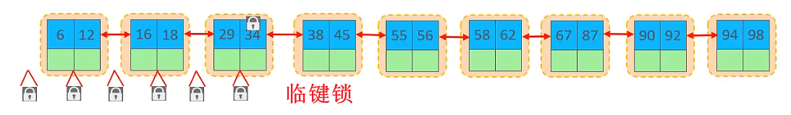

# 锁

### 锁的概述

锁是计算机协调多个进程或线程并发访问某一资源的机制。

MySQL中锁分为以下三类：

- 全局锁：锁定数据库中的所有表

- 表级锁：每次操作锁定整张表

- 行级锁：每次操作锁定对应的行数据


### 全局锁

全局锁：就是对整个数据库实例加锁，加锁后整个实例就处于**只读状态**，后续的 增、删、改操作都无法执行，但是可以查询。

其典型的使用场景是做 **全库的逻辑备份**，对所有的表进行锁定，备份完之后再解锁，从而保证数据的完整性。

```SQL
-- 设置全局锁
flush tables with read lock
-- 全库备份（注意需要在 cmd 中操作）
mysqldump -h127.0.0.1 -uroot -p1234 test > D:/test.sql
-- 不加锁的全库一致性数据备份
mysqldump --single-transaction -h127.0.0.1 -uroot -p1234 test > D:/test.sql
-- 解开全局锁
unlock tables
```

但是，数据库加全局锁，是一个比较重的操作，存在以下问题：

- 如果在主库上备份，那么在备份期间都不能执行更新，业务基本上就得停摆。

- 如果在从库上备份，那么在备份期间从库不能执行主库同步过来的二进制日志，会导致主从延迟。


### 表级锁

表级锁：每次操作锁住整张表。锁定粒度大，发生锁冲突的概率最高，并发度最低。

表级锁又可以分为以下三类：

- 表锁

    - 表共享读锁（read）

    - 表共享写锁（write）

- 元数据锁（MDL锁）

- 意向锁 


#### 表锁

对于表锁，分为两类：

- 表共享读锁（read）：当前客户端和其他客户端只能读，不能写。

- 表共享写锁（write）：当前客户端可读可写，其他客户端不能读不能写。

语法：

```SQL
-- 加锁
lock tables 表名 read / write;

-- 释放锁
unlock tables;
```

示例：

```SQL
-- 读锁
lock tables student read;
-- 可查
select * from student;
-- 不可写
update student set name = '天狗' where id = 2;

unlock tables;
```

```SQL
-- 写锁
lock tables dept write;
-- 可查
select * from dept;
-- 可写
update dept set name = '天狗' where id = 2;

unlock tables;
```


#### 元数据锁（DML）

MDL加锁过程是系统自动控制，无需显式使用，在访问一张表的时候会自动加上。

MDL锁的主要作用式维护表元数据的数据一致性，在表上有活动事务的时候，不可以对元数据进行写入操作。

简单来说就是“客户端1正在开启事务写入数据，客户端2把表结构改了，你觉着合理吗？”


当对一张表进行增删改查的时候，加DML读锁（共享锁），当对表结构进行变更的时候，加DML写锁（排他锁）。

|对应SQL|锁类型|说明|
|-|-|-|
|lock tables xxx read / write|共享读锁 / 共享写锁|无|
|select、select ... lock in shae mode|共享读锁|与 共享读锁 / 共享写锁 兼容，与 排他锁 互斥|
|insert、update、delete、select ... for update|共享写锁|与 共享读锁 / 共享写锁 兼容，与 排他锁 互斥|
|alter table ... |排他锁|与其他任何 DML 都互斥|


#### 意向锁

为了避免DML在执行的时候，加的行锁与表锁冲突，在 InnoDB 中引入了意向锁，使得表锁不用检查每行数据是否加锁，使用意向锁减少锁的检查。

简单来说就是“客户端1给表加了行锁，而客户端2需要给表加表锁，此时客户端2就会对表进行一行一行的扫描，查看能不能加表锁，效率变低。”。

而意向锁就是 “客户端1给表加了行锁，同时会加一个意向锁，而客户端2需要给表加表锁，他会查看表存在不存在意向锁，从而决定能不能加表锁。”


意向锁也分为两类：

- 意向共享锁（IS）：由语句 select ... lock in share mode 添加。

    - 与表锁共享锁（read）兼容，与表锁排他锁（write）互斥。

- 意向排他锁（IX）：由  insert、update、delete、select ... for udate 添加。

    - 与表锁共享锁（read）和表锁排他锁（write）都互斥。意向锁之间不会互斥。


### 行级锁

行级锁，每次操作锁住对应的行数据。锁定粒度最小，发生所冲突的概率最低，并发度最高。

InnoDB的数据是基于索引组织的，行锁是通过对索引上的索引加锁来实现的，而不是对记录加的锁。

行级锁也分为三类：

- 行锁（Record lock）：锁定单个行记录的锁，防止其他事务对此行进行 update 和 delete。

- 间隙锁（Gap lock）：锁定索引记录间隙，确保索引记录间隙不变，防止其他事务在这个间隙进行 insert，产生幻读。

- 临键锁（Next-Key lock）：行锁和间隙锁组合，同时锁住数据，并锁住数据前面的间隙Gap。临键锁就是行锁+间隙锁。




#### 行锁

InnoDB 实现了以下两种类型的行锁：

- 共享锁（S）：允许一个事务去读一行，阻止其他事务获得相同数据集的排他锁。

- 排他锁（X）：允许获取排他锁的事务更新数据，阻止其他事务获得相同数据集的共享锁和排他锁。

|锁类型|S（共享锁）|X（排他锁）|
|-|-|-|
|S（共享锁）|兼容|冲突|
|X（排他锁）|冲突|冲突|

|SQL|行锁类型|说明|
|-|-|-|
|insert|排他锁|自动加锁|
|update|排他锁|自动加锁|
|delete|排他锁|自动加锁|
|selet（正常）|不加任何锁||
|select ... lock in share mode|共享锁|手动添加 lock in share mode|
|select ... for update|排他锁|手动添加 for update|

默认情况下，InnoDB在事务隔离级别运行，InnoDB使用 next-key 锁进行搜索和索引扫描，以防止幻读。

1. 针对唯一索引进行检索时，对已存在的记录进行等值匹配时，将会自动优化为行锁。

2. InnoDB的行锁是针对于索引加的锁，没有索引的行加锁，会升级为表锁。


#### 间隙锁和临键锁

默认情况下，InnoDB在事务隔离级别运行，InnoDB使用 next-key 锁进行搜索和索引扫描，以防止幻读。

1. 索引上的等值查询（唯一索引），给不存在的记录加锁时，优化为间隙锁。

2. 索引上的等值查询（普通索引），向右遍历时最后一个值不满足查询需求时，next-key lock 退化为间隙锁。

3. 索引上的范围查询（唯一索引），会访问到不满足条件的第一个值为止。

