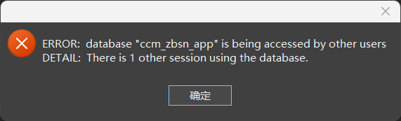

# 基础使用

## 权限设置

- 为数据库设置权限：

  ```sql
  -- 授予用户 admin_name 对数据库 database_name 的所有权限
  grant all privileges on database database_name to admin_name;
  
  -- 示例
  grant all privileges on database atgv_db_app to atgv_admin;
  ```

- 为数据库中所有表设置权限：

  ```sql
  -- 授予用户 admin_name 对模式 public 中所有表的所有权限
  grant all privileges on all tables in schema public to admin_name;
  
  -- 示例
  grant all privileges on all tables in schema public to atgv_admin;
  ```

- 更新数据库中表权限：

  ```sql
  -- 将表 table_name 的所有者修改为 admin_name
  alter table table_name owner to admin_name;
  
  -- 示例
  alter table basic_airport owner to admin;
  ```
  


## 复制数据库

在 PostgreSQL 中，有两种方法复制数据库：

1. 使用 `create database` 从模板数据库复制到另一个数据库，此方法仅是用于在同一个 PostgreSQL 服务器内操作；
2. 备份现有数据库，并将其恢复到另一个新数据库；

```sql
-- 为了数据的安全性，在操作之前最好先将数据库进行备份
create database new_db with template old_db;
```

上面的语句将复制 old_db 数据库到 new_db 数据库，但 old_db 数据库必须是 template 模板数据库，如果不是模板数据库，可以使用下面的 sql 更改：

```sql
alter database old_db with is_template true;
```


## 删除数据库

在删除 postgres 数据库时，提示下面的报错：



这是因为当前数据库在被别的用户使用，此时删除数据库千万要慎重，确保该数据库是可被删除的。

```sql
-- 1、断开要删除数据库的所有连接
SELECT pg_terminate_backend(pg_stat_activity.pid)
FROM pg_stat_activity
WHERE datname='ccm_zbsn_app' AND pid<>pg_backend_pid();

-- 2、删除数据库
drop DATABASE ccm_zbsn_app;
```

sql 解释：

- pg_terminate_backend：用来终止数据库正在连接使用的所有函数；
- pg_stat_activity：是一个系统表，用于存储服务进程的属性和状态；
- pg_backend_pid()：是一个系统函数，获取附加到当前会话的服务器进程的Id；


## WKT 转 geojson

WKT 在线预览：https://wktmap.com/

WKT 在线转 geojson：[WKT在线转换为geojson](https://www.zaixianjisuan.com/dilicesuan/wkt _ wkb _ geojson convert online.html)

::: info WKT简介

1. WKT 是用于描述地理空间数据的文本格式，它可以表示点、线、面等几何对象，每个点都是一个经纬度，点与点之间用空格分割；

2. EWKT 是带有 空间参考坐标系的 WKT；

:::

```sql
-- 语法
SELECT ST_AsGeoJSON('WKT'::geometry) AS geojson;

-- WKT 转 geojson
SELECT ST_AsGeoJSON('MULTIPOLYGON(((117.990302548244 39.7223643095277, 117.990483660197 39.7223533408427, 117.990475103726 39.7221208043105, 117.990302548244 39.7223643095277)))'::geometry) AS geojson;
```


## geojson 转 WKT/EWKT

```sql
-- 语法
SELECT ST_AsText(ST_GeomFromGeoJSON('geojson')) AS wkt;
SELECT ST_AsEwkt(ST_GeomFromGeoJSON('geojson')) As ewkt;

-- geojson 转 WKT
SELECT ST_AsText(ST_GeomFromGeoJSON('{"type":"MultiPolygon","coordinates":[[[[117.990302548,39.72236431],[117.99048366,39.722353341],[117.990475104,39.722120804],[117.990302548,39.72236431]]]]}')) AS wkt;

-- geojson 转 EWKT
SELECT ST_AsEwkt(ST_GeomFromGeoJSON('{"type":"MultiPolygon","coordinates":[[[[117.990302548,39.72236431],[117.99048366,39.722353341],[117.990475104,39.722120804],[117.990302548,39.72236431]]]]}')) AS ewkt;
```


## 从WKT中提取经纬度

>需求：有个一 WKT 格式的点 `POINT(114.202806 30.771083)`，想要提取它的经度和纬度，并重新命名为 lon 和 lat，该怎么做？

可以使用 PostGIS 的扩展：

- `ST_X(geom::geometry)`：从几何对象中提取经度（X坐标）；
- `ST_Y(geom::geometry)`：从几何对象中提取纬度（Y坐标）；

```sql
SELECT id,
	st_x ( geom :: geometry ) as lon,
	st_y ( geom :: geometry ) as lat 
from
	geo_vec_standpoint
```
