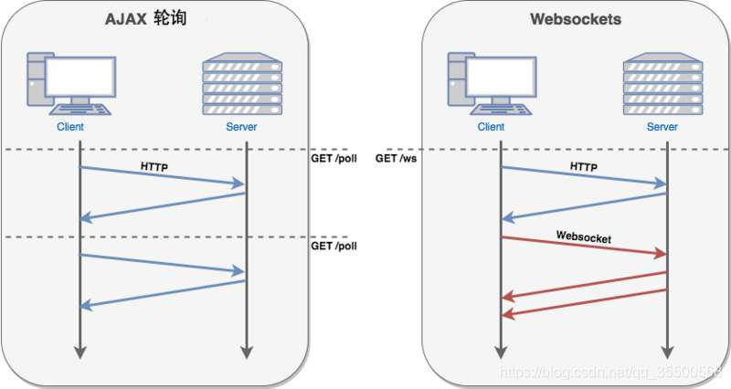

# WebSocket

WebSocket 是 HTML5 开始提供的一种在单个 TCP 连接上进行全双工通讯的协议。

WebSocket 使得客户端和服务器之间的数据交换变得简单，**允许服务端主动向客户端推送数据**。浏览器与服务器只需要完成一次握手，两者之间就直接可以创建持久性的连接，并进行双向数据传输。

很多网站为了实现推送技术，使用的都是 Ajax 轮询，由浏览器对服务器发出 HTTP 请求，然后由服务器返回最新的数据给客户端。这种传统的模式带来很明显的缺点，即浏览器需要不断的向服务器发出请求，然而 HTTP 请求可能包含较长的头部，其中真正有效的数据只占很小的一部分，显然这样说浪费很多的宽度资源。

HTML5 定义的 WebSocket 协议，能更好的节省服务器资源和带宽，并且能够更实时地进行通讯。



特点：

- 建立在 TCP 协议之上，服务器端的实现比较容易

- 与 HTTP 协议有着良好的兼容性，默认端口也是 80 和 443

- 数据格式比较轻量，性能开销小，通信高效

- 可以发送文本，也可以发送二进制数据

- 没有同源限制，客户端可以与任意服务器通信

- 协议标识符是 ws（如果加密，则为 wss），服务器网址就是 URL

## Websocket API

### Websocket 构造函数

Websocket 对象作为一个构造函数，用于创建新的 Websocket 实例。

执行完下面的语句以后，客户端和服务端便进行了连接：

```js
var socket = new Websocket("ws://echo.websocket.org");
```

### webSocket.readyState

- CONNECTING：值为 0，表示正在连接
- OPEN：值为 1，表示连接成功
- CLOSING：值为 2，表示连接正在关闭
- CLOSED：值为 3，表示连接已经关闭

```js
switch (Socket.readyState) {
  case WebSocket.CONNECTING:
    console.log("正在连接！");
    break;
  case WebSocket.OPEN:
    console.log("连接成功！");
    break;
  case WebSocket.CLOSING:
    console.log("连接正在关闭！");
    break;
  case WebSocket.CLOSED:
    console.log("连接已经关闭！");
    break;
  default:
    break;
}
```

### webSocket 事件

| 事件    | 事件处理程序     | 描述                       |
| ------- | ---------------- | -------------------------- |
| open    | Socket.onopen    | 连接建立时触发             |
| message | Socket.onmessage | 客户端接收服务端数据时触发 |
| error   | Socket.onerror   | 通信发生错误时触发         |
| close   | Socket.onclose   | 连接关闭时触发             |

实例对象的 `onopen` 属性，用于指定连接成功后的回调函数：

```js
Socket.onopen = function () {
  console.log("连接建立!");
};
```

如果要指定多个回调函数，可以使用 `addEventListener` 方法：

```js
Socket.addEventListener("open", function (e) {
  console.log("连接建立!");
});
```

### webSocket 方法

| 方法           | 描述             |
| -------------- | ---------------- |
| Socket.send()  | 使用连接发送数据 |
| Socket.close() | 关闭连接         |

下面是一个发送文本的例子：

```js
Socket.send("message");
```

发送 Blob 对象的例子：

```js
var file = document.querySelector("input[type="file"]").files[0];

Socket.send(file);
```
